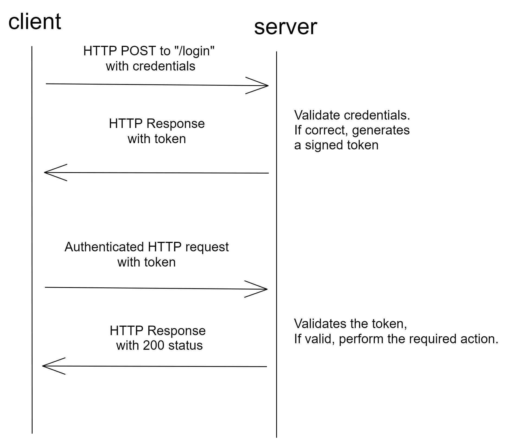

# Token-Based Authentication

Source: https://testdriven.io/blog/web-authentication-methods/#token-based-authentication

## Intro

This method uses tokens to authenticate users instead of cookies. The user authenticates using valid credentials and the server returns a signed token. This token can be used for subsequent requests.

Tokens don't need not be saved on the server-side. They can just be validated using their signature. In recent times, token adoption has increased due to the rise of RESTful APIs and Single Page Applications (SPAs).

## JSON Web Token

The most commonly used token is a JSON Web Token (JWT). A JWT consists of three parts:

* Header (includes the token type and the hashing algorithm used)
* Payload (includes the claims, which are statements about the subject)
* Signature (used to verify that the message wasn't changed along the way)

All three are base64 encoded and concatenated using a . and hashed. Since they are encoded, anyone can decode and read the message. But only authentic users can produce valid signed tokens. The token is authenticated using the Signature, which is signed with a private key.

JSON Web Token (JWT) is a compact, URL-safe means of representing claims to be transferred between two parties. The claims in a JWT are encoded as a JSON object that is used as the payload of a JSON Web Signature (JWS) structure or as the plaintext of a JSON Web Encryption (JWE) structure, enabling the claims to be digitally signed or integrity protected with a Message Authentication Code (MAC) and/or encrypted. - IETF

## Flow

# Pros
* It's stateless. The server doesn't need to store the token as it can be validated using the signature. This makes the request faster as a database lookup is not required.
* Suited for a microservices architecture, where multiple services require authentication. All we need to configure at each end is how to handle the token and the token secret. 
# Cons
* Depending on how the token is saved on the client, it can lead to XSS (via localStorage) or CSRF (via cookies) attacks.
* Tokens cannot be deleted. They can only expire. This means that if the token gets leaked, an attacker can misuse it until expiry. Thus, it's important to set token expiry to something very small, like 15 minutes.
* Refresh tokens need to be set up to automatically issue tokens at expiry.
* One way to delete tokens is to create a database for blacklisting tokens. This adds extra overhead to the microservice architecture and introduces state.