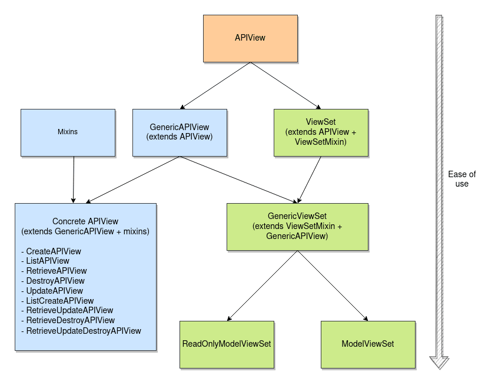

# API View

Source: https://testdriven.io/blog/drf-views-part-1/

## Intro
APIView class is a base for all the views that you might choose to use in your DRF application.



## Example
```python
class Item(models.Model):
    id = models.UUIDField(primary_key=True, default=uuid.uuid4)
    name = models.CharField(max_length=100)
    done = models.BooleanField()
```
Here's a view that allows users to delete all the items at once:

```python
from rest_framework.response import Response
from rest_framework.views import APIView

class DeleteAllItems(APIView):

    def delete(self, request):

        Item.objects.all().delete()

        return Response(status=status.HTTP_204_NO_CONTENT)
```
And here's a view that lists all the items:
```python
from rest_framework.response import Response
from rest_framework.views import APIView

class ListItems(APIView):

    def get(self, request):
        items = Item.objects.all()
        serializer = ItemSerializer(items, many=True)
        return Response(serializer.data)
```
The call to the database is done inside the handler functions. They're selected according to the request's HTTP method (e.g., GET -> get, DELETE -> delete).

## Policy attributes

| Attribute                 | 	Usage	                                                                                                                         | Examples                                    |
|---------------------------|---------------------------------------------------------------------------------------------------------------------------------|---------------------------------------------|
| renderer_classes          | determines which media types the response returns	                                                                              | JSONRenderer, BrowsableAPIRenderer          |
| parser_classes            | determines which data parsers for different media types are allowed	                                                            | JSONParser, FileUploadParser                |
| authentication_classes    | determines which authentication schemas are allowed for identifying the user                                                    | 	TokenAuthentication, SessionAuthentication |
| throttle_classes          | determines if a request should be authorized based on the rate of requests	                                                     | AnonRateThrottle, UserRateThrottle          |
| permission_classes        | determines if a request should be authorized based on user credentials	                                                         | IsAuthenticated, DjangoModelPermissions     |
| content_negotiation_class | selects one of the multiple possible representations of the resource to return to a client (unlikely you'll want to set it up)	 | only custom content negotiation classes     |