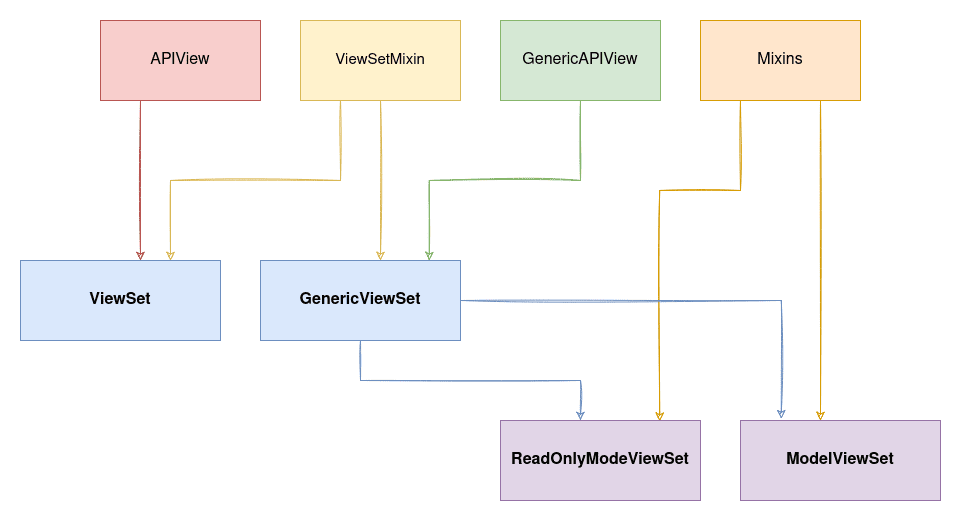

# ViewSets

Source: https://testdriven.io/blog/drf-views-part-3/

ViewSet is a type of class-based view.

Instead of method handlers, like .get() and .post(), it provides actions, like .list() and .create().

The most significant advantage of ViewSets is that the URL construction is handled automatically (with a router class). This helps with the consistency of the URL conventions across your API and minimizes the amount of code you need to write.

There are four types of ViewSets, from the most basic to the most powerful:

* ViewSet
* GenericViewSet
* ReadOnlyModelViewSet
* ModelViewSet



## Base ViewSet

The ViewSet class takes advantage of the APIView class. It doesn't provide any actions by default, but you can use it to create your own set of views:
```python
from django.shortcuts import get_object_or_404
from rest_framework.response import Response
from rest_framework.viewsets import ViewSet

class ItemViewSet(ViewSet):
    queryset = Item.objects.all()

    def list(self, request):
        serializer = ItemSerializer(self.queryset, many=True)
        return Response(serializer.data)

    def retrieve(self, request, pk=None):
        item = get_object_or_404(self.queryset, pk=pk)
        serializer = ItemSerializer(item)
        return Response(serializer.data)
```

## Actions

Possible actions:
* list
* create
* retrieve (pk needed)
* update (pk needed)
* partial_update (pk needed)
* destroy (pk needed)

You can also create custom actions with the @action decorator.

For example:

from django.shortcuts import get_object_or_404
from rest_framework.response import Response
from rest_framework.viewsets import ViewSet
```python
class ItemsViewSet(ViewSet):

    queryset = Item.objects.all()

    def list(self, request):
        serializer = ItemSerializer(self.queryset, many=True)
        return Response(serializer.data)

    def retrieve(self, request, pk=None):
        item = get_object_or_404(self.queryset, pk=pk)
        serializer = ItemSerializer(item)
        return Response(serializer.data)

    @action(detail=False, methods=['get'])
    def items_not_done(self, request):
        user_count = Item.objects.filter(done=False).count()

        return Response(user_count)
```

The detail parameter should be set as True if the action is meant for a single object or False if it's meant for all objects.