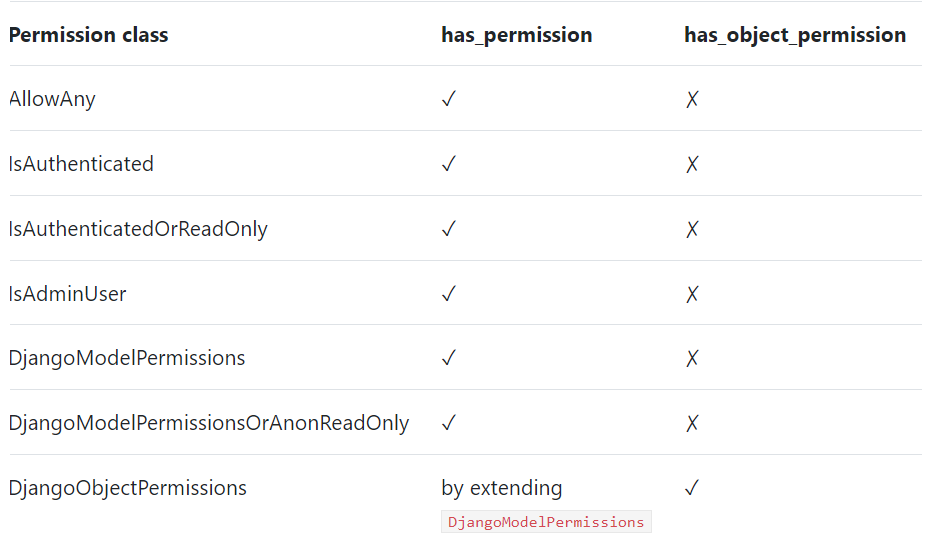
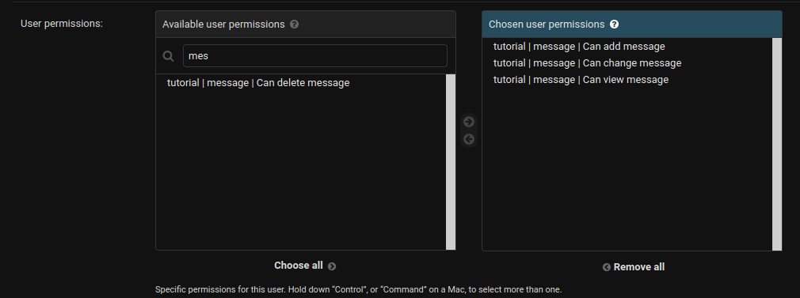

# Built-in permission classes

Source: https://testdriven.io/blog/built-in-permission-classes-drf/



All of those classes, except the last one, DjangoObjectPermissions, override just the has_permission method and inherits the has_object_permission from the BasePermission class. has_object_permission in the BasePermission class always returns True, so it has no impact on object-level access restriction.

## AllowAny

The most open permission of all is AllowAny. The has_permission and has_object_permission methods on AllowAny always return True without checking anything. Using it isn't necessary (by not setting the permission class, you implicitly set this one), but you still should since it makes the intent explicit and helps to maintain consistency throughout the app.
```python
from rest_framework import viewsets
from rest_framework.permissions import AllowAny

from .models import Message
from .serializers import MessageSerializer


class MessageViewSet(viewsets.ModelViewSet):

    permission_classes = [AllowAny] # built-in permission class used

    queryset = Message.objects.all()
    serializer_class = MessageSerializer
```
## IsAuthenticated

IsAuthenticated checks if the request has a user and if that user is authenticated. Setting permission_classes to IsAuthenticated means that only authenticated users will be able to access the API endpoint with any of the request methods.

## IsAuthenticatedOrReadOnly

When permissions are set to IsAuthenticatedOrReadOnly, the request must either have an authenticated user or use one of the safe/read-only HTTP request methods (GET, HEAD, OPTIONS). This means that every user will be able to see all the objects, but only logged-in users will be able to add, change, or delete objects.

## IsAdminUser

Permissions set to IsAdminUser means that the request needs to have a user and that user must have is_staff set to True. This means that only admin users can see, add, change, or delete objects.

## DjangoModelPermissions

DjangoModelPermissions allows us to set any combination of permissions to each of the users separately. The permission then checks if the user is authenticated and if they have add, change, or delete user permissions on the model.
```python
from rest_framework import viewsets
from rest_framework.permissions import DjangoModelPermissions

from .models import Message
from .serializers import MessageSerializer


class MessageViewSet(viewsets.ModelViewSet):

    permission_classes = [DjangoModelPermissions]

    queryset = Message.objects.all()
    serializer_class = MessageSerializer
```
You need to set the permissions for the specific user or group:



## DjangoModelPermissionsOrAnonReadOnly

DjangoModelPermissionsOrAnonReadOnly extends the DjangoModelPermissions and only changes one thing: It sets authenticated_users_only to False. 

Anonymous users can see the objects but can't interact with them.

## DjangoObjectPermissions

While DjangoModelPermissions limits the user's permission for interacting with a model (all the instances), DjangoObjectPermissions limits the interaction to a single instance of the model (an object). To use DjangoObjectPermissions you'll need a permission backend that supports object-level permissions, like django-guardian.
