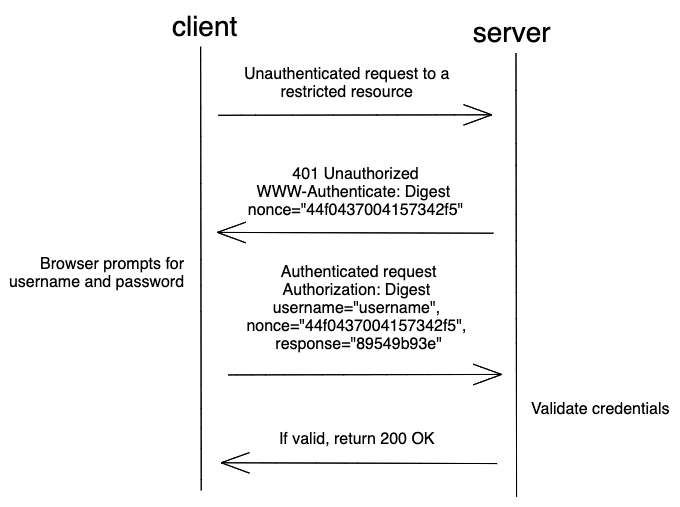

# HTTP Digest Authentication

Source: https://testdriven.io/blog/web-authentication-methods/#http-digest-authentication

## Intro

HTTP Digest Authentication (or Digest Access Authentication) is a more secure form of HTTP Basic Auth. The main difference is that the password is sent in MD5 hashed form rather than in plain text, so it's more secure than Basic Auth.

## Flow

## Pros

* More secure than Basic auth since the password is not sent in plain text.
* Easy to implement.
* Supported by all major browsers.

## Cons

* Credentials must be sent with every request.
* User can only be logged out by rewriting the credentials with an invalid one.
* Compared to Basic auth, passwords are less secure on the server since bcrypt can't be used.
* Vulnerable to man-in-the-middle attacks.