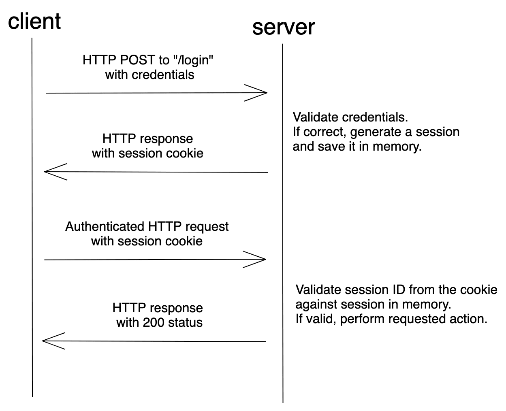

# Session-based Auth

Source: https://testdriven.io/blog/web-authentication-methods/#session-based-auth

## Intro

With session-based auth (or session cookie auth or cookie-based auth), the user's state is stored on the server. It does not require the user to provide a username or a password with each request. Instead, after logging in, the server validates the credentials. If valid, it generates a session, stores it in a session store, and then sends the session ID back to the browser. The browser stores the session ID as a cookie, which gets sent anytime a request is made to the server.

Session-based auth is stateful. Each time a client requests the server, the server must locate the session in memory in order to tie the session ID back to the associated user.

## Flow

## Pros
* Faster subsequent logins, as the credentials are not required.
* Improved user experience.
* Fairly easy to implement. Many frameworks (like Django) provide this feature out-of-the-box.
## Cons
* It's stateful. The server keeps track of each session on the server-side. The session store, used for storing user session information, needs to be shared across multiple services to enable authentication. Because of this, it doesn't work well for RESTful services, since REST is a stateless protocol.
* Cookies are sent with every request, even if it does not require authentication.
* Vulnerable to CSRF attacks. Read more about CSRF and how to prevent it in Flask here.