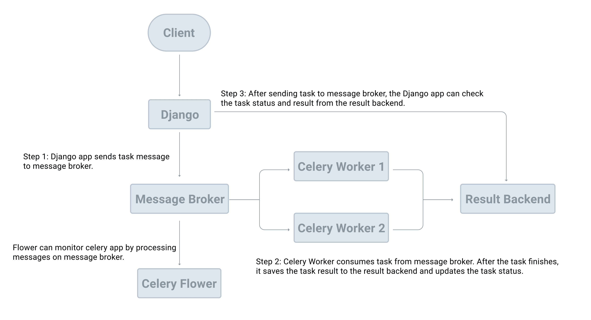

# Setting up

>Source: https://testdriven.io/courses/django-celery/getting-started/#H-4-setting-up-celery



Create a celery.py file in the same folder as wsgi.py:

```python
# config_dir/celery.py
"""
https://docs.celeryq.dev/en/stable/django/first-steps-with-django.html
"""
import os

from celery import Celery

from django.conf import settings

# this code copied from manage.py
# set the default Django settings module for the 'celery' app.
os.environ.setdefault('DJANGO_SETTINGS_MODULE', 'django_celery_example.settings')

# you can change the name here
app = Celery("django_celery_example")

# read config from Django settings, the CELERY namespace would make celery
# config keys has `CELERY` prefix
app.config_from_object('django.conf:settings', namespace='CELERY')

# discover and load tasks.py from from all registered Django apps
app.autodiscover_tasks(lambda: settings.INSTALLED_APPS)


@app.task
def divide(x, y):
    import time
    time.sleep(5)
    return x / y
```

```python
# config_dir/__init__.py
# This will make sure the app is always imported when
# Django starts so that shared_task will use this app.
from .celery import app as celery_app

__all__ = ('celery_app',)
```

Since Celery can read config from the Django settings file, add the following config to django_celery_example/settings.py for better configuration management:

```python
CELERY_BROKER_URL = "redis://127.0.0.1:6379/0"
CELERY_RESULT_BACKEND = "redis://127.0.0.1:6379/0"
```

It's worth noting here that the Celery documentation refers to the broker URL as BROKER_URL instead of CELERY_BROKER_URL. So, why are we using CELERY_BROKER_URL?

app.config_from_object('django.conf:settings', namespace='CELERY') tells Celery to read values from the CELERY namespace in settings.py. So, if you just set BROKER_URL in your Django settings file, the setting would be ignored since it lacks the CELERY namespace. This rule applies for all Celery config keys.