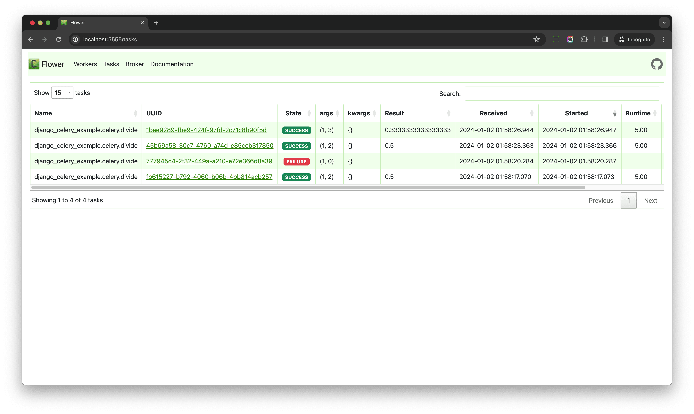

# Monitoring Celery with Flower

> Source: https://testdriven.io/courses/django-celery/getting-started/#H-8-monitoring-celery-with-flower

```commandline
pip install flower
```

Once installed, spin up the server:

```commandline
celery -A django_celery_example flower --port=5555
```

Navigate to http://localhost:5555 in your browser of choice to view the dashboard. Click "Tasks" in the nav bar at the top to view the finished tasks.

