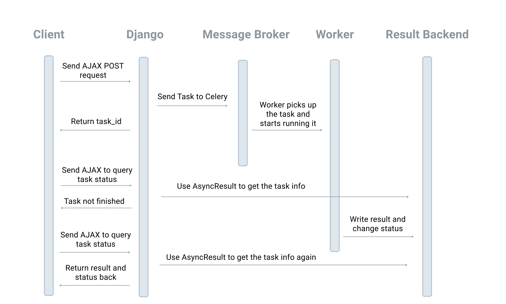

# Problem 1: Blocking Form Submission

> Source: https://testdriven.io/courses/django-celery/third-party-services/#H-1-problem-1-blocking-form-submission

## Problem

Say you have a form that lets users subscribe to your newsletter. In the view, you parse the form data, grab the provided email address, and send it to a third-party email marketing API like MailChimp or ConvertKit.

```python
def subscribe_user(email):
    # used for testing a failed api call
    if random.choice([0, 1]):
        raise Exception('random processing error')

    # used for simulating a call to a third-party email marketing api
    requests.post('https://httpbin.org/delay/5')


def subscribe(request):
    if request.method == 'POST':
        form = SubscribeForm(request.POST)
        if form.is_valid():
            subscribe_user(form.cleaned_data['email'])
            return HttpResponse('thanks')
    else:
        form = SubscribeForm()

    return render(request, 'subscribe.html', {'form': form})
```

So, we have a Django function-based view (FBV) that mimics a call to a third-party email marketing API with requests.post('https://httpbin.org/delay/5'). This view could degrade performance if you're sustaining heavy traffic.

If you're running three sync workers with Gunicorn then you'll have three child processes available to process each HTTP request to that view. If three users submit the form at the same time, all three processes will be blocked for at least five seconds. And so, since sync works can only serve a single request at a time, any other HTTP request will have to wait until one of the workers becomes available before the request can be handled.

If you need to call a third-party API within a view, you can move the actual call to an asynchronous Celery task to prevent the web process from being blocked.

Full workflow:

1. You'll want to use JavaScript to hijack the form submission and then send the data to the server via an AJAX request.
2. Within the Django view, enqueue a new task (which takes the submitted email and calls the external API) and return the task ID in the response back to the client.
3. You'll then use that task ID to continue to check the state of the task via another AJAX request.
4. When the task finishes, you should then display the appropriate message based on whether the task succeeds or fails.



> Rather than introducing a polling mechanism (calling the API in a loop, checking the status of the task), you could use WebSockets or HTTP/2 to "push" the response from the server to the client after the task finishes executing. You'll see an example of this in the next chapter.

> It's worth noting that this full workflow is a bit overkill for a simple call to a third-party email marketing API. The user isn't waiting to get something right away; they only care that they receive the next newsletter when you send the blast. Thus, you should indicate that the form submission was successful and handle any issues with the API call in the backend without the user knowing exactly what's happening. 
> 
> If you're using an API to process a payment or modify a user submitted file via an external service, then you should definitely use this full workflow.

## Implementation

Add the Requests library to your requirements file:

```
requests==2.31.0
```

Start by adding the following code to polls/views.py:

```python
import json
import random

import requests
from celery.result import AsyncResult
from django.http import JsonResponse
from django.shortcuts import render

from polls.forms import YourForm
from polls.tasks import sample_task


# helpers

def api_call(email):
    # used for testing a failed api call
    if random.choice([0, 1]):
        raise Exception('random processing error')

    # used for simulating a call to a third-party api
    requests.post('https://httpbin.org/delay/5')


# views

def subscribe(request):
    if request.method == 'POST':
        form = YourForm(request.POST)
        if form.is_valid():
            task = sample_task.delay(form.cleaned_data['email'])
            # return the task id so the JS can poll the state
            return JsonResponse({
                'task_id': task.task_id,
            })

    form = YourForm()
    return render(request, 'form.html', {'form': form})


def task_status(request):
    task_id = request.GET.get('task_id')

    if task_id:
        task = AsyncResult(task_id)
        state = task.state

        if state == 'FAILURE':
            error = str(task.result)
            response = {
                'state': state,
                'error': error,
            }
        else:
            response = {
                'state': state,
            }
        return JsonResponse(response)
```

Here, in the subscribe view, if the request method is POST (via AJAX), a task called sample_task is enqueued and the task ID is returned. The task_status view can then be used to check the status of the task given the task ID.

Wire up the app-level URLs in polls/urls.py:

```python
from django.urls import path

from polls.views import subscribe, task_status


urlpatterns = [
    path('form/', subscribe, name='form'),
    path('task_status/', task_status, name='task_status'),
]
```

Add a tasks.py file to the "polls" folder:

```python
from celery import shared_task


@shared_task()
def sample_task(email):
    from polls.views import api_call

    api_call(email)
```

> Celery will automatically search for tasks within each of your registered Django app's because we called the autodiscover_tasks method in django_celery_example/celery.py.

Next, add a basic form to polls/forms.py:

```python
from django import forms


class YourForm(forms.Form):
    def __init__(self, *args, **kwargs):
        # add class to make the fields work with Bootstrap
        # In real projects, you can check https://django-crispy-forms.readthedocs.io/en/latest/
        super().__init__(*args, **kwargs)
        for visible in self.visible_fields():
            visible.field.widget.attrs['class'] = 'form-control'

    username = forms.CharField(max_length=100)
    email = forms.EmailField(max_length=100)
```

Add a "templates" folder to "polls", and then add a form.html file:

```html
<!DOCTYPE html>
<html lang="en">

<head>
  <meta charset="UTF-8">
  <meta name="viewport" content="width=device-width, initial-scale=1.0">
  <title>Celery example</title>
  <link href="https://cdn.jsdelivr.net/npm/bootstrap@5.2.3/dist/css/bootstrap.min.css"
        rel="stylesheet"
        integrity="sha384-rbsA2VBKQhggwzxH7pPCaAqO46MgnOM80zW1RWuH61DGLwZJEdK2Kadq2F9CUG65"
        crossorigin="anonymous"
  >
</head>

<body>
<div class="container">
  <div class="row">
    <div class="col-12 col-md-4">
      <form id="your-form">
        
        <div class="mb-3">
          <label for="email" class="form-label">Email address</label>
          {{ form.email }}
        </div>
        <div class="mb-3">
          <label for="username" class="form-label">Username</label>
          {{ form.username }}
        </div>
        <div class="mb-3" id="messages"></div>
        <button type="submit" class="btn btn-primary">Submit</button>
      </form>
    </div>
  </div>
</div>

<script src="https://cdn.jsdelivr.net/npm/bootstrap@5.2.3/dist/js/bootstrap.bundle.min.js"
        integrity="sha384-kenU1KFdBIe4zVF0s0G1M5b4hcpxyD9F7jL+jjXkk+Q2h455rYXK/7HAuoJl+0I4"
        crossorigin="anonymous">
</script>
</body>
</html>
```
Then, add the core JavaScript to send the initial XHR request to kick off the task along with a request to check the status of the request using the task ID:

```html
<script>
  function getCookie(name) {
    let cookieValue = null;
    if (document.cookie && document.cookie !== '') {
      const cookies = document.cookie.split(';');
      for (let i = 0; i < cookies.length; i++) {
        const cookie = cookies[i].trim();
        // Does this cookie string begin with the name we want?
        if (cookie.substring(0, name.length + 1) === (name + '=')) {
          cookieValue = decodeURIComponent(cookie.substring(name.length + 1));
          break;
        }
      }
    }
    return cookieValue;
  }

  function updateProgress(yourForm, task_id, btnHtml) {
    fetch(`/task_status/?task_id=${task_id}`, {
      method: 'GET',
    })
      .then(response => response.json())
      .then((res) => {
        const taskStatus = res.state;

        if (['SUCCESS', 'FAILURE'].includes(taskStatus)) {
          const msg = yourForm.querySelector('#messages');
          const submitBtn = yourForm.querySelector('button[type="submit"]');

          if (taskStatus === 'SUCCESS') {
              msg.innerHTML = 'job succeeded';
          } else if (taskStatus === 'FAILURE') {
            // display error message on the form
            msg.innerHTML = res.error;
          }

          submitBtn.disabled = false;
          submitBtn.innerHTML = btnHtml;
        } else {
          // the task is still running
          setTimeout(function () {
            updateProgress(yourForm, task_id, btnHtml);
          }, 1000);
        }
      })
      .catch((error) => {
        console.error('Error:', error)
      });
  }

  document.addEventListener("DOMContentLoaded", function () {
    const yourForm = document.getElementById("your-form");
    yourForm.addEventListener("submit", function (event) {
      event.preventDefault();
      const submitBtn = yourForm.querySelector('button[type="submit"]');
      const btnHtml = submitBtn.innerHTML;
      const spinnerHtml = 'Processing...';
      submitBtn.disabled = true;
      submitBtn.innerHTML = spinnerHtml;

      const msg = yourForm.querySelector('#messages');
      msg.innerHTML = '';

      // Get all field data from the form
      const formData = new URLSearchParams(new FormData(yourForm));

      fetch('/form/', {
        method: 'POST',
        headers: {
          'X-CSRFToken': getCookie('csrftoken'),
        },
        body: formData,
      })
        .then(response => response.json())
        .then((res) => {
          // after we get Celery task id, we start polling
          const task_id = res.task_id;
          updateProgress(yourForm, task_id, btnHtml);
          console.log(res);
        })
        .catch((error) => {
          console.error('Error:', error)
        });
    });
  });
</script>
```
What's happening here?

* On form submit, we disabled the submit button and replaced the button text with "Processing...", to indicate to the end user that some sort of backend processing is happening. We also serialized the form input values and sent them along with the POST request to /form/.
* When a successful response comes back with the task ID, we passed the ID to the updateProgress function, which calls the /task_status/ endpoint. updateProgress continues to call that endpoint every second until the task is completed.
* Once complete, we displayed the appropriate message, updated the text in the button, and enabled the submit button.

Navigate to http://localhost:8010/form in your browser. Input a random name and email address and click submit.

Depending on the outcome of the API call, you'll see either a success or error message. The key here is that the web process is not blocked during the five second time from the API call: https://httpbin.org/delay/5.