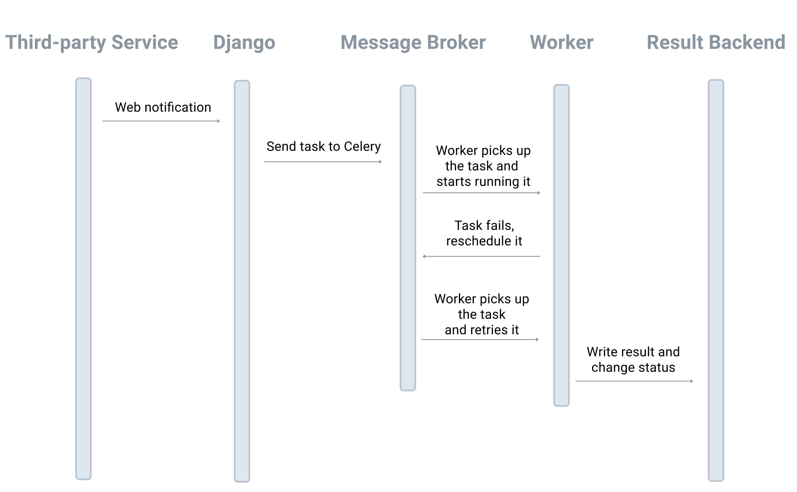

# Problem 2: Webhook Handler


> Source: https://testdriven.io/courses/django-celery/third-party-services/#H-4-problem-2-webhook-handler

Third party APIs often use webhooks to send event notifications. Depending on the notification, you may need to execute some sort of process. If the execution of this process is not handled in the background, this will block one of your Gunicorn workers until the process finishes execution.

Celery can again be used to handle such processing asynchronously.

## Problem

```python
# polls/urls.py
from django.urls import path

from polls.views import subscribe, task_status, webhook_test


urlpatterns = [
    path('form/', subscribe, name='form'),
    path('task_status/', task_status, name='task_status'),
    path('webhook_test/', webhook_test, name='webhook_test'),      # new
]
```
```python
# polls/views.py

@csrf_exempt
def webhook_test(request):
    if not random.choice([0, 1]):
        # mimic an error
        raise Exception()

    # blocking process
    requests.post('https://httpbin.org/delay/5')
    return HttpResponse('pong')
```
So, let's say you need to send a request to a third-party API when the webhook view is triggered. Example workflow:

* One third-party service (service A) sends a webhook notification request to /webhook_test/.
* The view processes the notification by calling a different third-party service (service B).

This can present a few problems:

* Some exception is raised in your webhook handler (or service B is down for maintenance) and service A does not have a retry policy.
> Most reliable services that provide webhook notifications, will retry delivery of the notification several times if the receiver does not send back a 200 OK.
* The webhook handler needs to call a third-party API, which, again, would block the web process.

## Implementation



```python
# polls/tasks.py

@shared_task(bind=True)
def task_process_notification(self):
    try:
        if not random.choice([0, 1]):
            # mimic random error
            raise Exception()

        # this would block the I/O
        requests.post('https://httpbin.org/delay/5')
    except Exception as e:
        logger.error('exception raised, it would be retry after 5 seconds')
        raise self.retry(exc=e, countdown=5)
```

Notes:

1. Since we set bind to True, this is a bound task, so the first argument to the task will always be the current task instance (self). Because of this, we can call self.retry to retry the failed task.
2. Remember to raise the exception returned by the self.retry method to make it work.
3. By setting the countdown argument to 5, the task will retry after a 5 second delay.

> It's worth noting that many Celery beginners get confused as to why some tutorials use app.task while others use shared_task. Well, shared_task lets you define Celery tasks without having to import the Celery instance, so it can make your task code more reusable.

Add a new view to send the new task to a Celery worker:

```python
@csrf_exempt
def webhook_test_async(request):
    """
    Use celery worker to handle the notification
    """
    task = task_process_notification.delay()
    logger.info(task.id)
    return HttpResponse('pong')
```

Add the view to polls/urls.py:

```python
from django.urls import path

from polls.views import subscribe, task_status, webhook_test, webhook_test_async


urlpatterns = [
    path('form/', subscribe, name='form'),
    path('task_status/', task_status, name='task_status'),
    path('webhook_test/', webhook_test, name='webhook_test'),
    path('webhook_test_async/', webhook_test_async, name='webhook_test_async'),
]
```