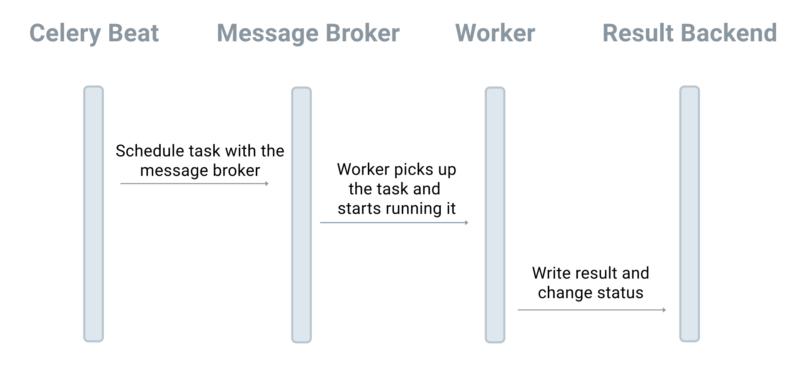
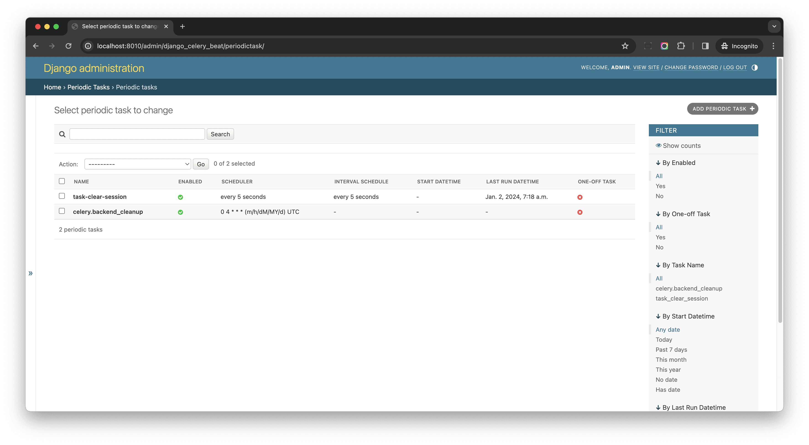

# Celery Beat

> Source: https://testdriven.io/courses/django-celery/periodic-tasks/

## Celery Beat for periodic tasks
Celery Beat is a scheduling tool used to enqueue tasks at regular intervals, which are then executed by Celery workers.

Responsibilities:

1. Celery Workers are responsible for picking up tasks from the queue, running them, and returning the results.
2. Celery Beat is responsible for sending tasks to the queue based on the defined config.

In production, while you can have multiple workers processing tasks from the queue, you should only have a single Celery Beat process. More than one Celery Beat process will result in duplicate tasks being enqueued. In other words, if you schedule a single task and have two Beat processes, two tasks will be enqueued.



## Static config

In this example, let's create a task that clears session records in the database every X seconds.

First, add the task to polls/tasks.py:
```python
@shared_task(name='task_clear_session')
def task_clear_session():
    from django.core.management import call_command
    call_command('clearsessions')
```

This task calls the Django clearsessions management command. We defined a name for the task via name='task_clear_session'. This name must be unique.

Next, add the Celery Beat config to your settings file:

```python
CELERY_BEAT_SCHEDULE = {
    'task-clear-session': {
        'task': 'task_clear_session',
        "schedule": 5.0,  # five seconds
    },
}
```

Notes:

1. The task field is the task name. If we didn't explicitly define a name above in the task, Celery would create one for us which is often the path module plus the function name -- i.e., polls.tasks.task_clear_session. This is not always the case, though, which is why it's a good practice to explicitly define a name. Otherwise, you can get the task name from the output of the Celery Worker after the task executes.
2. The schedule field supports crontab, timedelta, and solar formats.

## Dynamic config

What if you need to add, edit, or remove a periodic task dynamically? In other words, what if you wanted to make a change to the config at runtime?

The django-celery-beat package enables this by allowing you to manage periodic tasks from the Django Admin interface. The Beat config is then stored in the database.

First, add the package to the requirements file:

```
django-celery-beat==2.6.0
```
Add it to your INSTALLED_APPS in the settings as well:

```python
INSTALLED_APPS = [
    # ...
    'django_celery_beat',
]
```
Next, update the images, run the new containers, apply the migrations:

```
$ docker compose up -d --build

$ docker compose exec web python manage.py migrate
```

Next, update beat scheduler in the command in compose/local/django/celery/beat/start:

```bash
#!/bin/bash

set -o errexit
set -o nounset

rm -f './celerybeat.pid'
celery -A django_celery_example beat -l info --scheduler django_celery_beat.schedulers:DatabaseScheduler
```

Re-build again:
```commandline
docker compose up -d --build
```

Navigate to http://localhost:8010/admin/django_celery_beat/periodictask/.



Notes:

1. django_celery_beat pulled in the config from CELERY_BEAT_SCHEDULE allowing you to overwrite it dynamically.
2. Now, you can add, edit, or remove tasks from the Django Admin dynamically.

Go ahead and comment out the task-clear-session task in the settings to prevent this from firing and adding clutter to the logs:

```python
CELERY_BEAT_SCHEDULE = {
    # 'task-clear-session': {
    #     'task': 'task_clear_session',
    #     "schedule": 5.0,  # five seconds
    # },
}
```