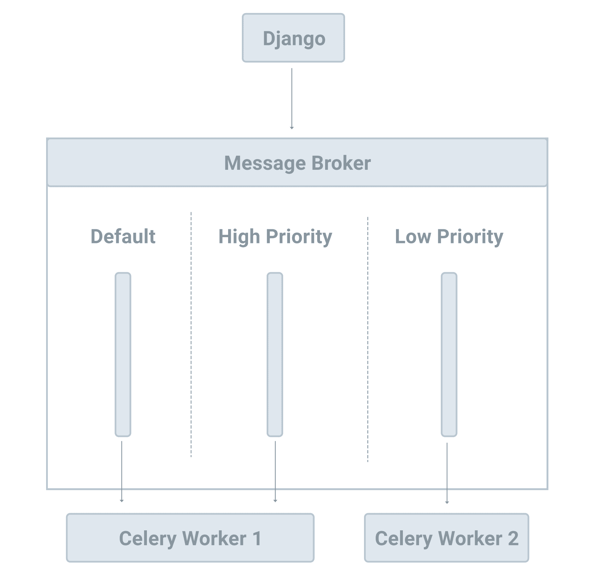

# Multiple Queues and Task Routing

> Source: https://testdriven.io/courses/django-celery/multiple-queues/

## Background

By default, Celery creates a default queue in your message broker when it's first executed. Celery then routes all tasks to that default queue and all Celery workers consume tasks from that queue as well. Celery allows you to spin up additional queues so you can have more control over which workers process which tasks.

For example, you could configure two queues: high_priority and low_priority. As the names suggest, "higher" priority tasks could be routed to the high_priority queue while the low_priority queue handles "lower" priority tasks. You can then spin up two workers: one for the high_priority queue and one for the low_priority and default queues.



It's a good practice to configure at least one additional queue (two total) so you can route slow tasks to one queue and fast tasks to a different queue so that slow tasks don't block the fast tasks.

## Configuration

Start by adding the following settings to settings.py:

```python
from kombu import Queue

...

CELERY_TASK_DEFAULT_QUEUE = 'default'

# Force all queues to be explicitly listed in `CELERY_TASK_QUEUES` to help prevent typos
CELERY_TASK_CREATE_MISSING_QUEUES = False

CELERY_TASK_QUEUES = (
    # need to define default queue here or exception would be raised
    Queue('default'),

    Queue('high_priority'),
    Queue('low_priority'),
)
```

Notes:

1. The Celery default queue name is celery. Here, we used CELERY_TASK_DEFAULT_QUEUE to change the name to default to prevent confusion.
2. CELERY_TASK_CREATE_MISSING_QUEUES = False prevents Celery from auto-creating queues for us that we don't have defined in CELERY_TASK_QUEUES. This forces us to be more explicit by adding all the queues that we want created (even the default queue) to CELERY_TASK_QUEUES. You'll see an example of this shortly.
3. In CELERY_TASK_QUEUES, we added the default queue along with two new queues: high_priority and low_priority.

Update compose/local/django/celery/worker/start:
```bash
#!/bin/bash

set -o errexit
set -o nounset

watchfiles \
  --filter python \
  'celery -A django_celery_example worker --loglevel=info -Q high_priority,default'      # update
```

Here, we added the -Q option to the command to specify the queues enabled (high_priority and default) for the worker.

To test, enqueue a few tasks in the Django shell within a new terminal window:

```commandline
$ docker compose down -v

$ docker compose up -d --build

$ docker compose exec web bash
(container)$ python manage.py shell

>>> from django_celery_example.celery import divide

# enqueue task to the default queue
>>> divide.apply_async(args=[1, 2])

# enqueue task to the high_priority queue
>>> divide.apply_async(args=[1, 2], queue='high_priority')

# enqueue task to the low_priority queue
>>> divide.apply_async(args=[1, 2], queue='low_priority')
```

Since no worker is set to consume tasks from the low_priority queue, you won't see any log output from the last task routed to that queue. You won't see the task in the Flower dashboard (at http://localhost:5557) either.

## Task routing

You can specify the destination for a particular task in the following places (in order of precedence):

1. Routing-related arguments in the apply_async method
2. Routing-related attributes on the Task
3. Routers defined in the CELERY_TASK_ROUTES setting

It's a good practice to set some general rules in the CELERY_TASK_ROUTES and override them as necessary.

### Manual Routing

Add CELERY_TASK_ROUTES to the settings file:

```python
CELERY_TASK_ROUTES = {
    'django_celery_example.celery.*': {
        'queue': 'high_priority',
    },
}
```

So, all tasks with a name that matches django_celery_example.celery.* are routed to the high_priority queue. Tasks that do not match that pattern will be routed to the default queue.

```bash
$ docker compose exec web bash
(container)$ ./manage.py shell

>>> from django_celery_example.celery import divide

# enqueue task to the high_priority queue
>>> divide.delay(1, 2)

# enqueue task to the low_priority queue (overwrite rule in CELERY_TASK_ROUTES)
>>> divide.apply_async(args=[1, 2], queue='low_priority')
```

### Dynamic Routing

Instead of manually configuring routing rules per task, you can also configure the rules in CELERY_TASK_ROUTES dynamically.

To do this, let's first define a common naming convention for tasks:

```
<QUEUE>:<TASK_NAME>
```

```python
@shared_task(name='default:dynamic_example_one')
def dynamic_example_one():
    logger.info('Example One')


@shared_task(name='low_priority:dynamic_example_two')
def dynamic_example_two():
    logger.info('Example Two')


@shared_task(name='high_priority:dynamic_example_three')
def dynamic_example_three():
    logger.info('Example Three')
```

Next, update settings.py like so:

```python
# manual task routing

# CELERY_TASK_ROUTES = {
#     'django_celery_example.celery.*': {
#         'queue': 'high_priority',
#     },
# }

# dynamic task routing

def route_task(name, args, kwargs, options, task=None, **kw):
    if ':' in name:
        queue, _ = name.split(':')
        return {'queue': queue}
    return {'queue': 'default'}


CELERY_TASK_ROUTES = (route_task,)
```