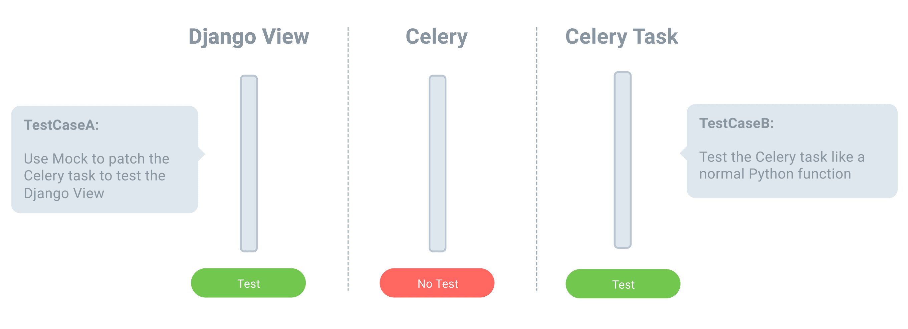

# Testing with Django Test Framework

> Source: https://testdriven.io/courses/django-celery/django-testing/

## Sample View and Task

Assume you have a Django view that accepts a username and email via a POST request. In the view, the user info is added to the database and a Celery task is enqueued that subscribes the user to a mailing list via a third-party API.

Add the view to polls/views.py:

```python
@transaction.atomic
def user_subscribe(request):
    """
    This Django view saves user info to the db and sends task to Celery worker
    to subscribe the user to the database
    """
    if request.method == 'POST':
        form = YourForm(request.POST)
        if form.is_valid():
            instance, flag = User.objects.get_or_create(
                username=form.cleaned_data['username'],
                email=form.cleaned_data['email'],
            )
            transaction.on_commit(
                partial(task_add_subscribe.delay, instance.pk)
            )
            return HttpResponseRedirect('')
    else:
        form = YourForm()

    return render(request, 'user_subscribe.html', {'form': form})
```
Notes:
1. As mentioned, it's recommended to use `transaction.atomic` or `ATOMIC_REQUESTS=True`, so atomicity on the database is guaranteed.
2. Since we wrapped our Django view with `transaction.atomic`, `transaction.on_commit` is used to register the callback function to call the Celery task.

Next, add the task to polls/tasks.py:

```python
@shared_task(bind=True)
def task_add_subscribe(self, user_pk):
    try:
        user = User.objects.get(pk=user_pk)
        requests.post(
            'https://httpbin.org/delay/5',
            data={'email': user.email},
        )
    except Exception as exc:
        raise self.retry(exc=exc)
```
Notes:

1. `requests.post` mimics the behavior of calling a third-party API.
2. If an exception is raised, the Celery task will retry via `raise self.retry(exc=exc)`.

Wire up the path in polls/urls.py:

```python
from django.urls import path

from polls.views import (
    subscribe,
    task_status,
    webhook_test,
    webhook_test_async,
    subscribe_ws,
    transaction_celery,
    user_subscribe
)

urlpatterns = [
    path('form/', subscribe, name='form'),
    path('task_status/', task_status, name='task_status'),
    path('webhook_test/', webhook_test, name='webhook_test'),
    path('webhook_test_async/', webhook_test_async, name='webhook_test_async'),
    path('form_ws/', subscribe_ws, name='form_ws'),
    path('transaction_celery/', transaction_celery, name='transaction_celery'),
    path('user_subscribe/', user_subscribe, name='user_subscribe'),
]
```

Create polls/templates/user_subscribe.html

```html
<form class="your-form" method="post">
  

  {{ form.as_p }}

  <button type="submit">Submit</button>

</form>
```

## Test Solution 1

Celery has a setting called `task_always_eager` which is `False` by default. By setting it to `True`, tasks will be executed immediately (synchronously) instead of being sent to the queue for asynchronous processing. It's a good idea to set this to True for testing the logic inside of a task.

Just make sure it's set to `False` in production as `task_add_subscribe.delay` will block the web process.

Add the following test to polls/tests.py:

```python
from unittest.mock import patch

from django.contrib.auth.models import User
from django.test import TestCase, TransactionTestCase, override_settings
from django.urls import reverse


class UserSubscribeTestCase(TransactionTestCase):

    @override_settings(CELERY_TASK_ALWAYS_EAGER=True)
    @patch('polls.views.requests.post')
    def test_subscribe_post_succeed(self, mock_requests_post):
        response = self.client.post(
            reverse('user_subscribe'),
            {
                'username': 'test',
                'email': 'test@email.com',
            }
        )
        self.assertEqual(response.status_code, 302)
        self.assertEqual(User.objects.filter(username='test').exists(), True)

        mock_requests_post.assert_called_with(
            'https://httpbin.org/delay/5',
            data={'email': 'test@email.com'}
        )
```
Notes:
1. We used `override_settings` to set `task_always_eager` to `True` for this test case.
2. We then used `@patch('polls.views.requests.post')` to patch the `post` method from `requests`, to prevent the HTTP request from being sent out during test.
3. `requests_post.assert_called_with` checks that the `requests.post` is called with the expected parameters in the task.

> Django's TestCase wraps each test in a transaction which is then rolled back after each test. Since no transactions are ever committed, on_commit() never runs either. So, if you need to test code fired in an on_commit callback, you can use TransactionTestCase in your test code.

While this code was easy to implement and understand it has a few problems:
1. Our test currently tests both the Django view and the Celery task. This is not a good practice. We should split up the test code to make it easier to maintain.
2. TransactionTestCase is slower than TestCase. Although speed is not an issue with this one test, we'll look at how to address this in the next solution for larger test suites.

## Test Solution 2

In this solution, we'll redesign our test case to address the above problems:
1. We'll create two test cases: one for the Django view and one for the Celery task.
2. In the first test, which tests the Django view, we'll patch the task_add_subscribe.delay method and check that it's called with the correct parameters.
3. Finally, we'll use TestCase.captureOnCommitCallbacks to capture transaction.on_commit() callbacks. If you're using an older version of Django, please use django-capture-on-commit-callbacks.



First, let's write the test code to test our Django view:

```python
class UserSubscribeViewTestCase(TestCase):
    """
    This class only tests the Django view
    """
    @patch('polls.views.task_add_subscribe.delay')
    def test_subscribe_post_succeed(self, mock_task_add_subscribe_delay):
        with self.captureOnCommitCallbacks(execute=True) as callbacks:
            response = self.client.post(
                reverse('user_subscribe'),
                {
                    'username': 'test',
                    'email': 'test@email.com',
                }
            )

        self.assertEqual(response.status_code, 302)
        self.assertEqual(User.objects.filter(username='test').exists(), True)

        # check callbacks
        self.assertEqual(len(callbacks), 1)

        user = User.objects.filter(username='test').first()
        mock_task_add_subscribe_delay.assert_called_with(
            user.pk
        )
```

Notes:

1. As you can see, we used patch('polls.views.task_add_subscribe.delay') to patch the Celery task's delay method. And we used task_add_subscribe_delay.assert_called_with to ensure that the Celery task has been called with the correct parameters.
2. Since the Celery task is patch'ed, we do not need to set task_always_eager to True.
3. This test case now only tests our Django view and ensures that the correct parameters are sent to the Celery task.

Next, let's write test code for the Celery task.

The key to writing test cases for Celery tasks is to test Celery tasks like normal Python functions. In other words, don't worry about testing whether or not the tasks are run synchronously or asynchronously since this is a Celery feature (you should assume that the Celery developers are testing this accordingly).

We just need to make sure our code works as expected.

```python
class TaskAddSubscribeTest(TestCase):
    """
    Only tests the Celery task
    """

    @patch('polls.tasks.requests.post')
    def test_post_succeed(self, mock_requests_post):
        instance = User.objects.create(username='test', email='test@email.com')
        task_add_subscribe(instance.pk)

        mock_requests_post.assert_called_with(
            'https://httpbin.org/delay/5',
            data={'email': instance.email}
        )

    @patch('polls.tasks.task_add_subscribe.retry')
    @patch('polls.views.requests.post')
    def test_exception(self, mock_requests_post, mock_task_add_subscribe_retry):
        mock_task_add_subscribe_retry.side_effect = Retry()
        mock_requests_post.side_effect = Exception()

        instance = User.objects.create(username='test', email='test@email.com')

        with self.assertRaises(Retry):
            task_add_subscribe(instance.pk)
```

Notes:

1. Again, requests_post.assert_called_with helps confirm that the correct parameters are sent to the third-party API.
2. side_effect allows us to raise an exception when the mock is called in this tests to ensure that the task is retried appropriately.

## Test Solution 3

Next, let's look at how to add some dummy data to our test with factory_boy.

Why dummy data? Sometimes you need to create some basic test data in order to ensure that the code behaves in a specific way given different types of data.

It's worth noting that you can use fixture data for this via a JSON file. Fixture files have a few problems, though:

1. They're not easy to maintain over time.
2. They're slow to load.

With factory_boy we can create test data during the test.

Add a new file to "polls" called factories.py:

```python
from factory import LazyAttribute
from factory.django import DjangoModelFactory
from factory import Faker

from django.contrib.auth.hashers import make_password
from django.contrib.auth.models import User


class UserFactory(DjangoModelFactory):
    class Meta:
        model = User

    username = Faker("user_name")
    email = LazyAttribute(lambda o: '%s@example.com' % o.username)
    password = LazyAttribute(lambda o: make_password(o.username))
    first_name = Faker("first_name")
    last_name = Faker("last_name")
```

Add the requirement to requirements.txt:

```
factory-boy==3.3.0
```

Now, update TaskAddSubscribeTest like so:

```python
class TaskAddSubscribeTest(TestCase):
    """
    Only test the Celery task
    """

    @patch('polls.tasks.requests.post')
    def test_post_succeed(self, mock_requests_post):
        instance = UserFactory.create()
        task_add_subscribe(instance.pk)

        mock_requests_post.assert_called_with(
            'https://httpbin.org/delay/5',
            data={'email': instance.email}
        )

    @patch('polls.tasks.task_add_subscribe.retry')
    @patch('polls.views.requests.post')
    def test_exception(self, mock_requests_post, mock_task_add_subscribe_retry):
        mock_task_add_subscribe_retry.side_effect = Retry()
        mock_requests_post.side_effect = Exception()

        instance = UserFactory.create()

        with self.assertRaises(Retry):
            task_add_subscribe(instance.pk)
```

Now, we can quickly create dummy data for our tests. Our test code is clean and easy to maintain. Plus, without fixture data files, our test will run faster.

## Test Coverage

To test the number of lines covered by tests, add Coverage.py to the requirements file:

```
coverage==7.4.0
```

Run the tests with coverage:

```
$ docker compose up -d --build

$ docker compose exec web coverage run --source='.' manage.py test
$ docker compose exec web coverage report

Name                                Stmts   Miss  Cover
-------------------------------------------------------
django_celery_example/__init__.py       2      0   100%
django_celery_example/asgi.py           6      6     0%
django_celery_example/celery.py        20      7    65%
django_celery_example/settings.py      33      4    88%
django_celery_example/urls.py           3      0   100%
django_celery_example/wsgi.py           4      4     0%
manage.py                              12      2    83%
polls/__init__.py                       0      0   100%
polls/admin.py                          1      0   100%
polls/apps.py                           4      0   100%
polls/consumers.py                     27      9    67%
polls/factories.py                     13      0   100%
polls/forms.py                          8      0   100%
polls/migrations/__init__.py            0      0   100%
polls/models.py                         1      0   100%
polls/routing.py                        3      3     0%
polls/tasks.py                         52     17    67%
polls/tests.py                         39      0   100%
polls/urls.py                           3      0   100%
polls/views.py                         78     43    45%
-------------------------------------------------------
TOTAL                                 309     95    69%
```

You can create an HTML report to get more info:
```
$ docker compose exec web coverage html
$ open htmlcov/index.html
```
