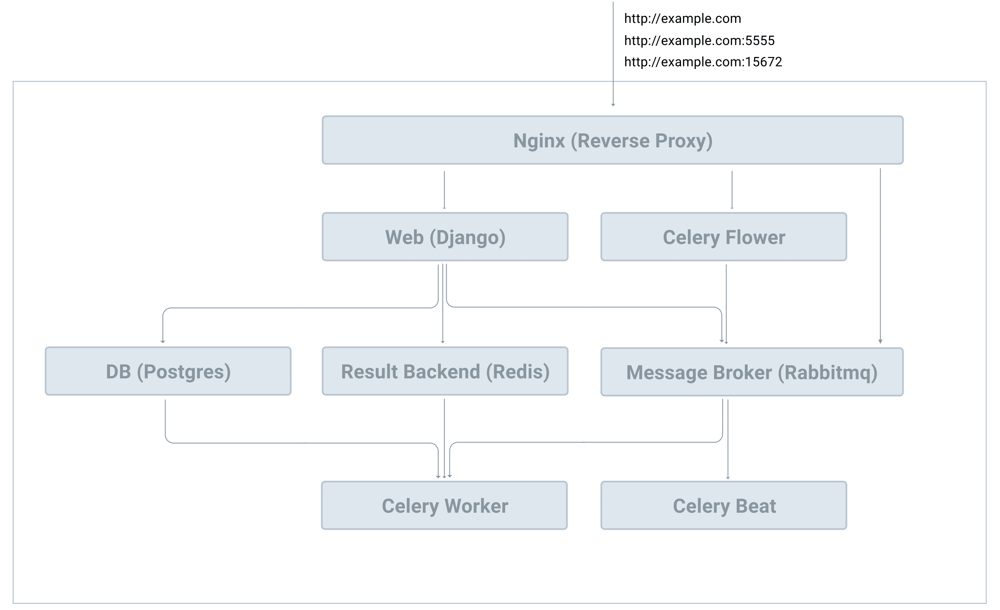

# Deployment

> Source: https://testdriven.io/courses/django-celery/deployment/

## Compose file

Start by creating a new compose file called docker-compose.prod.yml for the production infrastructure:

```yaml
version: '3.8'

services:

  nginx:
    build: ./compose/production/nginx
    volumes:
      - staticfiles:/app/staticfiles
      - mediafiles:/app/mediafiles
    ports:
      - 80:80
      - 5555:5555
      - 15672:15672
    depends_on:
      - web
      - flower

  web:
    build:
      context: .
      dockerfile: ./compose/production/django/Dockerfile
    command: /start
    volumes:
      - staticfiles:/app/staticfiles
      - mediafiles:/app/mediafiles
    env_file:
      - ./.env/.prod-sample
    depends_on:
      - redis
      - db

  db:
    image: postgres:16-alpine
    volumes:
      - postgres_data:/var/lib/postgresql/data/
    environment:
      - POSTGRES_DB=hello_django
      - POSTGRES_USER=hello_django
      - POSTGRES_PASSWORD=hello_django

  redis:
    image: redis:7-alpine

  rabbitmq:
    image: rabbitmq:3-management
    env_file:
      - ./.env/.prod-sample

  celery_worker:
    build:
      context: .
      dockerfile: ./compose/production/django/Dockerfile
    image: django_celery_example_celery_worker
    command: /start-celeryworker
    volumes:
      - staticfiles:/app/staticfiles
      - mediafiles:/app/mediafiles
    env_file:
      - ./.env/.prod-sample
    depends_on:
      - redis
      - db

  celery_beat:
    build:
      context: .
      dockerfile: ./compose/production/django/Dockerfile
    image: django_celery_example_celery_beat
    command: /start-celerybeat
    volumes:
      - staticfiles:/app/staticfiles
      - mediafiles:/app/mediafiles
    env_file:
      - ./.env/.prod-sample
    depends_on:
      - redis
      - db

  flower:
    build:
      context: .
      dockerfile: ./compose/production/django/Dockerfile
    image: django_celery_example_celery_flower
    command: /start-flower
    volumes:
      - staticfiles:/app/staticfiles
      - mediafiles:/app/mediafiles
    env_file:
      - ./.env/.prod-sample
    depends_on:
      - redis
      - db

volumes:
  postgres_data:
  staticfiles:
  mediafiles:
```

1. The production app uses Nginx as a reverse proxy.
2. For the message broker, we're using RabbitMQ instead of Redis.
3. Environment variables are stored in ./.env/.prod-sample.
4. Both static and media files are stored in Docker volumes.



## Nginx

```yaml
nginx:
  build: ./compose/production/nginx
  volumes:
    - staticfiles:/app/staticfiles
    - mediafiles:/app/mediafiles
  ports:
    - 80:80
    - 5555:5555
    - 15672:15672
  depends_on:
    - web
    - flower
```

1. As you can see, we used a custom Dockerfile (compose/production/nginx/Dockerfile) to build the nginx service image.
2. Nginx will listen on three ports:
   1. 80 for Django
   2. 5555 for Flower
   3. 15672 for the RabbitMQ dashboard
 
Next, create a "production" folder inside the "compose folder and add the following files and folders it:

```
production
├── django
└── nginx
    ├── Dockerfile
    └── nginx.conf
```

compose/production/nginx/Dockerfile:

```dockerfile
FROM nginx:1.25.3-alpine

RUN rm /etc/nginx/conf.d/default.conf
COPY nginx.conf /etc/nginx/conf.d
```

compose/production/nginx/nginx.conf:

```
upstream hello_django {
    server web:8000;
}

upstream celery_flower {
    server flower:5555;
}

upstream rabbitmq {
    server rabbitmq:15672;
}

server {
    listen 80;
    location / {
        proxy_pass http://hello_django;
        proxy_set_header X-Forwarded-For $proxy_add_x_forwarded_for;
        proxy_set_header Host $host;
        proxy_redirect off;
        client_max_body_size 20M;
    }
    location /static/ {
        alias /app/staticfiles/;
    }
    location /media/ {
        alias /app/mediafiles/;
    }

    location /ws {
        proxy_pass http://hello_django;
        proxy_http_version  1.1;
        proxy_set_header    Upgrade $http_upgrade;
        proxy_set_header    Connection "upgrade";
        proxy_set_header    Host $http_host;
        proxy_set_header    X-Real-IP $remote_addr;
    }
}

server {
    listen 5555;
    location / {
        proxy_pass http://celery_flower;
        proxy_set_header X-Forwarded-For $proxy_add_x_forwarded_for;
        proxy_set_header Host $host;
        proxy_redirect off;
    }
}


server {
    listen 15672;
    location / {
        proxy_pass http://rabbitmq;
        proxy_set_header X-Forwarded-For $proxy_add_x_forwarded_for;
        proxy_set_header Host $host;
        proxy_redirect off;
    }
}
```

> A reverse proxy handles requests from the Internet and forwards them along to the services in an internal network.

