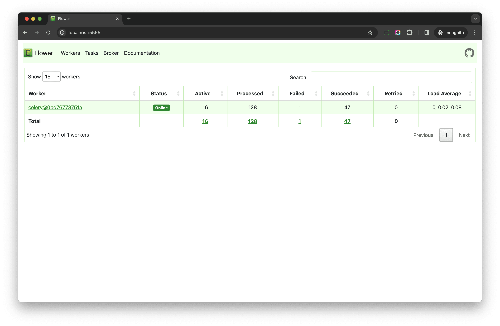
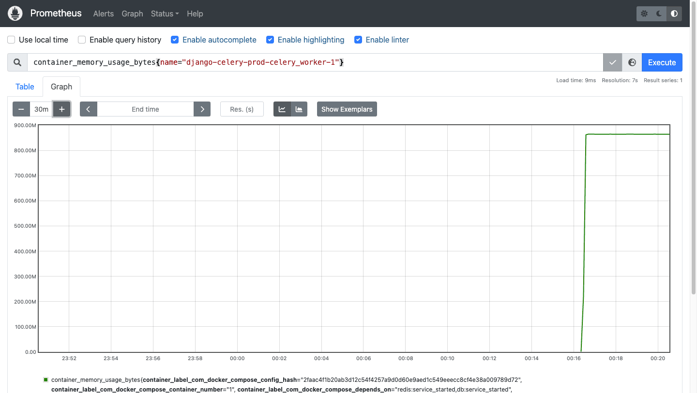

# Monitoring

> Source: https://testdriven.io/courses/django-celery/monitoring/

```commandline
docker compose -f docker-compose.prod.yml -p django-celery-prod up -d --build
```

## Flower

The easiest way to monitor your Celery app is via Flower. With it, you can get quick feedback on how your app is performing.

Navigate to the Flower dashboard at http://localhost:5555.

> Use `admin` for both the username and password to log in.



Here, we launched one worker node, which is currently running four tasks.

If you click the worker node, you can see more details:

* The "Queues" tab shows which queues the worker consumes from.
* The "Tasks" tab shows which tasks the worker node is running.
* The "Limits" tab allows you to set rate limits and timeouts for the worker node dynamically.

Be aware that the dynamic config for rate limits and timeouts won't persist after the worker node is restarted.

### Persistent mode

By default, Flower does not persist any data. So, if you restart the service, all old task data will be lost.

If you'd like to save the state, you can enable persistent mode to save data to a local database file.

First, update docker-compose.prod.yml to create a named volume to store the database flat file:

```yaml
services:
  ...

  flower:
    build:
      context: .
      dockerfile: ./compose/production/django/Dockerfile
    image: django_celery_example_celery_flower
    command: /start-flower
    volumes:
      - staticfiles:/app/staticfiles
      - mediafiles:/app/mediafiles
      - flower_db:/app/flower_db                              # new
    env_file:
      - ./.env/.prod-sample
    depends_on:
      - redis
      - db

volumes:
  postgres_data:
  staticfiles:
  mediafiles:
  flower_db:                                                  # new
```

Here, we added a named volume called flower_db and mounted it to /app/flower_db.

Then, update django-celery/compose/production/django/Dockerfile:

```dockerfile
# above code ignored for brevity

RUN mkdir /app
RUN mkdir /app/staticfiles
RUN mkdir /app/mediafiles
RUN mkdir /app/flower_db                            # new
WORKDIR /app

# copy project code
COPY . .

RUN chown -R django:django /app

USER django

ENTRYPOINT ["/entrypoint"]
```

We created a directory called /app/flower_db and changed the owner to django when building the image to prevent the Permission denied error.

Now update django-celery/compose/production/django/celery/flower/start:

```bash
exec celery -A django_celery_example \
    --broker="${CELERY_BROKER}" \
    flower \
    --basic_auth="${CELERY_FLOWER_USER}:${CELERY_FLOWER_PASSWORD}" \
    --persistent=1 --db=/app/flower_db/flower.db --state_save_interval=5000
```

Notes:
1. --persistent=1 enables persistent mode
2. --db=/app/flower_db/flower.db sets the database path
3. --state_save_interval=5000 writes data to the database every five seconds

## Inspect Celery

If you prefer the CLI, you use the inspect command for monitoring.

```
# run command in a new container
$ docker compose -f docker-compose.prod.yml -p django-celery-prod exec web bash
```

Celery overview:

```
(container)$ celery -A django_celery_example inspect stats
```

You can also get stats on currently running tasks as well as scheduled tasks:

```
(container)$ celery -A django_celery_example inspect active

->  celery@e4655d79e535: OK
    * {'id': 'cf514dbf-41a0-4a9b-aa3f-ec86c1cdfe7b', 'name': 'django_celery_example.celery.divide', 'args': [1, 999], 'kwargs': {}, 'type': 'django_celery_example.celery.divide', 'hostname': 'celery@e4655d79e535', 'time_start': 1704269147.4518552, 'acknowledged': True, 'delivery_info': {'exchange': '', 'routing_key': 'default', 'priority': 0, 'redelivered': False}, 'worker_pid': 42}
    * {'id': '658af977-49d7-4fca-a3d5-cb40b05eef28', 'name': 'django_celery_example.celery.divide', 'args': [1, 996], 'kwargs': {}, 'type': 'django_celery_example.celery.divide', 'hostname': 'celery@e4655d79e535', 'time_start': 1704269147.4473484, 'acknowledged': True, 'delivery_info': {'exchange': '', 'routing_key': 'default', 'priority': 0, 'redelivered': False}, 'worker_pid': 39}
    * {'id': '18e765fe-5e7b-4f34-aa4f-6a95266b4012', 'name': 'django_celery_example.celery.divide', 'args': [1, 997], 'kwargs': {}, 'type': 'django_celery_example.celery.divide', 'hostname': 'celery@e4655d79e535', 'time_start': 1704269147.4495938, 'acknowledged': True, 'delivery_info': {'exchange': '', 'routing_key': 'default', 'priority': 0, 'redelivered': False}, 'worker_pid': 34}
    * {'id': '10caca18-83e6-4521-bb42-5991e8b17117', 'name': 'django_celery_example.celery.divide', 'args': [1, 998], 'kwargs': {}, 'type': 'django_celery_example.celery.divide', 'hostname': 'celery@e4655d79e535', 'time_start': 1704269147.449727, 'acknowledged': True, 'delivery_info': {'exchange': '', 'routing_key': 'default', 'priority': 0, 'redelivered': False}, 'worker_pid': 44}
    * {'id': '1ea64172-9b4e-4a2c-9149-37030c890764', 'name': 'django_celery_example.celery.divide', 'args': [1, 995], 'kwargs': {}, 'type': 'django_celery_example.celery.divide', 'hostname': 'celery@e4655d79e535', 'time_start': 1704269147.4434083, 'acknowledged': True, 'delivery_info': {'exchange': '', 'routing_key': 'default', 'priority': 0, 'redelivered': False}, 'worker_pid': 46}
    * {'id': 'dd791787-b2cc-4e94-8b85-a6ee8db86e61', 'name': 'django_celery_example.celery.divide', 'args': [1, 993], 'kwargs': {}, 'type': 'django_celery_example.celery.divide', 'hostname': 'celery@e4655d79e535', 'time_start': 1704269147.4380627, 'acknowledged': True, 'delivery_info': {'exchange': '', 'routing_key': 'default', 'priority': 0, 'redelivered': False}, 'worker_pid': 43}
    * {'id': '952fb33d-da81-4b5f-82a4-917cc7bc4bdf', 'name': 'django_celery_example.celery.divide', 'args': [1, 992], 'kwargs': {}, 'type': 'django_celery_example.celery.divide', 'hostname': 'celery@e4655d79e535', 'time_start': 1704269147.438911, 'acknowledged': True, 'delivery_info': {'exchange': '', 'routing_key': 'default', 'priority': 0, 'redelivered': False}, 'worker_pid': 35}
    * {'id': '8fefb187-bac3-46ad-a462-9251e42f6b15', 'name': 'django_celery_example.celery.divide', 'args': [1, 994], 'kwargs': {}, 'type': 'django_celery_example.celery.divide', 'hostname': 'celery@e4655d79e535', 'time_start': 1704269147.4405167, 'acknowledged': True, 'delivery_info': {'exchange': '', 'routing_key': 'default', 'priority': 0, 'redelivered': False}, 'worker_pid': 37}
```

```
(container)$ celery -A django_celery_example inspect scheduled
->  celery@27f75083593e: OK
    * {'eta': '2024-01-03T08:54:11.806097+00:00', 'priority': 6, 'request': {'id': 'cf0947ee-1c55-4fd8-9c12-ce5a73b55ce2', 'name': 'polls.tasks.task_transaction_test', 'args': [], 'kwargs': {}, 'type': 'polls.tasks.task_transaction_test', 'hostname': 'celery@27f75083593e', 'time_start': None, 'acknowledged': False, 'delivery_info': {'exchange': '', 'routing_key': 'default', 'priority': 0, 'redelivered': False}, 'worker_pid': None}}
```

## Inspect Queues

### Redis

If you are using Redis as message broker, you can use the `llen` command to get the length of the queue:

```
$ docker compose -f docker-compose.prod.yml -p django-celery-prod exec redis sh

(container)$ redis-cli llen celery

(integer) 19
```

Notes:

1. This means that the there are 19 messages in the queue.
2. If you see something like celery-task-meta-d6edd803-baff-40b2-bd73-ffc36bfde35c in Redis, this key is used to store the result of the Celery task.
3. If you choose to use Redis as your message broker in your Celery app, it's recommended to use the Redis db number to split the message broker and results backend up. For example, you could use db 0 for the broker, db 1 for the results backend, and db 2 for the Django cache backend.

Or you can a Python script to do the same thing:

```python
import redis
from django.conf import settings

redis_connection = redis.Redis.from_url(settings.CELERY_BROKER_URL)

# celery is the queue name here
unacked_count = redis_connection.llen("celery")
print(f"Number of unacknowledged tasks: {unacked_count}")
```

### RabbitMQ

```
$ docker compose -f docker-compose.prod.yml -p django-celery-prod exec rabbitmq sh

(container)$ rabbitmqctl list_queues name messages messages_ready messages_unacknowledged

Timeout: 60.0 seconds ...
Listing queues for vhost / ...
name    messages        messages_ready  messages_unacknowledged
default 985     921     64
celeryev.0bd19ba6-3491-49f4-a704-da1e62a7e3f7   0       0       0
low_priority    0       0       0
celery@27f75083593e.celery.pidbox       0       0       0
high_priority   0       0       0
celeryev.06e46623-62cc-4e8c-85b5-3065701e23bc   0       0       0
```

Notes:

1. Here, we checked all the queues in RabbitMQ.
2. default is the default queue name for Celery. There are 985 messages in the queue. 921 messages are ready to be sent. 64 have already been sent to the worker.
3. The celeryev.* prefix means that the queue is used for Celery events. Such queues can become quite large, so you may need to set the message expiry time via event_queue_ttl.

## Metrics

As you're monitoring your Celery app, pay attention to the running metrics such as CPU and memory usage. If you're using Docker, make sure you check the running metrics for the containers as well as the host.

Let's look at a few open source and SaaS-based solutions.

### Container Advisor

cAdvisor (Container Advisor) is an open source solution used for analyzing resource usage and performance data from running containers.

We will use it to monitor the CPU and memory usage of our Docker app.

### Prometheus

Next, let's take a look at another open source solution called Prometheus, which is used for event monitoring and alerting.

Prometheus can work in conjunction with cAdvisor by pulling the metrics data from it. You can then query the data directly from the Prometheus web UI. What's more, Prometheus also provides a powerful and flexible way to configure alerts based on specific events.

To use, add the two services to the docker-compose.prod.yml file:

```dockerfile
prometheus:
  image: prom/prometheus
  ports:
    - 9090:9090
  command:
    - --config.file=/etc/prometheus/prometheus.yml
  volumes:
    - ./prometheus.yml:/etc/prometheus/prometheus.yml:ro
  depends_on:
    - cadvisor

cadvisor:
  image: gcr.io/cadvisor/cadvisor
  container_name: cadvisor
  volumes:
    - /:/rootfs:ro
    - /var/run:/var/run:rw
    - /sys:/sys:ro
    - /var/lib/docker/:/var/lib/docker:ro
    - /var/run/docker.sock:/var/run/docker.sock:ro
```

Add a config file called prometheus.yml to the root directory of your project:

```yaml
scrape_configs:

- job_name: cadvisor
  scrape_interval: 5s
  static_configs:
    - targets:
      - cadvisor:8080
```

Here, we tell Prometheus to pull data every five seconds from the cAdvisor service at cadvisor:8080.

```
$ docker compose -f docker-compose.prod.yml -p django-celery-prod stop
$ docker compose -f docker-compose.prod.yml -p django-celery-prod up -d --build
```

In your browser, navigate to http://localhost:9090/graph to see the web interface. You can use the Prometheus Query Language (PromQL) to view the metrics. For example, to check the memory usage of the Celery worker container, run the following query:

```
container_memory_usage_bytes{name="django-celery-prod-celery_worker-1"}
```



Next, you can set up AlertManager to configure alerting to send alerts to services like Grafana, Slack, and PagerDuty.

Check out the dockprom project for tying Prometheus, Grafana, cAdvisor, and AlertManager together.

Also, danihodovic/celery-exporter is a Prometheus exporter for Celery metrics.

### Services

There are a number of SaaS solutions for monitoring as well, like New Relic and Datadog. Please review them on your own.

### Recommendations

If you have a small team with a small budget and can't hire a full-time DevOps engineer, a SaaS solution is probably the better choice especially if you're concerned about HA (high availability).

