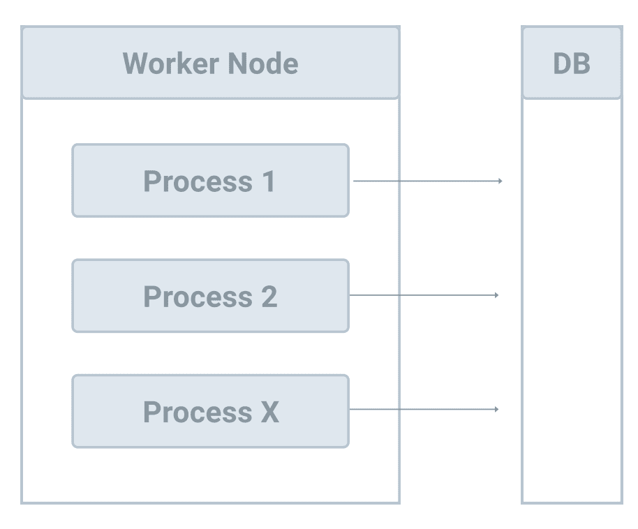
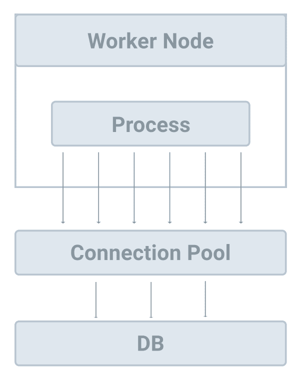

# Performance

> Source: https://testdriven.io/courses/django-celery/performance-tuning/

## Parallelism and Concurrency

1. CPU-bound Task: The task spends the majority of its time simply using the CPU (performing calculations).
2. IO-bound Task: The task is limited by the speed of the IO subsystem. A task that processes data from disk, for example, counting the number of lines in a file is likely to be IO-bound.

If the majority of your tasks are CPU-bound, you should leverage parallelism to speed up processing. On the other hand, if most of your tasks are IO-bound then you should leverage concurrency.

The `--pool` command line option can be used to specify the type of execution pool:
- prefork
- solo
- eventlet
- gevent

### Parallelism via Prefork

By default, Celery workers use the `prefork` pool to leverage parallelism:



Celery uses the number of CPUs available on your machine if `--concurrency` is not set:

```
$ docker compose exec web celery -A django_celery_example  worker -l info
```

You should see something similar to:

```
[config]
.> app:         django_celery_example:0x10c1328e0
.> transport:   redis://127.0.0.1:6379/0
.> results:     redis://127.0.0.1:6379/0
.> concurrency: 8 (prefork)
.> task events: OFF (enable -E to monitor tasks in this worker)
```

So, you can see that we're using 8 worker processes.

To decrease the number of worker processes, add the --concurrency option like so:

```
$ docker compose exec web celery worker -A django_celery_example -l info --concurrency=4

...

[config]
.> app:         django_celery_example:0x105c4e8b0
.> transport:   redis://127.0.0.1:6379/0
.> results:     redis://127.0.0.1:6379/0
.> concurrency: 4 (prefork)
.> task events: OFF (enable -E to monitor tasks in this worker)
```

Want to update development or production? Add the `--concurrency` option to compose/local/django/celery/worker/start or compose/production/django/celery/worker/start.

Or you can set `CELERY_WORKER_CONCURRENCY` in the Django settings file to make it work.

### Concurrency via Eventlet and Gevent

If most of your Celery tasks are IO-bound, which, again, means a lot of them process data from disk or make network requests, the `prefork` model might not work very well.

For example, if you have eight worker processes and you're tasks send network requests, then you can only send eight requests at a time.

Eventlet and Gevent can help speed things up in this case. Also, compared to the `prefork` model, both `eventlet` and gevent `consume` little memory.



Be careful with this though. Changing the --pool option to eventlet or gevent may not be enough. Review [Why Zapier Doesn't Use Gevent (Yet)](https://zapier.com/engineering/why-zapier-doesnt-use-gevent-yet/) and [Concurrency with Eventlet](https://docs.celeryq.dev/en/stable/userguide/concurrency/eventlet.html) for more on this.

When you use eventlet or gevent, you can specify the number of worker threads via the --concurrency option:

```
$ celery worker -A django_celery_example --pool=gevent --concurrency=100
```

## Memory

Since memory usage is often high with Celery, you can run into memory leaks.

The quick fix to solve this is to use `--max-tasks-per-child` so a worker process will run X number of tasks before it's killed.

For more on this, review the excellent [Diagnosing Memory "Leaks" in Python](https://chase-seibert.github.io/blog/2013/08/03/diagnosing-memory-leaks-python.html) post.


