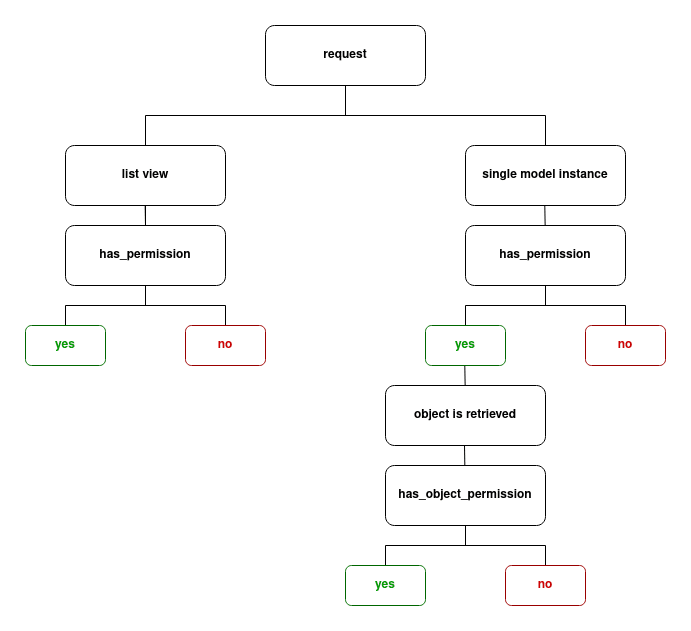

# Permission classes

Source: https://testdriven.io/blog/drf-permissions/

## BasePermission
All permission classes, either custom or built-in, extend from the BasePermission class:
```python
class BasePermission(metaclass=BasePermissionMetaclass):

    def has_permission(self, request, view):
        return True

    def has_object_permission(self, request, view, obj):
        return True
```
As you can see, BasePermission has two methods, has_permission and has_object_permission, that both return True. The permission classes override one or both of the methods to conditionally return True.

## has_permission

has_permission is used to decide whether a request and a user are allowed to access a specific view

For example:
* Is the request method allowed?
* Is the user authenticated?
* Is the user an admin or super user?

has_permission possesses knowledge about the request, but not about the object of the request.

has_permission (called by check_permissions) gets executed before the view handler is executed, without explicitly calling it.

## has_object_permission

has_object_permission is used to decide whether a specific user is allowed to interact with a specific object

For example:
* Who created the object?
* When was it created?
* In which group does the object belong to?

Besides the knowledge of the request, has_object_permission also possesses data about the object of the request. The method executes after the object is retrieved from the database.

Unlike has_permission, has_object_permission isn't always executed by default:
* With an APIView, you must explicitly call check_object_permission to execute has_object_permission for all permission classes.
* With ViewSets (like ModelViewSet) or Generic Views (like RetrieveAPIView), has_object_permission is executed via check_object_permission inside a get_object method out of the box.
* has_object_permission is never executed for list views (regardless of the view you're extending from) or when the request method is POST (since the object doesn't exist yet).
* When any has_permission returns False, the has_object_permission doesn't get checked. The request is immediately rejected.

## Difference between has_permission and has_object_permission



List views, only has_permission is executed and the request is either granted or refused access. If access is refused, the objects never get retrieved.

Detail views, has_permission is executed and then only if permission is granted, has_object_permission is executed after the object is retrieved.
