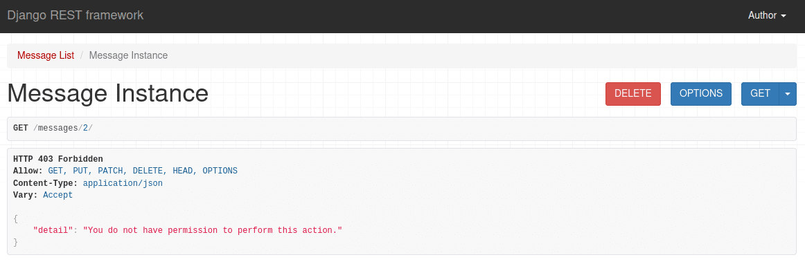

# Custom permission classes

Source: https://testdriven.io/blog/custom-permission-classes-drf/

## BasePermission

All permission classes, either custom or built-in, extend from the BasePermission class:
```python
class BasePermission(metaclass=BasePermissionMetaclass):
    """
    A base class from which all permission classes should inherit.
    """

    def has_permission(self, request, view):
        """
        Return `True` if permission is granted, `False` otherwise.
        """
        return True

    def has_object_permission(self, request, view, obj):
        """
        Return `True` if permission is granted, `False` otherwise.
        """
        return True
```

Permission classes override one or both of those methods to conditionally return True. If you don't override the methods, they will always return True, granting unlimited access.

## Permission based on User properties
```python
# permissions.py

from rest_framework import permissions


class AuthorAllStaffAllButEditOrReadOnly(permissions.BasePermission):

    edit_methods = ("PUT", "PATCH")

    def has_permission(self, request, view):
        if request.user.is_authenticated:
            return True

    def has_object_permission(self, request, view, obj):
        if request.user.is_superuser:
            return True

        if request.method in permissions.SAFE_METHODS:
            return True

        if obj.author == request.user:
            return True

        if request.user.is_staff and request.method not in self.edit_methods:
            return True

        return False
```

## Permission based on object properties

Let's say you want to restrict access to objects older than 10 minutes for everyone except superusers:

```python
# permissions.py

from datetime import datetime, timedelta

from django.utils import timezone
from rest_framework import permissions

class ExpiredObjectSuperuserOnly(permissions.BasePermission):

    def object_expired(self, obj):
        expired_on = timezone.make_aware(datetime.now() - timedelta(minutes=10))
        return obj.created < expired_on

    def has_object_permission(self, request, view, obj):

        if self.object_expired(obj) and not request.user.is_superuser:
            return False
        else:
            return True
```

## Custom error message



Take note of the error message. It's not very informative. The user has no idea why their access was denied. We can create a custom error message by adding a message attribute to our permission class:
```python
class ExpiredObjectSuperuserOnly(permissions.BasePermission):

    message = "This object is expired." # custom error message

    def object_expired(self, obj):
        expired_on = timezone.make_aware(datetime.now() - timedelta(minutes=10))
        return obj.created < expired_on

    def has_object_permission(self, request, view, obj):

        if self.object_expired(obj) and not request.user.is_superuser:
            return False
        else:
            return True
```