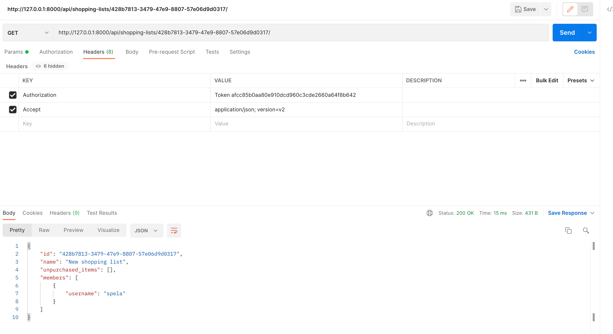
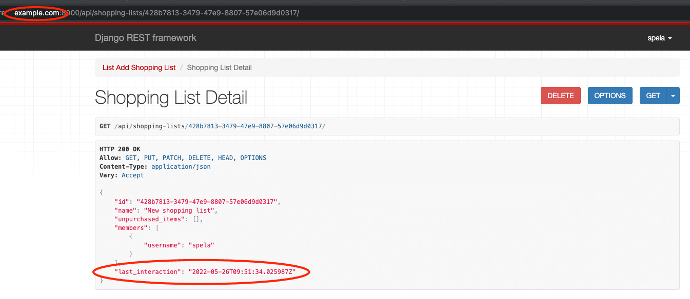
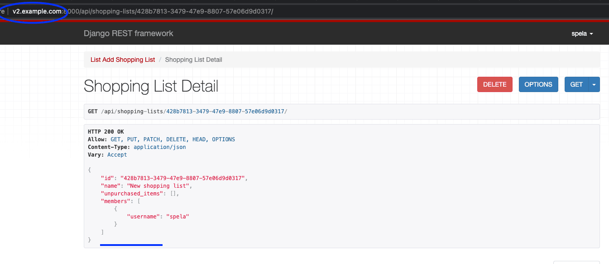

# Versioning

Source: https://testdriven.io/courses/django-rest-framework/api-versioning/

When maintaining a real-life RESTful API, you'll sooner or later need to make some breaking changes. Changes need to be introduced incrementally and transparently -- both of which you can achieve via versioning.

DRF supports multiple versioning schemes:

1. AcceptHeaderVersioning
2. URLPathVersioning
3. NamespaceVersioning
4. HostNameVersioning
5. QueryParameterVersioning

## Setup

For example, you could update the ShoppingListDetail view to choose the serializer based on the version parameter:
```python
# shopping_list/api/views.py


from shopping_list.api.serializers import ShoppingListSerializer,ShoppingListSerializerV2

class ShoppingListDetail(generics.RetrieveUpdateDestroyAPIView):
    queryset = ShoppingList.objects.all()
    permission_classes = [ShoppingListMembersOnly]

    def get_serializer_class(self):
        if self.request.version == "v2":
            return ShoppingListSerializerV2
        return ShoppingListSerializer
```
The second version of the serializer would look something like this:

```python
# shopping_list/api/serializers.py


# original serializer:
class ShoppingListSerializer(serializers.ModelSerializer):
    members = UserSerializer(many=True, read_only=True)
    unpurchased_items = serializers.SerializerMethodField()

    class Meta:
        model = ShoppingList
        fields = ["id", "name", "unpurchased_items", "members", "last_interaction"]

    def get_unpurchased_items(self, obj) -> List[UnpurchasedItem]:
        return [{"name": shopping_item.name} for shopping_item in obj.shopping_items.filter(purchased=False)][:3]

# new serializer:
class ShoppingListSerializerV2(serializers.ModelSerializer):
    members = UserSerializer(many=True, read_only=True)
    unpurchased_items = serializers.SerializerMethodField()

    class Meta:
        model = ShoppingList
        fields = ["id", "name", "unpurchased_items", "members"]  # last_interaction removed

    def get_unpurchased_items(self, obj) -> List[UnpurchasedItem]:
        return [{"name": shopping_item.name} for shopping_item in obj.shopping_items.filter(purchased=False)][:3]
```
Now let's see how to get DRF to use different serializers based on the incoming request for different types of versioning.

## AcceptHeaderVersioning

According to the DRF docs, versioning based on accept headers is considered the best practice.

In short, DRF gets info about the version from the HTTP request Accept header.

To use AcceptHeaderVersioning, inside REST_FRAMEWORK settings within the settings.py file, set DEFAULT_VERSIONING_CLASS to AcceptHeaderVersioning:

```python
# core/settings.py


REST_FRAMEWORK = {
 # ...
    "DEFAULT_VERSIONING_CLASS": "rest_framework.versioning.AcceptHeaderVersioning",
}
```



## URLPathVersioning

With URLPathVersioning, the URL pattern includes a version key argument -- e.g., v1/api/ or v2/api.

```python
# core/settings.py


REST_FRAMEWORK = {
    # other DRF settings
    "DEFAULT_VERSIONING_CLASS": "rest_framework.versioning.URLPathVersioning",
}
```

Add a second version URL pattern to the urls.py file:

```python
# core/urls.py


from django.urls import path, re_path

urlpatterns = [
    # ...
    path("api/shopping-lists/<uuid:pk>/", ShoppingListDetail.as_view(), name="shopping-list-detail"), # removing this url would be a breaking change
    re_path(r"(?P<version>(v2))/api/shopping-lists/(?P<pk>\S+)/$", ShoppingListDetail.as_view(), name="shopping-list-detail-v2"), # adding url for the same view with versioning
]
```
## NamespaceVersioning

NamespaceVersioning is the same as the URLPathVersioning for the client. The only difference is that it uses namespaces instead of URL keyword arguments.

In the core urls.py file, you just need to add a namespace like so:

```python
# core/urls.py


urlpatterns = [
    path("admin/", admin.site.urls),
    path("", include("shopping_list.urls", namespace="v1")),
    path("v2/", include("shopping_list.urls", namespace="v2")),
]
```
Now, the namespace will be passed to all the included URLs.

Without any additional change, now if you navigate to http://127.0.0.1:8000/v2/api/shopping-lists/<SHOPPING-LIST-UUID>/, you'll see that the second serializer is used. The result is the same as with URLPathVersioning.

## HostNameVersioning

HostNameVersioning gets the requested version based on the hostname.

To use it, DEFAULT_VERSIONING_CLASS must be set to HostNameVersioning:

```python
# core/settings.py


REST_FRAMEWORK = {
    # other DRF settings
    "DEFAULT_VERSIONING_CLASS": "rest_framework.versioning.HostNameVersioning",
}
```

Now a subdomain can serve a different version of the app.

Main domain:

Subdomain:


## QueryParameterVersioning

QueryParameterVersioning allows a client to include the version as a query parameter -- e.g., api?version=v1 or api?version=v2.

Change the DEFAULT_VERSIONING_CLASS to URLPathVersioning:

```python
# core/settings.py


REST_FRAMEWORK = {
    # other DRF settings
    "DEFAULT_VERSIONING_CLASS": "rest_framework.versioning.QueryParameterVersioning",
}
```

You can test this option directly in the browser by adding a query parameter to the URL: http://127.0.0.1:8000/v2/api/shopping-lists/<SHOPPING-LIST-UUID>/?version=v2.

