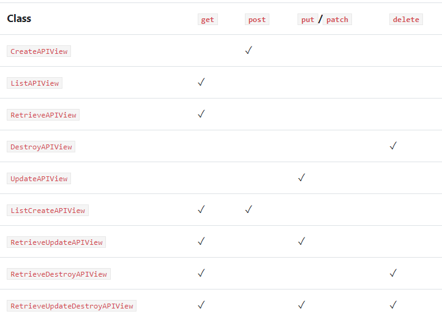

# Concrete Views

Concrete views do most of the work that we need to do on our own when using APIView. They use mixins as their basic building blocks, combine the building blocks with GenericAPIView, and bind actions to the methods.

Example:
```python
class ListCreateAPIView(mixins.ListModelMixin,
                        mixins.CreateModelMixin,
                        GenericAPIView):

    def get(self, request, *args, **kwargs):
        return self.list(request, *args, **kwargs)

    def post(self, request, *args, **kwargs):
        return self.create(request, *args, **kwargs)
```        

|Class|	Usage|	Method handler	|Extends mixin|
|-|-|-|-|
|CreateAPIView|	create-only|	post|	CreateModelMixin|
|ListAPIView|	read-only for multiple instances|	get|	ListModelMixin|
|RetrieveAPIView|	read-only for single instance	|get	|RetrieveModelMixin|
|DestroyAPIView|	delete-only for single instance	|delete	|DestroyModelMixin|
|UpdateAPIView|	update-only for single instance	put, |patch|	UpdateModelMixin|
|ListCreateAPIView|	read-write for multiple instances	|get, post|	CreateModelMixin, ListModelMixin|
|RetrieveUpdateAPIView|	read-update for single instance	|get, put, patch	|RetrieveModelMixin, UpdateModelMixin|
|RetrieveDestroyAPIView|	read-delete for single instance	|get, delete	|RetrieveModelMixin, DestroyModelMixin|
|RetrieveUpdateDestroyAPIView|	read-update-delete for single instance|	get, put, patch, delete	|RetrieveModelMixin, UpdateModelMixin, DestroyModelMixin|



All classes that extend from a concrete view need:

* queryset
* serializer class