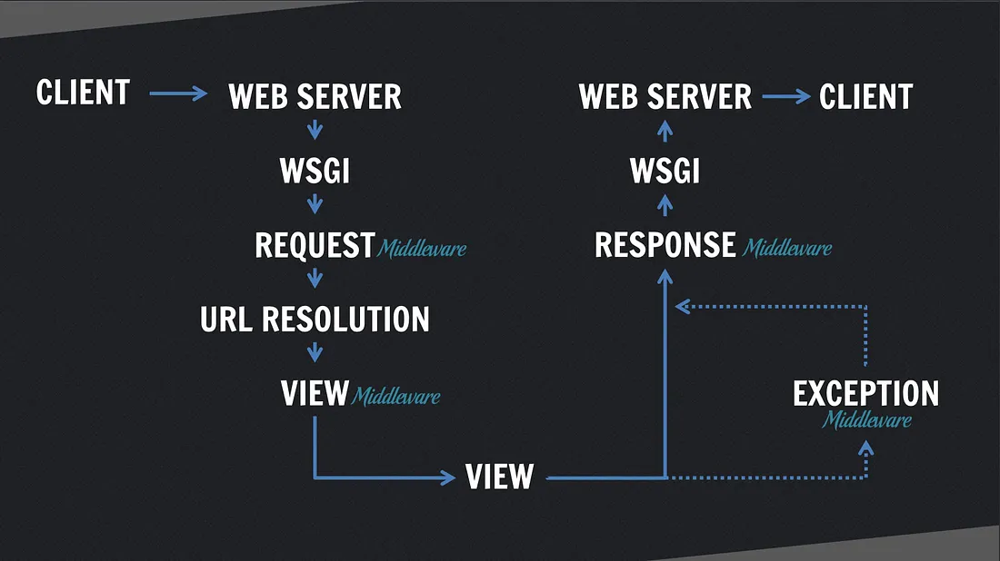

# Request/response cycle

Source: https://medium.com/@ksarthak4ever/django-request-response-cycle-2626e9e8606e



## WSGI
As we know a Web server is a program that uses HTTP (Hypertext Transfer Protocol) to serve the files that form Web pages to users, in response to their requests, which are forwarded by their computers’ HTTPclients.

WSGI is a tool created to solve a basic problem: connecting a web server to a web framework. WSGI has two sides: the ‘server’ side and the ‘application’ side. To handle a WSGI response, the server executes the application and provides a callback function to the application side. The application processes the request and returns the response to the server using the provided callback. Essentially, the WSGI handler acts as the gatekeeper between your web server (Apache, NGINX, etc) and your Django project.

Between the server and the application lie the middlewares. You can think of middlewares as a series of bidirectional filters: they can alter (or short-circuit) the data flowing back and forth between the network and your Django application.

## Single request flow

When the user makes a request of your application, a WSGI handler is instantiated, which:

1. imports your settings.py file and Django’s exception classes.
2. loads all the middleware classes it finds in the MIDDLEWARE_CLASSES or MIDDLEWARES(depending on Django version) tuple located in settings.py
3. builds four lists of methods which handle processing of request, view, response, and exception.
4. loops through the request methods, running them in order
5. resolves the requested URL
6. loops through each of the view processing methods
7. calls the view function (usually rendering a template)
8. processes any exception methods
9. loops through each of the response methods, (from the inside out, reverse order from request middlewares)
10. finally builds a return value and calls the callback function to the web server

## Layers of Django Application
1. Request Middlewares
2. URL Router(URL Dispatcher)
3. Views
4. Context Processors
5. Template Renderers
6. Response Middlewares

## Middlewares

There are four key points you can hook into the request/response cycle through your own custom middleware: ```process_request```, ```process_response```, ```process_view```, and ```process_exception```. Think of an onion: request middlewares are executed from the outside-in, hit the view at the center, and return through response middlewares back to the surface.