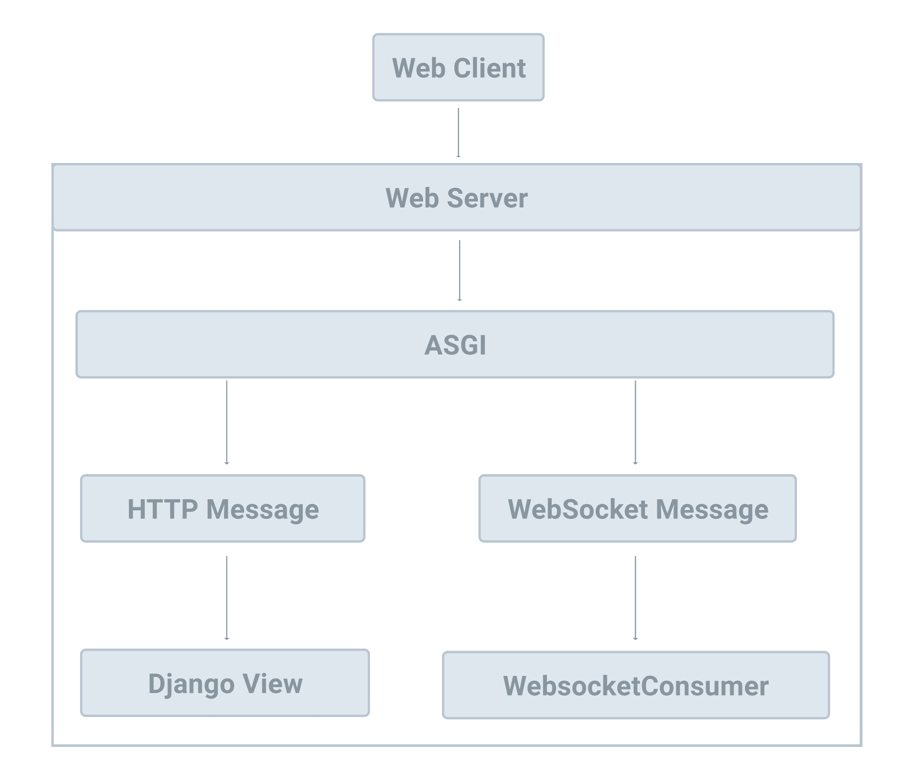

# Websockets

> Source: https://testdriven.io/courses/django-celery/websockets/#H-2-websocket

## WebSocket
WebSocket is a computer communications protocol, providing full-duplex communication channels over a single TCP connection.

When a web client establishes a WebSocket connection with a server, the connection stays alive and the client and server can send messages to each other.

## ASGI vs WSGI

> ASGI is a spiritual successor to WSGI, the long-standing Python standard for compatibility between web servers, frameworks, and applications.

In short, ASGI was created to add support for WebSockets, HTTP/2, and async/await, none of which are supported by WSGI. Like WSGI, it's an interface between Django and a web server (like Nginx).

As you can see, ASGI handles:

1. Standard HTTP requests from the web server to a Django view and returns HTTP responses back to the web server.
2. WebSocket connections between the web server and WebSocket Consumers for sending and receiving messages.
