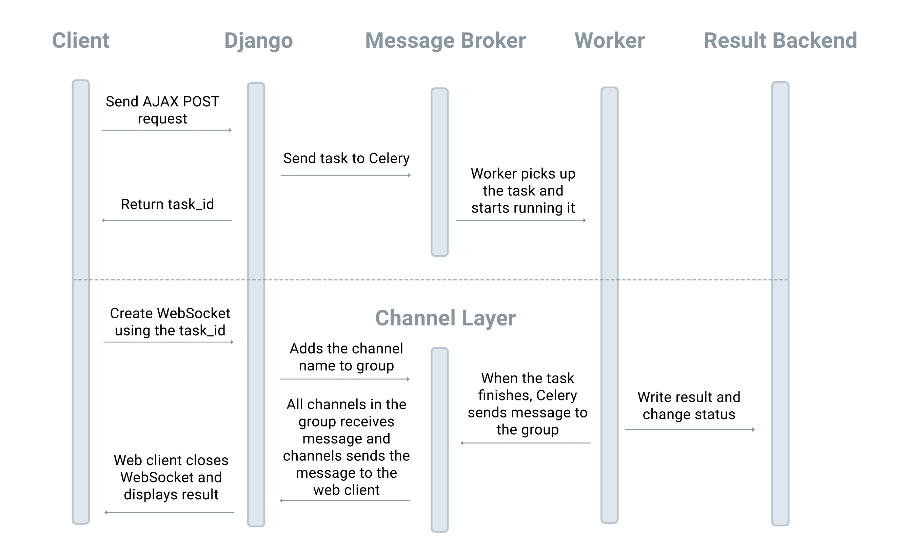
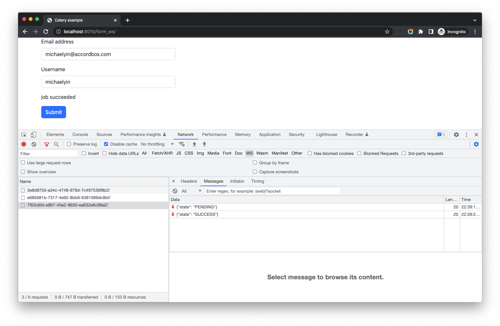

# Django Channels

> Source: https://testdriven.io/courses/django-celery/websockets/#H-5-django-channels

## Django Channels

Django Channels is a project that takes Django and extends its abilities beyond HTTP -- to handle WebSockets, chat protocols, IoT protocols, and more. It’s built on a Python specification called ASGI.

In Django Channels:

1. Consumers are akin to regular Django views. However, regular views can only process incoming requests whereas a consumer can send and receive messages and react to a WebSocket connection being opened or closed.
2. Channels are mailboxes that messages can be sent to. Each channel has a name. Anyone who has the name of a channel can send a message to that channel.
3. Groups are collections of related channels. Each group has a name. Anyone who has the name of a group can add or remove a channel to the group by name and send a message to all channels in the group.

## Workflow



> For simplicity, the web server and ASGI interface were omitted from the above diagram.

1. The client sends an AJAX request to a Django view to trigger a Celery task.
2. Django returns a task_id which can be used to receive messages about the task.
3. The client then uses the task_id to create a WebSocket connection via ws://127.0.0.1:8010/ws/task_status/{task_id}.
4. When the Django consumer receives the WebSocket request, it registers to receive group events sent to a group with the task ID.
5. After the Celery task finishes processing, Celery sends a message to the group and the consumer instance receives the message as well.
6. The consumer then sends a message back to the client with the task status and result.
7. The client closes the WebSocket and displays the result on the page.

## Implementation

```
# requirements.txt

daphne==4.0.0
channels==4.0.0
channels-redis==4.1.0
```

```python
# django_celery_example/settings.py
INSTALLED_APPS = [
    'daphne',  # should put this on top

    ...

    'channels',
]
```
Also, in your settings comment out the WSGI_APPLICATION and add the ASGI_APPLICATION config:

```python
# django_celery_example/settings.py

# WSGI_APPLICATION = 'django_celery_example.wsgi.application'
ASGI_APPLICATION = 'django_celery_example.asgi.application'
```

```python
# django_celery_example/settings.py

CHANNEL_LAYERS = {
    'default': {
        'BACKEND': 'channels_redis.core.RedisChannelLayer',
        'CONFIG': {
            "hosts": [(os.environ.get("CHANNELS_REDIS", "redis://127.0.0.1:6379/0"))],
        },
    },
}
```

```
# .env

CHANNELS_REDIS=redis://redis:6379/0
```

```python
# django_celery_example/asgi.py

import os

from channels.routing import ProtocolTypeRouter, URLRouter
from django.core.asgi import get_asgi_application

from polls import routing

os.environ.setdefault('DJANGO_SETTINGS_MODULE', 'django_celery_example.settings')

application = ProtocolTypeRouter({
    "http": get_asgi_application(),
    'websocket': URLRouter(
        routing.urlpatterns
    )
})
```

Notes:

1. django_celery_example/asgi.py is the entry point into the app.
2. By default, we do not need to config the HTTP router since Channels handles this for us.
3. We added the websocket router along with routing.urlpatterns to point to the polls app.

> In Channels, a router is akin to Django's URL configuration.

```python
# polls/routing.py

from django.urls import path

from polls import consumers


urlpatterns = [
    path('ws/task_status/<task_id>/', consumers.TaskStatusConsumer.as_asgi()),
]
```

Here, the `ws://localhost:8010/ws/task_status/{task_id}/` URL points to the `consumers.TaskStatusConsumer` consumer.

```python
# polls/consumers.py

import json

from asgiref.sync import async_to_sync
from channels.layers import get_channel_layer
from channels.generic.websocket import WebsocketConsumer
from celery.result import AsyncResult


def get_task_info(task_id):
    """
    return task info according to the task_id
    """
    task = AsyncResult(task_id)
    state = task.state

    if state == 'FAILURE':
        error = str(task.result)
        response = {
            'state': state,
            'error': error,
        }
    else:
        response = {
            'state': state,
        }
    return response


def notify_channel_layer(task_id):
    """
    This function would be called in Celery task.

    Since Celery now still not support `asyncio`, so we should use async_to_sync
    to make it synchronous

    https://channels.readthedocs.io/en/stable/topics/channel_layers.html#using-outside-of-consumers
    """
    channel_layer = get_channel_layer()
    async_to_sync(channel_layer.group_send)(
        task_id,
        {'type': 'update_task_status', 'data': get_task_info(task_id)}
    )


class TaskStatusConsumer(WebsocketConsumer):
    def connect(self):
        self.task_id = self.scope['url_route']['kwargs']['task_id']

        async_to_sync(self.channel_layer.group_add)(
            self.task_id,
            self.channel_name
        )

        self.accept()

        self.send(text_data=json.dumps(get_task_info(self.task_id)))

    def disconnect(self, close_code):
        async_to_sync(self.channel_layer.group_discard)(
            self.task_id,
            self.channel_name
        )

    def update_task_status(self, event):
        data = event['data']

        self.send(text_data=json.dumps(data))
```

Notes:

1. The get_task_info helper function returns a dict that contains the task state for the given task ID.
2. notify_channel_layer, another helper, is called by Celery to send status notifications to TaskStatusConsumer.
3. In TaskStatusConsumer.connect, we get the task_id from self.scope, and then add the current channel to the task_id group.
4. In TaskStatusConsumer.update_task_status, if the consumer receives an event which has a type of update_task_status, it will send the data back to client.

```python
# polls/tasks.py
from celery.signals import task_postrun
from polls.consumers import notify_channel_layer


@task_postrun.connect
def task_postrun_handler(task_id, **kwargs):
    """
    When celery task finish, send notification to Django channel_layer, so Django channel would receive
    the event and then send it to web client
    """
    notify_channel_layer(task_id)
```

Here, we created a Celery signal handler that will be called after each Celery task is executed, which sends a message to the relevant channel via get_channel_layer.

```python
# polls/urls.py

from django.urls import path

from polls.views import subscribe, task_status, webhook_test, webhook_test_async, subscribe_ws


urlpatterns = [
    path('form/', subscribe, name='form'),
    path('task_status/', task_status, name='task_status'),
    path('webhook_test/', webhook_test, name='webhook_test'),
    path('webhook_test_async/', webhook_test_async, name='webhook_test_async'),
    path('form_ws/', subscribe_ws, name='form_ws'),
]
```

```python
# polls/views.py

def subscribe_ws(request):
    """
    Use Websocket to get notification of Celery task, instead of using ajax polling
    """
    if request.method == 'POST':
        form = YourForm(request.POST)
        if form.is_valid():
            task = sample_task.delay(form.cleaned_data['email'])
            # return the task id so the JS can poll the state
            return JsonResponse({
                'task_id': task.task_id,
            })

    form = YourForm()
    return render(request, 'form_ws.html', {'form': form})
```

So, if the form passes validation, we send the submitted email to the Celery worker and return the task_id back to the client. The client will then use the task_id to open a WebSocket connection.

```html
# polls/templates/form_ws.html 

<!DOCTYPE html>
<html lang="en">

<head>
  <meta charset="UTF-8">
  <meta name="viewport" content="width=device-width, initial-scale=1.0">
  <title>Celery example</title>
    <link href="https://cdn.jsdelivr.net/npm/bootstrap@5.2.3/dist/css/bootstrap.min.css"
          rel="stylesheet"
          integrity="sha384-rbsA2VBKQhggwzxH7pPCaAqO46MgnOM80zW1RWuH61DGLwZJEdK2Kadq2F9CUG65"
          crossorigin="anonymous"
    >
</head>

<body>
<div class="container">
  <div class="row">
    <div class="col-12 col-md-4">
      <form id="your-form">
        
        <div class="mb-3">
          <label for="email" class="form-label">Email address</label>
          {{ form.email }}
        </div>
        <div class="mb-3">
          <label for="username" class="form-label">Username</label>
          {{ form.username }}
        </div>
        <div class="mb-3" id="messages"></div>
        <button type="submit" class="btn btn-primary">Submit</button>
      </form>
    </div>
  </div>
</div>

<script src="https://cdn.jsdelivr.net/npm/bootstrap@5.2.3/dist/js/bootstrap.bundle.min.js"
        integrity="sha384-kenU1KFdBIe4zVF0s0G1M5b4hcpxyD9F7jL+jjXkk+Q2h455rYXK/7HAuoJl+0I4"
        crossorigin="anonymous">
</script>
</body>
</html>
```

Next, add the JavaScript code to the template file as well:

```html
<script>
  function getCookie(name) {
    let cookieValue = null;
    if (document.cookie && document.cookie !== '') {
      const cookies = document.cookie.split(';');
      for (let i = 0; i < cookies.length; i++) {
        const cookie = cookies[i].trim();
        // Does this cookie string begin with the name we want?
        if (cookie.substring(0, name.length + 1) === (name + '=')) {
          cookieValue = decodeURIComponent(cookie.substring(name.length + 1));
          break;
        }
      }
    }
    return cookieValue;
  }

  function updateProgress(yourForm, task_id, btnHtml) {
    const ws_url = `/ws/task_status/${task_id}/`;
    const WS = new WebSocket((location.protocol === 'https:' ? 'wss' : 'ws') + '://' + window.location.host + ws_url);

    WS.onmessage = function (event) {
      const res = JSON.parse(event.data);
      const taskStatus = res.state;

      if (['SUCCESS', 'FAILURE'].includes(taskStatus)) {
        const msg = yourForm.querySelector('#messages');
        const submitBtn = yourForm.querySelector('button[type="submit"]');

        if (taskStatus === 'SUCCESS') {
          msg.innerHTML = 'job succeeded';
        } else if (taskStatus === 'FAILURE') {
          msg.innerHTML = res.error;
        }

        submitBtn.disabled = false;
        submitBtn.innerHTML = btnHtml;

        // close the websocket because we do not need it now
        WS.close();
      }
    }
  }

  document.addEventListener("DOMContentLoaded", function () {
    const yourForm = document.getElementById("your-form");
    yourForm.addEventListener("submit", function (event) {
      event.preventDefault();
      const submitBtn = yourForm.querySelector('button[type="submit"]');
      const btnHtml = submitBtn.innerHTML;
      const spinnerHtml = 'Processing...';
      submitBtn.disabled = true;
      submitBtn.innerHTML = spinnerHtml;

      const msg = yourForm.querySelector('#messages');
      msg.innerHTML = '';

      // Get all field data from the form
      const formData = new URLSearchParams(new FormData(yourForm));

      fetch('/form_ws/', {
        method: 'POST',
        headers: {
          'X-CSRFToken': getCookie('csrftoken'),
        },
        body: formData,
      })
        .then(response => response.json())
        .then((res) => {
          // after we get Celery task id, we start polling
          const task_id = res.task_id;
          updateProgress(yourForm, task_id, btnHtml);
          console.log(res);
        })
        .catch((error) => {
          console.error('Error:', error)
        });
    });
  });

</script>
```

What's happening here?

1. On form submit, we disabled the submit button and replaced the button text with "Processing...", to indicate to the end user that some sort of backend processing is happening. We also serialized the form input values and sent them along with the POST request to /form_ws/.
2. When a successful response comes back with the task ID, we passed the ID to the updateProgress function, which creates a WebSocket connection to /ws/task_status/${task_id}/.
3. After the WebSocket is connected, when the client receives a message from the server, the WS.onmessage callback will fire.
4. If we receive the task status from the server, which tells us the task has finished, WS.close is called to close the WebSocket.
5. Once complete, we displayed the appropriate message, updated the text in the button, and enabled the submit button.

Navigate to http://localhost:8010/form_ws in your browser. Input a random name and email address and click submit.

Depending on the outcome of the API call, you'll see either a success or error message. The key here is that the web process is not blocked during the five second delay from the API call: https://httpbin.org/delay/5.

If you open devtools to check the WS, you can see all the messages.



* As you can see, when we connect to the server, it returned the task status PENDING.
* When the task finishes, the signal handler was executed and the message was sent to the channel_layer (RedisChannelLayer in this case), then the consumer received the message and sent it to the client.

Finally, to improve performance, let's update the methods in TaskStatusConsumer to handle async processing in polls/consumers.py

```python
# polls/consumers.py
from channels.generic.websocket import AsyncWebsocketConsumer

...

class TaskStatusConsumer(AsyncWebsocketConsumer):
    async def connect(self):
        self.task_id = self.scope['url_route']['kwargs']['task_id']

        await self.channel_layer.group_add(
            self.task_id,
            self.channel_name
        )

        await self.accept()

        await self.send(text_data=json.dumps(get_task_info(self.task_id)))

    async def disconnect(self, close_code):
        await self.channel_layer.group_discard(
            self.task_id,
            self.channel_name
        )

    async def update_task_status(self, event):
        data = event['data']

        await self.send(text_data=json.dumps(data))
```

Here, we:

1. Updated the base class of our consumer from WebsocketConsumer to AsyncWebsocketConsumer.
2. Used async to declare asynchronous methods.
3. Replaced async_to_sync with await to call the async functions. Thus, channel_layer.group_add, channel_layer.group_send, and channel_layer.group_discard are async by default, which is why we needed to use async_to_sync() before this refactor.

It's worth knowing that we didn't update the notify_channel_layer helper to use async/await since the function is called from Celery and Celery does not support asyncio yet.

