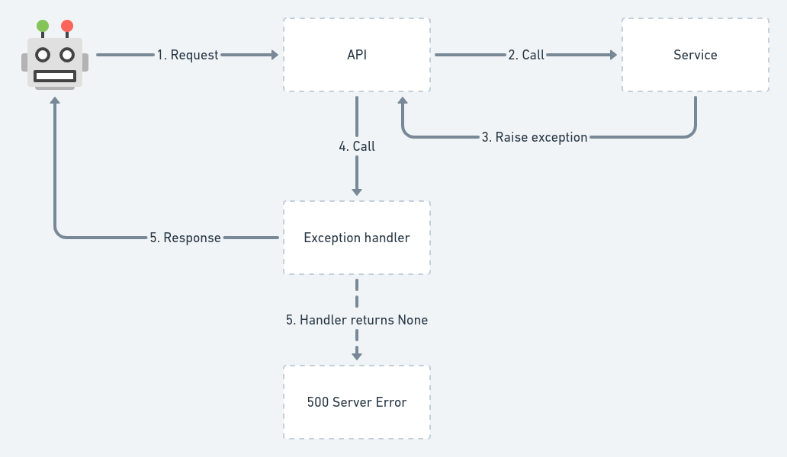

# Errors & Exception Handling

Source: https://github.com/HackSoftware/Django-Styleguide?tab=readme-ov-file#errors--exception-handling

> 👀 If you want the code, hop to the Styleguide-Example project - https://github.com/HackSoftware/Styleguide-Example/blob/master/styleguide_example/api/exception_handlers.py

Errors & exception handling is a big topic & quite often - the details are specific for a given project.

That's why we'll split things into two - general guidelines, followed by some specific approaches for error handling.

Our general guidelines are:

* Know how exception handling works (we'll give context for Django Rest Framework).
* Describe how your API errors are going to look like.
* Know how to change the default exception handling behavior.

Followed by some specific approaches:

* Use DRF's default exceptions, with very little modifications.
* HackSoft's proposed approach.

If you are looking for a standard way to structure your error responses, check RFC7807 - https://datatracker.ietf.org/doc/html/rfc7807

## How exception handling works (in the context of DRF)

DRF has an excellent guide on how exceptions are being handled, so make sure to read it first - https://www.django-rest-framework.org/api-guide/exceptions/



Basically, if the exception handler cannot handle the given exception & returns None, this will result in an unhandled exception & a 500 Server Error. This is often good, because you won't be silencing errors, that you need to pay attention to.

### DRF's ValidationError

For example, if we simply raise a rest_framework.exceptions.ValidationError like that:

```python
from rest_framework import exceptions


def some_service():
    raise ValidationError("Error message here.")
```

The response payload is going to look like this:

```python
["Some message"]
```

This looks strange, because if we do it like this:

```python
from rest_framework import exceptions


def some_service():
    raise exceptions.ValidationError({"error": "Some message"})
```

The response payload is going to look like this:

```python
{
  "error": "Some message"
}
```

That's basically what we passed as the detail of the ValidationError. But it's a different data structure from the initial array.

Now, if we decide to raise another of the DRF's built-in exceptions:
```python
from rest_framework import exceptions


def some_service():
    raise exceptions.NotFound()
```
The response payload is going to look like this:

```python
{
  "detail": "Not found."
}
```
That's entirely different from what we saw as behavior from the ValidationError and this might cause problems.

So far, the default DRF behavior can get us:

* An array.
* A dictionary.
* A specific {"detail": "something"} result.

So if we need to use the default DRF behavior, we need to take care of this inconsistency.

### Django's ValidationError

Now, DRF's default exception handling is not playing nice with Django's ValidationError.

This piece of code:
```python
from django.core.exceptions import ValidationError as DjangoValidationError


def some_service():
    raise DjangoValidationError("Some error message")
```
Will result in an unhandled exception, causing 500 Server Error.

This will also happen if this ValidationError comes from model validation, for example:

```python
def some_service():
    user = BaseUser()
    user.full_clean()  # Throws ValidationError
    user.save()
```
This will also result in 500 Server Error.

If we want to start handling this, as if it was rest_framework.exceptions.ValidationError, we need to roll-out our own custom exception handler:
```python
from django.core.exceptions import ValidationError as DjangoValidationError

from rest_framework.views import exception_handler
from rest_framework.serializers import as_serializer_error
from rest_framework import exceptions


def custom_exception_handler(exc, ctx):
    if isinstance(exc, DjangoValidationError):
        exc = exceptions.ValidationError(as_serializer_error(exc))

    response = exception_handler(exc, ctx)

    # If unexpected error occurs (server error, etc.)
    if response is None:
        return response

    return response
```
This is basically the default implementation, with the addition of this piece of code:

```python
if isinstance(exc, DjangoValidationError):
    exc = exceptions.ValidationError(as_serializer_error(exc))
```

Since we need to map between django.core.exceptions.ValidationError and rest_framework.exceptions.ValidationError, we are using DRF's as_serializer_error, which is used internally in the serializers, just for that.

With that, we can now have Django's ValidationError playing nice with DRF's exception handler.

## Describe how your API errors are going to look like.

This is very important and should be done as early as possible in any given project.

This is basically agreeing upon what the interface of your API errors - How an error is going to look like as an API response?

This is very project specific, you can use some of the popular APIs for inspiration:

* Stripe - https://stripe.com/docs/api/errors

As an example, we might decide that our errors are going to look like this:
* 4** and 5** status codes for different types of errors.
* Each error will be a dictionary with a single message key, containing the error message.

```python
{
  "message": "Some error message here"
}
```
That's simple enough:

* 400 will be used for validation errors.
* 401 for auth errors.
* 403 for permission errors.
* 404 for not found errors.
* 429 for throttling errors.
* 500 for server errors (we need to be careful not to silence an exception causing 500 and always report that in services like Sentry)

Again, this is up to you & it's specific to the project.\

## Know how to change the default exception handling behavior.
This is also important, because when you decide how your errors are going to look like, you need to implement this as custom exception handling.

We've already provided an example for that in the paragraph above, talking about Django's ValidationError.

We'll also provide additional examples in the sections below.

## Approach 1 - Use DRF's default exceptions, with very little modifications.

DRF's error handling is good. It'd be great, if the end result was always consistent. Those are the little modifications that we are going to do.

We want to end up with errors, always looking like that:
```python
{
  "detail": "Some error"
}
```
```python
{
  "detail": ["Some error", "Another error"]
}
```
```python
{
  "detail": { "key": "... some arbitrary nested structure ..." }
}
```
Basically, make sure we always have a dictionary with a detail key.

Additonally, we want to handle Django's ValidationError as well.

In order to achieve that, this is how our custom exception handler is going to look like:
```python
from django.core.exceptions import ValidationError as DjangoValidationError, PermissionDenied
from django.http import Http404

from rest_framework.views import exception_handler
from rest_framework import exceptions
from rest_framework.serializers import as_serializer_error


def drf_default_with_modifications_exception_handler(exc, ctx):
    if isinstance(exc, DjangoValidationError):
        exc = exceptions.ValidationError(as_serializer_error(exc))

    if isinstance(exc, Http404):
        exc = exceptions.NotFound()

    if isinstance(exc, PermissionDenied):
        exc = exceptions.PermissionDenied()

    response = exception_handler(exc, ctx)

    # If unexpected error occurs (server error, etc.)
    if response is None:
        return response

    if isinstance(exc.detail, (list, dict)):
        response.data = {
            "detail": response.data
        }

    return response
```
We kind-of replicate the original exception handler, so we can deal with an APIException after that (looking for detail).

Now, lets run a set of tests:

Code:
```python
def some_service():
    raise DjangoValidationError("Some error message")
```
Response:
```python
{
  "detail": {
    "non_field_errors": ["Some error message"]
  }
}
```
---
Code:
```python
from django.core.exceptions import PermissionDenied

def some_service():
    raise PermissionDenied()
```
Response:
```python
{
  "detail": "You do not have permission to perform this action."
}
```
---
Code:
```python
from django.http import Http404

def some_service():
    raise Http404()
```
Response:
```python
{
  "detail": "Not found."
}
```
---
Code:
```python
def some_service():
    raise RestValidationError("Some error message")
```
Response:
```python
{
  "detail": ["Some error message"]
}
```
---
Code:
```python
def some_service():
    raise RestValidationError(detail={"error": "Some error message"})
```
Response:
```python
{
  "detail": {
    "error": "Some error message"
  }
}
```
---
Code:
```python
class NestedSerializer(serializers.Serializer):
    bar = serializers.CharField()


class PlainSerializer(serializers.Serializer):
    foo = serializers.CharField()
    email = serializers.EmailField(min_length=200)

    nested = NestedSerializer()


def some_service():
    serializer = PlainSerializer(data={
        "email": "foo",
        "nested": {}
    })
    serializer.is_valid(raise_exception=True)
```
Response:
```python
{
  "detail": {
    "foo": ["This field is required."],
    "email": [
      "Ensure this field has at least 200 characters.",
      "Enter a valid email address."
    ],
    "nested": {
      "bar": ["This field is required."]
    }
  }
}
```
---
Code:
```python
from rest_framework import exceptions


def some_service():
    raise exceptions.Throttled()
```
Response:
```python
{
  "detail": "Request was throttled."
}
```
## Approach 2 - HackSoft's proposed way
We are going to propose an approach, that can be easily extended into something that works well for you.

Here are the key ideas:

* Your application will have its own hierarchy of exceptions, that are going to be thrown by the business logic.
* Lets say, for simplicity, that we are going to have only 1 error - ApplicationError.
  * This is going to be defined in a special core app, within exceptions module. Basically, having project.core.exceptions.ApplicationError.
* We want to let DRF handle everything else, by default.
* ValidationError is now special and it's going to be handled differently.
  * ValidationError should only come from either serializer or a model validation.
---
We are going to define the following structure for our errors:

```python
{
  "message": "The error message here",
  "extra": {}
}
```
The extra key can hold arbitrary data, for the purposes of passing information to the frontend.

For example, whenever we have a ValidationError (usually coming from a Serializer or a Model), we are going to present the error like that:
```python
{
  "message": "Validation error.",
  "extra": {
    "fields": {
      "password": ["This field cannot be blank."],
      "email": ["This field cannot be blank."]
    }
  }
}
```
This can be communicated with the frontend, so they can look for extra.fields, to present those specific errors to the user.

In order to achieve that, the custom exception handler is going to look like this:
```python
from django.core.exceptions import ValidationError as DjangoValidationError, PermissionDenied
from django.http import Http404

from rest_framework.views import exception_handler
from rest_framework import exceptions
from rest_framework.serializers import as_serializer_error
from rest_framework.response import Response

from styleguide_example.core.exceptions import ApplicationError


def hacksoft_proposed_exception_handler(exc, ctx):
    """
    {
        "message": "Error message",
        "extra": {}
    }
    """
    if isinstance(exc, DjangoValidationError):
        exc = exceptions.ValidationError(as_serializer_error(exc))

    if isinstance(exc, Http404):
        exc = exceptions.NotFound()

    if isinstance(exc, PermissionDenied):
        exc = exceptions.PermissionDenied()

    response = exception_handler(exc, ctx)

    # If unexpected error occurs (server error, etc.)
    if response is None:
        if isinstance(exc, ApplicationError):
            data = {
                "message": exc.message,
                "extra": exc.extra
            }
            return Response(data, status=400)

        return response

    if isinstance(exc.detail, (list, dict)):
        response.data = {
            "detail": response.data
        }

    if isinstance(exc, exceptions.ValidationError):
        response.data["message"] = "Validation error"
        response.data["extra"] = {
            "fields": response.data["detail"]
        }
    else:
        response.data["message"] = response.data["detail"]
        response.data["extra"] = {}

    del response.data["detail"]

    return response
```
Take a look at that code & try to understand what's going on. The strategy is - reuse as much as possible from DRF & then adjust.

Now, we are going to have the following behavior:

Code:
```python
from styleguide_example.core.exceptions import ApplicationError


def trigger_application_error():
    raise ApplicationError(message="Something is not correct", extra={"type": "RANDOM"})
```
Response:
```python
{
  "message": "Something is not correct",
  "extra": {
    "type": "RANDOM"
  }
}
```
Now, this can be extended & made to better suit your needs:

* You can have ApplicationValidationError and ApplicationPermissionError, as an additional hierarchy.
* You can reimplement DRF's default exception handler, instead of reusing it (copy-paste it & adjust to your needs).

The general idea is - figure out what kind of error handling you need and then implement it accordingly.

As you can see, we can mold exception handling to our needs.

You can start handling more stuff - for example - translating django.core.exceptions.ObjectDoesNotExist to rest_framework.exceptions.NotFound.

You can even handle all exceptions, but then, you should be sure those exceptions are being logged properly, otherwise you might silence something that's important.