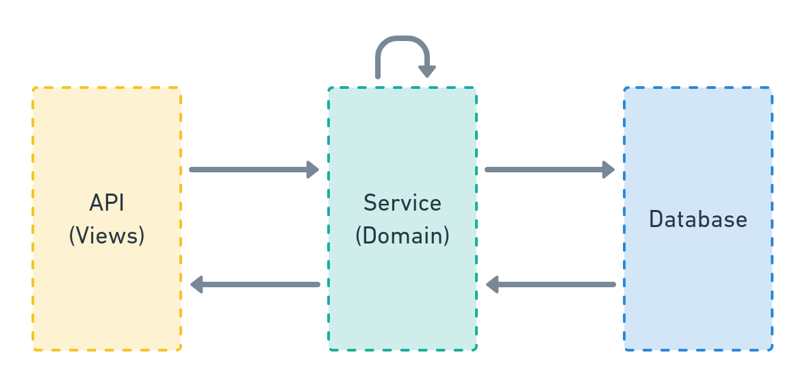

# Service

Source: https://github.com/HackSoftware/Django-Styleguide?tab=readme-ov-file#services

## What is Service?

Services are where business logic lives.

The service layer speaks the specific domain language of the software, can access the database & other resources & can interact with other parts of your system.

Here's a very simple diagram, positioning the service layer in our Django apps:

A service can be:

* A simple function.
* A class.
* An entire module.
* Whatever makes sense in your case.

In most cases, a service can be simple function that:

* Lives in <your_app>/services.py module.
* Takes keyword-only arguments, unless it requires no or one argument.
* Is type-annotated (even if you are not using mypy at the moment).
* Interacts with the database, other resources & other parts of your system.
* Does business logic - from simple model creation to complex cross-cutting concerns, to calling external services & tasks.

