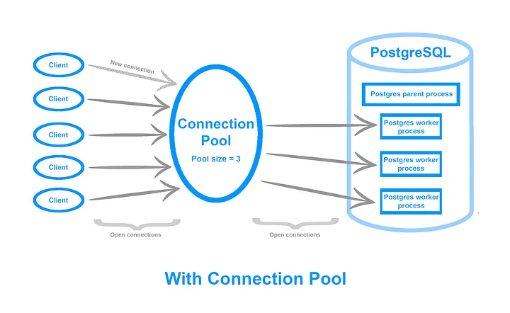
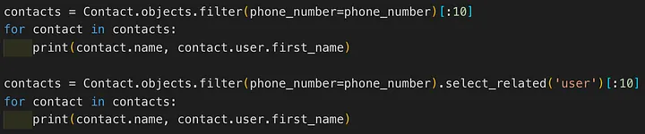

# Scalling

> Source: https://cjgiridhar.medium.com/scaling-django-for-millions-of-users-7658113e720

## Scalable Architecture

Scaling vertically means that you scale your application by upgrading the machine it is running on. You just throw more resources (RAM, CPU) on it and hope that it will be enough to support the number of requests that your app receives. This will work well in the initial days before you’d want to scale horizontally by spawning more machines that serve your application, instead of dumping more resources on a single machine and distributing traffic across your machines with the help of a load balancer.

One way to achieve horizontal scaling is to opt for a scalable architectural pattern like that of the microservices. Splitting applications to individual services (SOA) help you scale them individually as your load increases. You can also work on optimizations at a service level. You can have multiple services written in Django to scale your app horizontally. (Note: Be aware of the extra costs in terms of communication among services, the data transfer and complexities involved in managing services.)

Scaling horizontally also requires you to make your app stateless and keep the state “outside”. This can be achieved in Django with Cache Backends (Memcache or Redis) to store data on another server to achieve statelessness. Adding cache to Django can help you handle 45k requests per second.

## Connections and Connection Pooling

If you have not used Django extensively, it is easy to miss out on the CONN_MAX_AGE param in settings.py that defines the maximum lifetime of your connection. This is Django’s way of connection pooling.

By default, Django, closes the connection at the end of each request. Persistent connections avoid overloading the database for each request and the cost ( it takes 20ms to make a DB connection ) of creating a connection is also reduced. So developers should consider setting CONN_MAX_AGE to None (unlimited persistent connections) or a suitable value depending on your request volume at the applications’ end.

Way to offload the connection pooling outside of Django is using tools like PgBouncer that helps you set the pool size, the max clients you want to handle at any moment (default_pool_size), and the number of clients that can connect to the DB ( max_client_conn).Also to make sure the max_connections param in postgres.conf file is tuned to handle the number of concurrent connections to the PostgreSQL server.

## Databases

If you are not able to scale your backend, then most likely the database is your bottleneck. There are a few quick things that can help you reduce the time to process your DB query and shorten the request/response cycle to improve performance (always think about reducing the time for the request/response cycle — the holy grail).

* Choosing the right database
* Indexes — Adding appropriate indexes can speed up your DB (SELECT) Queries and reduce the time to respond to users. It is best to look at slow (above 30 ms) queries and queries that are done often to look at avenues for improvements. But don’t overdo it. More indexes would impact performance of INSERT and UPDATE and also increase the load on disks to store the indexes. pgFouine is a good log analyzer tool that you may want to try to get to these slow performing queries.
* Also it is recommended that the CPU and RAM is tuned correctly for the number of client connections. Pgtune does a great job of helping you tune Postgres config by your hardware.

## Django Middleware

Coming back to Django, another way to reduce the request/response time is by removing the extra middlewares that your app is not benefiting from. Every request that is made to the Django backend passes through these middlewares and adds extra time (20–30ms) to the request/response cycle.

Example app: API calls to the Django backend from the React Native app and didn’t need to use some of the middlewares that are enabled in Django by default. Sessions (django.contrib.sessions), Messages (django.contrib.messages) and Admins (django.contrib.admin) app and corresponding middlewares (django.contrib.sessions.middleware.SessionMiddleware, django.contrib.messages.middleware.MessagesMiddleware) could be removed from settings > INSTALLED_APPS and settings > MIDDLEWARE sections respectively.

## Django Code Optimizations

There are a few best practices that you should watch out for while performing code reviews:

select_related() and prefetch_related() are designed to stop the deluge of database queries that are caused by accessing related objects. select_related works by creating an SQL join and including the fields of the related object in the SELECT statement. For this reason, select_related gets the related objects in the same database query. In this case, 2nd example is the right way to do it:

prefetch_related is handy when you’re going to get a set of things, it does a separate lookup for each relationship, and performs the join operation in Python.

Bulk queries are preferred to insert/update large amounts of datasets. Django ORM can perform multiple inserts or update operations in a single query. Typically you would batch 1000 or 5000 records and insert or update them in one go. bulk_create() and bulk_update() are the methods to be used in this case.

Only querying specific information from the DB tables also improves the response times. For instance, functions like values(), only() help you select specific fields or columns from the table when you filter data with ORM.

## Measuring

This is the most important piece in the puzzle. How do you figure something is wrong? Where is the bottleneck — is the CPU usage high or is it the Memory? Setting up monitoring systems like Prometheus (or munin) is required to identify issues and also to understand if your changes indeed fixed the issues.

Setting up debug logs in Django settings > LOGGING section also helps in understanding the time it takes to run a query. Ideally when you create an API you should make sure that the response time is under 100ms, and in turn make sure queries are executed within 20ms. Note: This setting should be enabled only in development setup.

