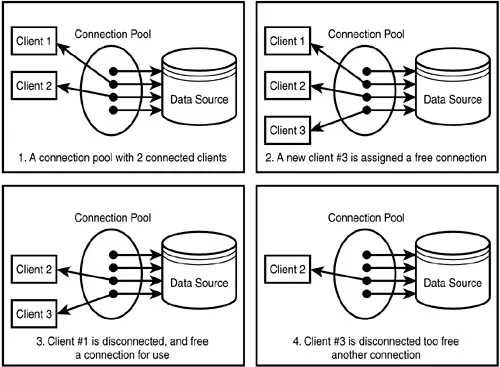

# Pooling

> Sources: 
> https://medium.com/@shreyasbulbule007/database-pooling-in-django-and-node-js-for-postgresql-db-why-what-and-how-a27bba7d17c4
> https://stackoverflow.com/questions/4041114/what-is-database-pooling

Database connection pooling is a method used to keep database connections open so they can be reused by others.

Typically, opening a database connection is an expensive operation, especially if the database is remote. You have to open up network sessions, authenticate, have authorisation checked, and so on. Pooling keeps the connections active so that, when a connection is later requested, one of the active ones is used in preference to having to create another one.



## Usual approach

Let’s say a client wants to run an SQL query on some remote AWS server. So normally a client makes a connection to the database server which is a heavy task since it involves Authentication, Authorization, Starting Network Sessions, etc. Then the given SQL query runs and obtains the result. After that, the connection is again closed permanently. A normal SQL connection is quite heavy around 1.3 MB in size [ref]. Over time when multiple such connections are concurrently opened and closed it causes a large amount of overhead which causes database performance to deteriorate and hence the high API response times in case the server does not have good resources.

## Pooling approach

With the database pooling available the connections are not immediately closed when the connection is closed by the client instead they are stored in a pool of connections that are reused for future clients. In this way, we avoid the major overhead of opening and closing the connections when new clients request new connections. The connections are only closed when certain conditions are met like ageing of the connections or inactivity.

## Pooling in Django

Adding Pooling to Django is super-duper easy. We would be using the django-db-connection-pool package.

Let's Install it first in the project’s virtual environment. I am installing the PostgreSQL version but you can choose whichever you are using.

```commandline
pip install django-db-connection-pool[postgresql]
```

Open your settings.py and replace the DATABASES settings with the one below:

```python
DATABASES = {
    'default': {
        'ENGINE': 'dj_db_conn_pool.backends.postgresql'
    },
    'POOL_OPTIONS' : {
            'POOL_SIZE': 10,
            'MAX_OVERFLOW': 10,
            'RECYCLE': 24 * 60 * 60
        }
}
```

Now here we have POOL_OPTIONS. I will explain every option in detail so that you can configure the Pool the way you want.

1. POOL_SIZE: These are the largest number of concurrent connections that would be kept alive to the Database. Note that when we start the server the connections start from 0. Defaults to 5.
2. MAX_OVERFLOW: Let’s say if the total number of active connections surpasses POOL_SIZE then they would be handled up to this limit. If a connection is closed and the total active connections are more than POOL_SIZE then it is closed and discarded instead of keeping it in a standby state inside the pool. If the total active connections surpass POOL_SIZE + MAX_OVERFLOW then the SQLalchemy that Django uses under the hood raises an exception. If you don’t want this limit you can set it to -1 to enable unlimited overflow connections. Defaults to 10.
3. RECYCLE: This is the time in seconds after which a connection in the pool is considered stale and replaced by a new connection. If you set the value to -1 then the connections are never recycled. Defaults to -1.
4. PRE_PING: When set to True, this parameter enables the pre-ping feature, which checks the health of connections in the pool before they are used. It helps to identify and discard any connections that have become stale or invalid. The default is True.
5. ECHO: Setting this parameter to True would enable logging of SQL statements and other relevant information to the console. This can be useful for debugging purposes but is usually disabled in production environments. The default is False.
6. TIMEOUT: Specifies the maximum number of seconds that a connection attempt can wait for a connection to become available in the pool. If no connection becomes available within this time, an exception is raised. The default is 30 seconds.

