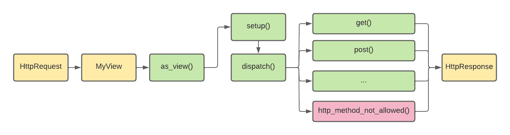

# Class-based views

Source: https://testdriven.io/blog/django-class-based-vs-function-based-views/#class-based-views-cbvs

## Pros

* Are extensible
* They take advantage of OOP concepts (most importantly inheritance)
* Great for writing CRUD views
* Cleaner and reusable code
* Django's built-in generic CBVs
* They're similar to Django REST framework views

## Cons

* Implicit code flow (a lot of stuff happens in the background)
* Use many mixins, which can be confusing
* More complex and harder to master
* Decorators require an extra import or code override

## Flow

1. An HttpRequest is routed to MyView by the Django URL dispatcher.
2. The Django URL dispatcher calls as_view() on MyView.
3. as_view() invokes setup() and dispatch().
4. dispatch() triggers a method for a specific HTTP method or http_method_not_allowed().
5. An HttpResponse is returned.

