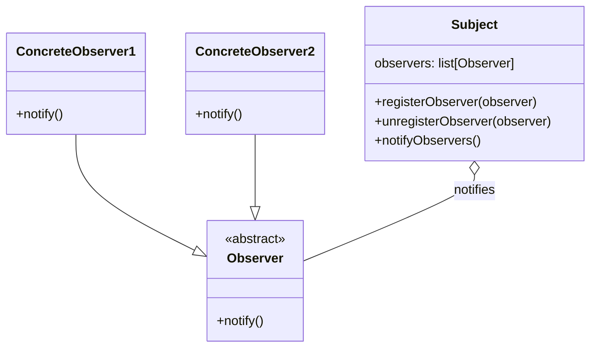
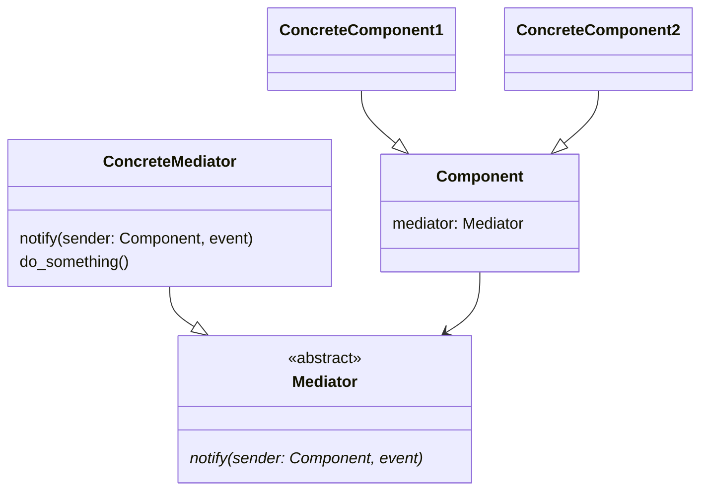
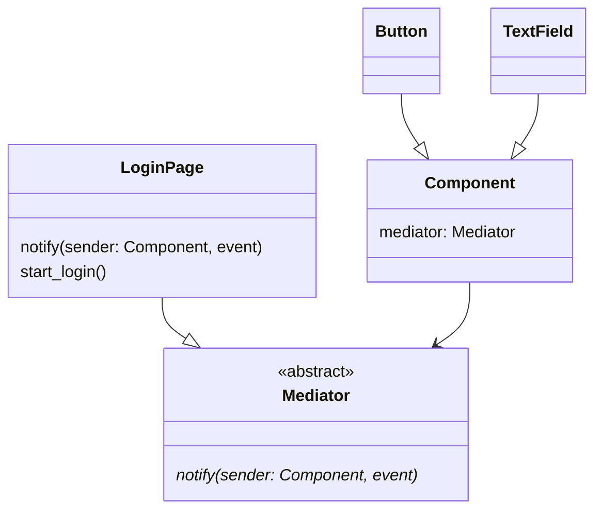

# Notification patterns

> Source: https://academy.arjancodes.com/products/the-software-designer-mindset-pythonic-patterns/categories/2149946554/posts/2160000668

## Observer pattern


* Observer abstract class for notifier objects
* Concrete subclasses of Observer class - like email notifier, sms notifier, etc.
* Subject class for business logic handling

```python
from abc import ABC, abstractmethod
from dataclasses import dataclass, field


class Observer(ABC):
    @abstractmethod
    def notify(self) -> None:
        pass


class ConcreteObserver(Observer):
    def notify(self) -> None:
        print("ConcreteObserver.notify")


@dataclass
class Subject:
    observers: list[Observer] = field(default_factory=list)

    def register_observer(self, observer: Observer) -> None:
        self.observers.append(observer)

    def unregister_observer(self, observer: Observer) -> None:
        self.observers.remove(observer)

    def notify_observers(self) -> None:
        for obs in self.observers:
            obs.notify()

    def do_something(self) -> None:
        print("Subject.do_something")
        self.notify_observers()


def main() -> None:
    subject = Subject()
    observer = ConcreteObserver()
    subject.register_observer(observer)
    subject.do_something()
```

## Mediator pattern


* Abstract `Mediator` class, that has `notify` method
* `Mediator` subclasses, that have `notify` method implemented
* `Component` class with mediator variable
* Subclasses of `Component` class
* Mediator is notified by Component, that something is happening



```python
from __future__ import annotations

from abc import ABC, abstractmethod
from dataclasses import dataclass
from typing import Optional


class Mediator(ABC):
    @abstractmethod
    def notify(self, sender: Component):
        """Notify all components that a change has occurred."""


@dataclass
class Component(ABC):
    mediator: Optional[Mediator] = None


@dataclass
class Button(Component):
    name: str = "login"

    def click(self):
        if self.mediator:
            self.mediator.notify(self)


@dataclass
class TextField(Component):
    name: str = "email"
    value: str = ""
    disabled: bool = False


@dataclass
class LoginPage(Mediator):
    text_field: TextField
    button: Button

    def __post_init__(self):
        self.text_field.mediator = self
        self.button.mediator = self

    def notify(self, sender: Component):
        if sender == self.button:
            self.start_login()

    def start_login(self):
        print("Disabling text field.")
        self.text_field.disabled = True
        print(f"Starting login process with email address {self.text_field.value}.")


def main() -> None:
    text_field = TextField(name="email", disabled=False)
    button = Button(name="login")

    # create the login page
    _ = LoginPage(text_field=text_field, button=button)

    text_field.value = "hi@arjancodes.com"
    button.click()
    print(f"Text field disabled: {text_field.disabled}")
```
## Event Aggregator / Pub-Sub

```python
# event/core.py

from typing import Callable

from lib.db import User

EventHandler = Callable[[User], None]

subscribers: dict[str, list[EventHandler]] = {}


def subscribe(event_type: str, handler: EventHandler) -> None:
    if not event_type in subscribers:
        subscribers[event_type] = []
    subscribers[event_type].append(handler)


def post_event(event_type: str, user: User) -> None:
    if event_type not in subscribers:
        return
    for handler in subscribers[event_type]:
        handler(user)
```
* EventHandler type for function handling event for particular User
* Dictionary with events, and list of EventHandlers for single event in `subscribers`
* `subscribe` method for updating `subscribers` dict with new handler for particular event
* `post_event` method for performing all handlers for particular event for given User

```python
# event/email.py
from lib.db import User
from lib.email import send_email

from event.core import subscribe


def handle_user_registered_event(user: User) -> None:
    # send a welcome email
    send_email(
        user.name,
        user.email,
        "Welcome",
        f"Thanks for registering, {user.name}!\nRegards, The team",
    )


def handle_user_password_forgotten_event(user: User) -> None:
    # send a password reset message
    send_email(
        user.name,
        user.email,
        "Reset your password",
        f"To reset your password, use this code: {user.reset_code}.\nRegards, The team",
    )


def handle_user_upgrade_plan_event(user: User) -> None:
    # send a thank you email
    send_email(
        user.name,
        user.email,
        "Thank you",
        f"Thanks for upgrading, {user.name}! You're gonna love it. \nRegards, The team",
    )


def setup_email_event_handlers() -> None:
    subscribe("user_registered", handle_user_registered_event)
    subscribe("user_password_forgotten", handle_user_password_forgotten_event)
    subscribe("user_upgrade_plan", handle_user_upgrade_plan_event)
```
* Three EventHandler functions subscribed for email handling

```python
#api/plan.py
from event.core import post_event
from lib.db import find_user


def upgrade_plan(email: str) -> None:
    # find the user
    user = find_user(email)

    # upgrade the plan
    user.plan = "paid"

    # post an event
    post_event("user_upgrade_plan", user)
```
* Performing business logic of upgrading plan
* `post_event()` method used to notify user with registered handlers for given event name instead of setting up
handlers in `upgrade_plan` function


```python
# main.py
from api.plan import upgrade_plan
from api.user import password_forgotten, register_new_user
from event.email import setup_email_event_handlers
from event.log import setup_log_event_handlers
from event.slack import setup_slack_event_handlers


def main() -> None:
    # initialize the event structure
    setup_slack_event_handlers()
    setup_log_event_handlers()
    setup_email_event_handlers()

    # register a new user
    register_new_user("Arjan", "BestPasswordEva", "hi@arjancodes.com")

    # send a password reset message
    password_forgotten("hi@arjancodes.com")

    # upgrade the plan
    upgrade_plan("hi@arjancodes.com")
```
* In main function all different handlers are being set up - email, slack, and log
* Business logic performed in  `register_new_user`, `password_forgotten`, `upgrade_plan` has `post_event` method used 
inside for handling events 