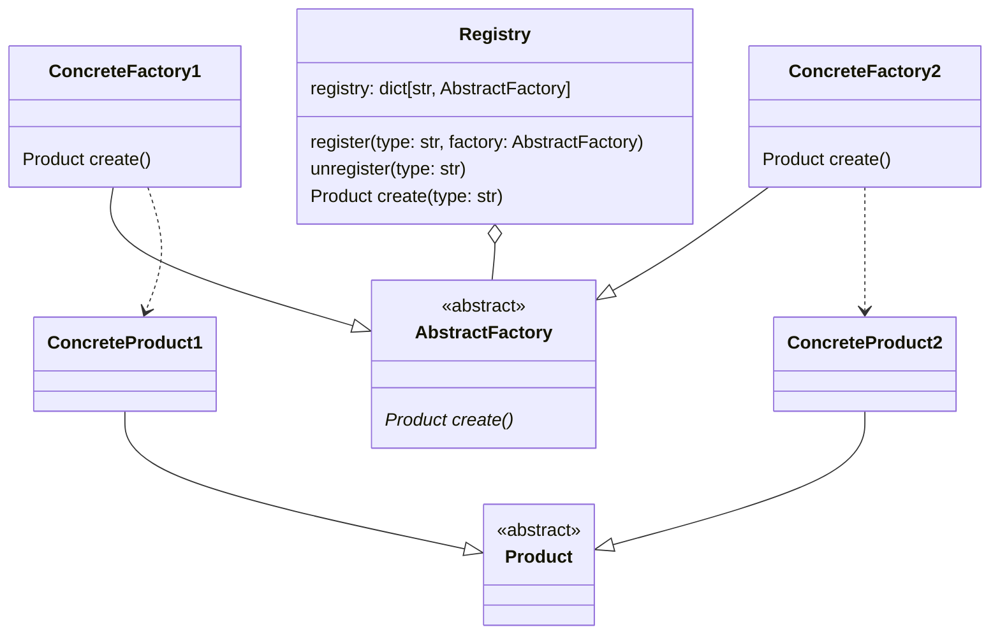
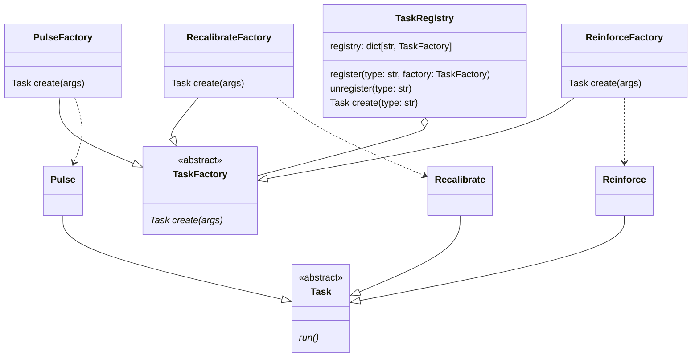

# Registry

> Source: https://academy.arjancodes.com/products/the-software-designer-mindset-pythonic-patterns/categories/2149946555/posts/2160000778

## Registry pattern

* Registry contains str for representing particular AbstractFactory subclass.
* ConcreteFactories as AbstractFactory subclasses
* Product as abstract class for ConcreteProducts
* ConcreteFactories only create ConcreteProducts
* Registry handles creating objects of particular type 

* TaskRegistry contains str for representing particular TaskFactory subclass.
* PulseFactory, ReinforceFactory and RecalibrateFactory as TaskFactory subclasses
* Task as abstract class for Pulse, Recalibrate and Reinforce classes
* PulseFactory, ReinforceFactory and RecalibrateFactory only create Pulse, Recalibrate and Reinforce classes
* TaskRegistry handles creating objects of particular type 

## Implementation
```python
# registry.py

from typing import Any, Protocol


class Task(Protocol):
    def run(self) -> None:
        """Run the task."""


class TaskFactory(Protocol):
    def create(self, args: dict[str, Any]) -> Task:
        """Creates a new task."""
```
* Protocol for Task defined
* Factory for Task class

```python
# tasks.py
from dataclasses import dataclass
from typing import Any

from registry import Task


@dataclass
class Pulse:
    strength: int

    def run(self) -> None:
        print(
            f"Sending a subspace pulse of {self.strength} microPicards to the converter assembly."
        )


@dataclass
class Recalibrate:
    target: str

    def run(self) -> None:
        print(f"Recalibrating the {self.target}.")


@dataclass
class Reinforce:
    plating_type: str
    target: str

    def run(self) -> None:
        print(f"Reinforcing {self.plating_type} plating of {self.target}.")


class PulseFactory:
    def create(self, args: dict[str, Any]) -> Task:
        return Pulse(**args)


class RecalibrateFactory:
    def create(self, args: dict[str, Any]) -> Task:
        return Recalibrate(**args)


class ReinforceFactory:
    def create(self, args: dict[str, Any]) -> Task:
        return Reinforce(**args)
```
* Reinforce, Recalibrate and Pulse classes matching Task protocol
* Factories for Reinforce, Recalibrate and Pulse classes matching TaskFactory protocol

```python
# registry.py

from typing import Any, Protocol

...

class TaskRegistry:
    def __init__(self):
        self.registry: dict[str, TaskFactory] = {}

    def register(self, task_type: str, factory: TaskFactory) -> None:
        self.registry[task_type] = factory

    def unregister(self, task_type: str) -> None:
        self.registry.pop(task_type, None)

    def create(self, args: dict[str, Any]) -> Task:
        args_copy = args.copy()
        task_type = args_copy.pop("type")
        try:
            factory = self.registry[task_type]
        except KeyError:
            raise ValueError(f"Unknown task type: {task_type!r}") from None
        return factory.create(args_copy)

```
* TaskRegistry class for registering/unregistering Factory for particular task type
* `.create()` method for creating object for given task

```python
# main.py

import json

from registry import TaskRegistry
from tasks import PulseFactory, RecalibrateFactory, ReinforceFactory


def main() -> None:

    # register a couple of tasks
    task_registry = TaskRegistry()
    task_registry.register("pulse", PulseFactory())
    task_registry.register("recalibrate", RecalibrateFactory())
    task_registry.register("reinforce", ReinforceFactory())

    # read data from a JSON file
    with open("./tasks.json", encoding="utf-8") as file:
        data = json.load(file)

        # create the tasks
        tasks = [task_registry.create(item) for item in data["tasks"]]

        # run the tasks
        for task in tasks:
            task.run()
```
* TaskRegistry init
* Registering factories for particular Task type
* Creating Task objects by registered TaskFactory for all tasks in JSON file
* Running created Task object

## Functional approach

```python
# registry.py

from typing import Any, Callable

task_functions: dict[str, Callable[..., None]] = {}


def register(task_type: str, task_fn: Callable[..., None]) -> None:
    task_functions[task_type] = task_fn


def unregister(task_type: str) -> None:
    task_functions.pop(task_type, None)


def run(arguments: dict[str, Any]) -> None:
    args_copy = arguments.copy()
    task_type = args_copy.pop("type")
    task_functions[task_type](**args_copy)
```
* `task_functions` dictionary for storing registered functions
* Functions instead of TaskRegistry class methods

```python
# main.py

import json

from loader import load_plugins
from registry import register, run


def send_pulse(strength: int) -> None:
    print(
        f"Sending a subspace pulse of {strength} microPicards to the converter assembly."
    )


def recalibrate(target: str) -> None:
    print(f"Recalibrating the {target}.")


def reinforce(plating_type: str, target: str) -> None:
    print(f"Reinforcing {plating_type} plating of {target}.")


def main() -> None:

    # register a couple of tasks
    register("pulse", send_pulse)
    register("recalibrate", recalibrate)
    register("reinforce", reinforce)

    # read data from a JSON file
    with open("./tasks.json", encoding="utf-8") as file:
        data = json.load(file)

        # load the plugins
        load_plugins(data["plugins"])

        # run the tasks
        for task in data["tasks"]:
            run(task)
```
* No Factories for objects creation, as it only performs operations, not storing any data
* Functions for particular Task execution defined
* Registering function for particular Task type
* Loading plugins for additional tasks from JSON file

```json
// tasks.json
        
{
  "plugins": ["inject"],
  "tasks": [
    {
      "type": "pulse",
      "strength": 190
    },
    {
      "type": "recalibrate",
      "target": "Thoron subspace transponder"
    },
    {
      "type": "reinforce",
      "plating_type": "biogenic",
      "target": "the deflector array"
    },
    {
      "type": "inject",
      "material": "tachyons",
      "target": "molecular transporter resonator"
    }
  ]
}

```
```python
# inject.py

from registry import register


def inject(material: str, target: str) -> None:
    print(f"Injecting {material} into {target}.")


register("inject", inject)

```
* inject plugin defined in separate file
* plugin registered

```python
# loader.py
import importlib


def load_plugins(plugins: list[str]) -> None:
    for plugin in plugins:
        importlib.import_module(plugin)

```
* Function for loading additional plugins defined.