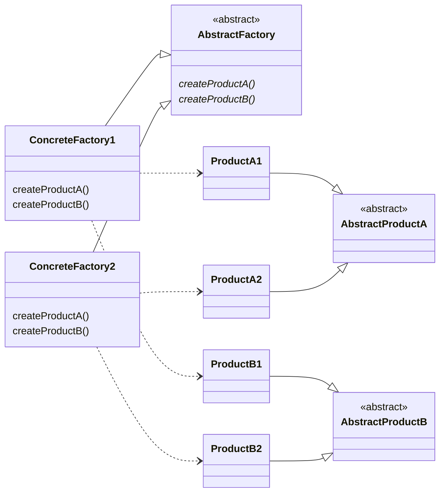

# Abstract Factory

> Source: https://academy.arjancodes.com/products/the-software-designer-mindset-pythonic-patterns/categories/2149946549/posts/2160000491

## Abstract Factory pattern




## Classic Abstract Factory

```python
from abc import ABC, abstractmethod


class IncomeTaxCalculator(ABC):
    @abstractmethod
    def calculate_tax(self, income: int, apply_floor=True) -> int:
        """Calculates income tax."""


class CapitalTaxCalculator(ABC):
    @abstractmethod
    def calculate_tax(self, capital: int) -> int:
        """Calculates capital tax."""
```
* Abstract classes for TaxCalculator objects

```python
from dataclasses import dataclass


@dataclass
class SimpleIncomeTaxCalculator(IncomeTaxCalculator):
    tax_rate: float = 0.1

    def calculate_tax(self, income: int, apply_floor=True) -> int:
        return int(income * self.tax_rate)


@dataclass
class NLTaxCalculator(IncomeTaxCalculator):
    floor: int = 10_000_00

    def calculate_tax(self, income: int, apply_floor=True) -> int:
        brackets: list[tuple[int | None, float]] = [
            (69_398_00, 0.37),
            (None, 0.495),
        ]
        taxable_income = income
        if apply_floor:
            taxable_income -= self.floor

        total_tax = 0
        for max_income, percentage in brackets:
            bracket_income = min(taxable_income, max_income or taxable_income)
            total_tax += int(bracket_income * percentage)
            taxable_income -= bracket_income
            if taxable_income <= 0:
                break
        return total_tax


@dataclass
class PercentageCapitalTaxCalculator(CapitalTaxCalculator):
    tax_rate: float = 0.05

    def calculate_tax(self, capital: int) -> int:
        return int(capital * self.tax_rate)


class ZeroCapitalTaxCalculator(CapitalTaxCalculator):
    def calculate_tax(self, capital: int) -> int:
        return 0
```

* TaxCalculator objects inheriting from abstract classes

```python
from abc import ABC, abstractmethod


class TaxFactory(ABC):
    @abstractmethod
    def create_income_tax_calculator(self) -> IncomeTaxCalculator:
        """Creates an income tax calculator."""

    @abstractmethod
    def create_capital_tax_calculator(self) -> CapitalTaxCalculator:
        """Creates a capital tax calculator."""
```
* Abstract class for Factory

```python
class SimpleTaxFactory(TaxFactory):
    def create_income_tax_calculator(self) -> IncomeTaxCalculator:
        return SimpleIncomeTaxCalculator()

    def create_capital_tax_calculator(self) -> CapitalTaxCalculator:
        return ZeroCapitalTaxCalculator()


class NLTaxFactory(TaxFactory):
    def create_income_tax_calculator(self) -> IncomeTaxCalculator:
        return NLTaxCalculator()

    def create_capital_tax_calculator(self) -> CapitalTaxCalculator:
        return PercentageCapitalTaxCalculator()
```
* Subclasses of Factory abstact class for producing TaxCalculator objects.

```python
def compute_tax(
    factory: TaxFactory, income: int, capital: int, apply_floor: bool = True
) -> int:
    """Computes tax for a given income and capital."""

    # create the calculator
    income_tax_calculator = factory.create_income_tax_calculator()
    capital_tax_calculator = factory.create_capital_tax_calculator()

    # calculate the tax
    income_tax = income_tax_calculator.calculate_tax(income, apply_floor)
    capital_tax = capital_tax_calculator.calculate_tax(capital)

    # return the total tax
    return income_tax + capital_tax
```
* Function for tax computing basing on passed TaxFactory

## Functional approach

```python
from typing import Callable, Optional

IncomeTaxCalculator = Callable[[int, Optional[bool]], int]
CapitalTaxCalculator = Callable[[int], int]
TaxFactory = tuple[IncomeTaxCalculator, CapitalTaxCalculator]


def calculate_income_tax_simple(
    income: int, apply_floor=True, tax_rate: float = 0.1
) -> int:
    return int(income * tax_rate)


def calculate_income_tax_nl(income: int, apply_floor=True) -> int:
    floor = 10_000_00
    brackets: list[tuple[int | None, float]] = [
        (69_398_00, 0.37),
        (None, 0.495),
    ]
    taxable_income = income
    if apply_floor:
        taxable_income -= floor

    total_tax = 0
    for max_income, percentage in brackets:
        bracket_income = min(taxable_income, max_income or taxable_income)
        total_tax += int(bracket_income * percentage)
        taxable_income -= bracket_income
        if taxable_income <= 0:
            break
    return total_tax


def calculate_percentage_capital_tax(capital: int, tax_rate: float = 0.05) -> int:
    return int(capital * tax_rate)


def calculate_zero_capital_tax(_: int) -> int:
    return 0


simple_tax_factory: TaxFactory = (
    calculate_income_tax_simple,
    calculate_zero_capital_tax,
)

nl_tax_factory: TaxFactory = (
    calculate_income_tax_nl,
    calculate_percentage_capital_tax,
)


def compute_tax(
    factory: TaxFactory, income: int, capital: int, apply_floor: bool = True
) -> int:
    """Computes tax for a given income and capital."""
    income_tax_calculator, capital_tax_calculator = factory

    # calculate the tax
    income_tax = income_tax_calculator(income, apply_floor)
    capital_tax = capital_tax_calculator(capital)

    # return the total tax
    return income_tax + capital_tax
```