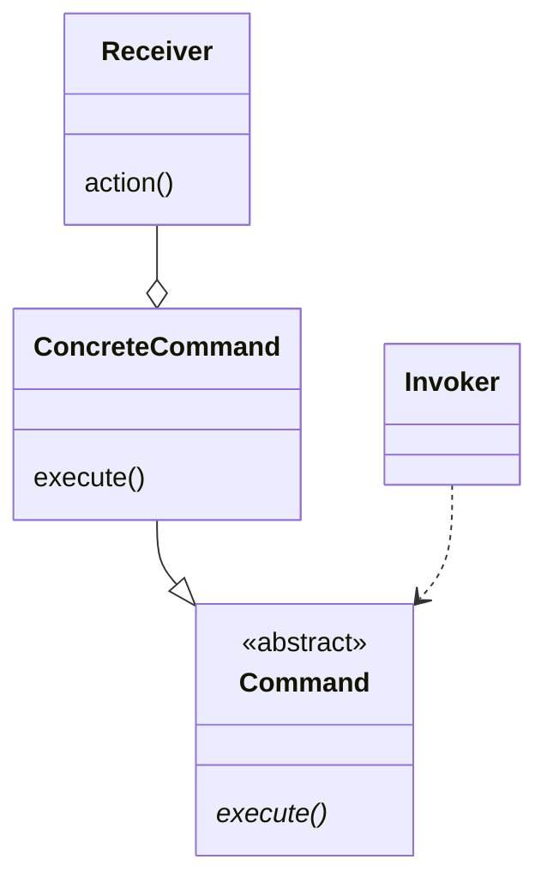
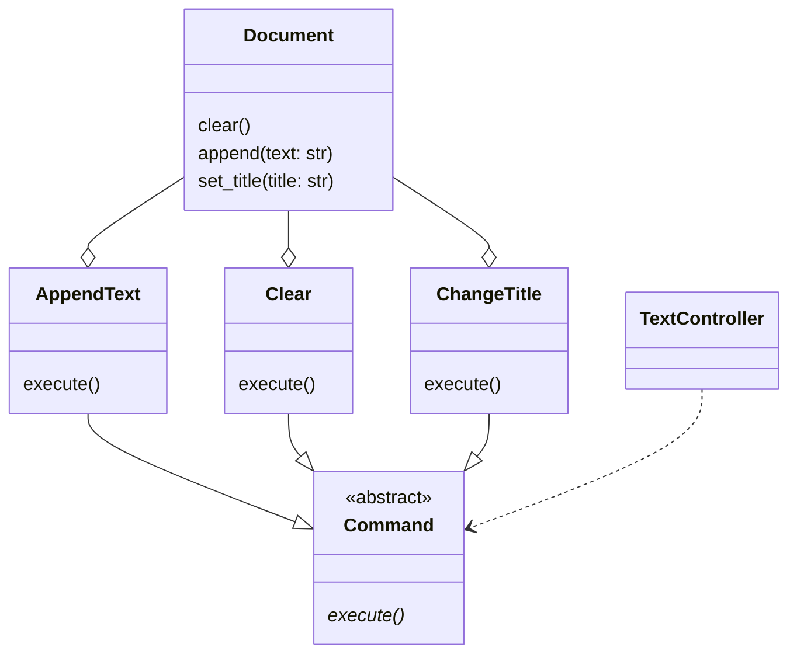

# Command

> Source: https://academy.arjancodes.com/products/the-software-designer-mindset-pythonic-patterns/categories/2149946559/posts/2156337466

## Command pattern

* `Command` abstract class with `execute` method
* `ConcreteCommand` class with implementation of `execute` method
* `Receiver` performing some action by `ConcreteCommand`
* `Invoker` invoking abstract `Command`

* `Command` abstract class with `execute` method
* `AppendText`, `Clear` and `ChangeTitle` classes with implementations of `execute` method
* `Document` performing some action by `Command` subclasses.
* `TextController` invoking abstract `Command`

## Classic Command Pattern
```python
# text/controller.py
from dataclasses import dataclass, field

from .edit import Edit


@dataclass
class TextController:
    undo_stack: list[Edit] = field(default_factory=list)

    def execute(self, edit: Edit) -> None:
        edit.execute()
        self.undo_stack.append(edit)

    def undo(self) -> None:
        if not self.undo_stack:
            return
        edit = self.undo_stack.pop()
        edit.undo()

    def undo_all(self) -> None:
        while self.undo_stack:
            self.undo()

```
* TextController class with `execute` and `undo` methods defined
* `undo_stack` list of performed commands for ability to undo command
* `undo_all` for clearing all changes performed by commands

```python
# text/commands.py

from dataclasses import dataclass, field

from .document import Document
from .edit import Edit


@dataclass
class AppendText:
    doc: Document
    text: str

    def execute(self) -> None:
        self.doc.append(self.text)

    def undo(self) -> None:
        self.doc.text = self.doc.text[: -len(self.text)]


@dataclass
class Clear:
    doc: Document
    _old_text: str = ""

    def execute(self) -> None:
        self._old_text = self.doc.text
        self.doc.clear()

    def undo(self) -> None:
        self.doc.append(self._old_text)


@dataclass
class ChangeTitle:
    doc: Document
    title: str
    _old_title: str = ""

    def execute(self) -> None:
        self._old_title = self.doc.title
        self.doc.set_title(self.title)

    def undo(self) -> None:
        self.doc.set_title(self._old_title)


@dataclass
class Batch:
    commands: list[Edit] = field(default_factory=list)

    def execute(self) -> None:
        for command in self.commands:
            command.execute()

    def undo(self) -> None:
        for command in reversed(self.commands):
            command.undo()

```
* Commands classes defined
* Each class has `execute` and `undo` method defined
* `Batch` command to execute multiple commands

```python
# main.py

from text.commands import AppendText, Batch, ChangeTitle, Clear
from text.controller import TextController
from text.processor import Processor


def main() -> None:

    # create a processor
    processor = Processor()

    # create a text controller
    controller = TextController()

    # create some documents
    doc1 = processor.create_document("ArjanCodes")
    doc2 = processor.create_document("Meeting Notes")

    # append some text to the documents
    controller.execute(AppendText(doc1, "Hello World!"))
    controller.execute(AppendText(doc2, "The meeting started at 9:00."))

    # update the title of the first document
    controller.execute(ChangeTitle(doc1, "Important Meeting"))
    controller.undo()

    print(processor)

    # execute a batch of commands
    controller.execute(
        Batch(
            commands=[
                AppendText(doc1, "Hello World!"),
                ChangeTitle(doc2, "Useless Meeting."),
                Clear(doc2),
            ]
        )
    )

    print(processor)

    # undo
    controller.undo()
    print(processor)
```

## Functional approach
```python
# text/commands.py

from typing import Callable

from .document import Document

UndoFunction = Callable[[], None]
EditFunction = Callable[[], UndoFunction]


def append_text(doc: Document, text: str) -> UndoFunction:
    def undo():
        doc.text = doc.text[: -len(text)]

    doc.append(text)
    return undo


def clear_text(doc: Document) -> UndoFunction:
    text = doc.text

    def undo():
        doc.text += text

    doc.clear()
    return undo


def change_title(doc: Document, title: str) -> UndoFunction:
    old_title = doc.title

    def undo():
        doc.set_title(old_title)

    doc.set_title(title)
    return undo


def batch(edits: list[EditFunction]) -> UndoFunction:
    undo_fns = [edit() for edit in edits]

    def undo():
        for undo_fn in reversed(undo_fns):
            undo_fn()

    return undo
```
* Higher order functions instead of classes for particular command
* Closure for returning undo function

```python
# main.py

from functools import partial

from text.commands import append_text, batch, change_title, clear_text
from text.processor import Processor


def main() -> None:

    # create a processor
    processor = Processor()

    # create some documents
    doc1 = processor.create_document("ArjanCodes")
    doc2 = processor.create_document("Meeting Notes")

    print(processor)

    # append some text to the documents
    undo_append = append_text(doc1, "Hello World!")
    append_text(doc2, "The meeting started at 9:00.")

    # update the title of the first document
    undo_title_change = change_title(doc1, "Important Meeting")

    print(processor)

    # undo things
    undo_append()
    undo_title_change()

    print(processor)

    # execute a batch of commands
    undo_batch = batch(
        [
            partial(append_text, doc1, "Hello World!"),
            partial(change_title, doc1, "Useless Meeting"),
            partial(clear_text, doc2),
        ]
    )

    print(processor)

    # undo
    undo_batch()

    print(processor)


if __name__ == "__main__":
    main()

```