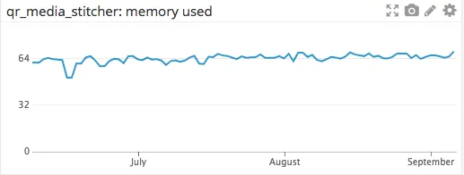
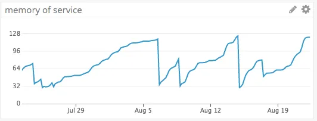
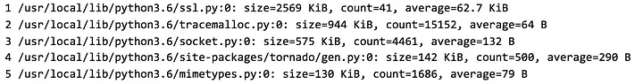
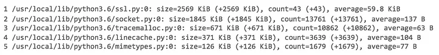
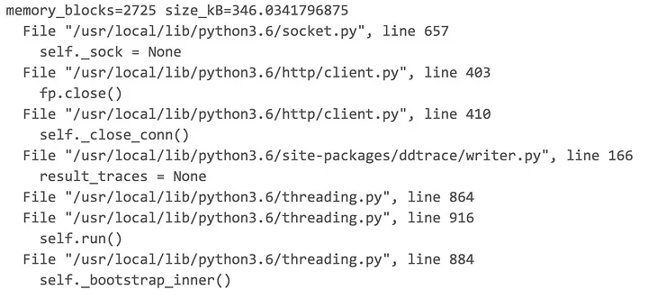

# tracemalloc

Sources: 
* https://tech.buzzfeed.com/finding-and-fixing-memory-leaks-in-python-413ce4266e7d
* https://www.fugue.co/blog/diagnosing-and-fixing-memory-leaks-in-python.html

## Basics
In the case of memory a well-behaved service will use memory and free memory. It performs like this chart reporting on the memory used over a three-month period.



A microservice that leaks memory over time will exhibit a saw-tooth behavior as memory increases until some point (for example, maximum memory available) where the service is shut down, freeing all the memory and then restarted.



If a code review does not turn up any viable suspects, then it is time to turn to tools for tracking down memory leaks. The first tool should provide a way to chart memory usage over time. At BuzzFeed we use DataDog to monitor microservices performance. Leaks may accumulate slowly over time, several bytes at a time. In this case it is necessary to chart the memory growth to see the trend.

The other tool, **tracemalloc**, is part of the Python system library. Essentially **tracemalloc** is used to take snapshots of the Python memory. To begin using tracemalloc first call `tracemalloc.start()` to initialize tracemalloc, then take a snapshot using
```python
snapshot=tracemalloc.take_snapshot()
```
tracemalloc can show a sorted list of the top allocations in the snapshot using the statistics() method on a snapshot. In this snippet the top five allocations grouped by source filename are logged.
```python
for i, stat in enumerate(snapshot.statistics(‘filename’)[:5], 1):
    logging.info(“top_current”,i=i, stat=str(stat))
```
The output will look similar to this:

This shows the size of the memory allocation, the number of objects allocated and the average size each on a per module basis.

## Snapshots comparison

We take a snapshot at the start of our program and implement a callback that runs every few minutes to take a snapshot of the memory. Comparing two snapshots shows changes with memory allocation. We compare each snapshot to the one taken at the start. By observing any allocation that is increasing over time we may capture an object that is leaking memory. The method compare_to() is called on snapshots to compare it with another snapshot. The 'filename' parameter is used to group all allocations by module. This helps to narrow a search to a module that is leaking memory.

```python
current = tracemalloc.take_snapshot()
stats = current.compare_to(start, ‘filename’)
for i, stat in enumerate(stats[:5], 1):
    logging.info(“since_start”, i=i, stat=str(stat))
```

The output will look similar to this:



This shows the size and the number of objects and a comparison of each and the average allocation size on a per module basis.

## Leaking code detection
Once a suspect module is identified, it may be possible to find the exact line of code responsible for a memory allocation. tracemalloc provides a way to view a stack trace for any memory allocation. As with a Python exception traceback, it shows the line and module where an allocation occurred and all the calls that came before.
```python
traces = current.statistics('traceback')
for stat in traces[1]:
    logging.info('traceback', memory_blocks=stat.count, size_kB=stat.size / 1024)
    for line in stat.traceback.format():
        logging.info(info)
```

Reading bottom to top, this shows a trace to a line in the socket module where a memory allocation took place. With this information it may be possible to finally isolate the cause of the memory leak.

## The Search for Memory Leak