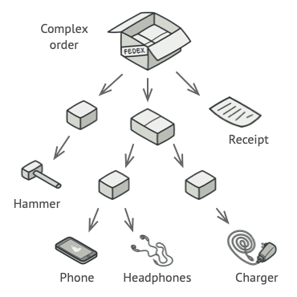
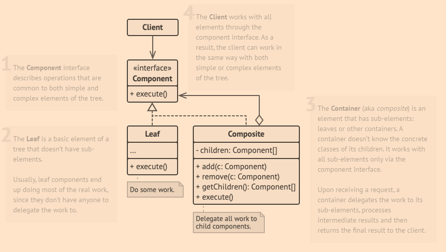

# Composite

> Source: https://refactoring.guru/design-patterns/composite

Composite is a structural design pattern that lets you compose objects into tree structures and then work with these structures as if they were individual objects.

## Problem

Using the Composite pattern makes sense only when the core model of your app can be represented as a tree.

For example, imagine that you have two types of objects: Products and Boxes. A Box can contain several Products as well as a number of smaller Boxes. These little Boxes can also hold some Products or even smaller Boxes, and so on.

Say you decide to create an ordering system that uses these classes. Orders could contain simple products without any wrapping, as well as boxes stuffed with products...and other boxes. How would you determine the total price of such an order?

*An order might comprise various products, packaged in boxes, which are packaged in bigger boxes and so on. The whole structure looks like an upside down tree.*

## Solution

The Composite pattern suggests that you work with Products and Boxes through a common interface which declares a method for calculating the total price.

How would this method work? For a product, it’d simply return the product’s price. For a box, it’d go over each item the box contains, ask its price and then return a total for this box. If one of these items were a smaller box, that box would also start going over its contents and so on, until the prices of all inner components were calculated. A box could even add some extra cost to the final price, such as packaging cost.

*The Composite pattern lets you run a behavior recursively over all components of an object tree.*

The greatest benefit of this approach is that you don’t need to care about the concrete classes of objects that compose the tree. You don’t need to know whether an object is a simple product or a sophisticated box. You can treat them all the same via the common interface. When you call a method, the objects themselves pass the request down the tree.

## Structure

