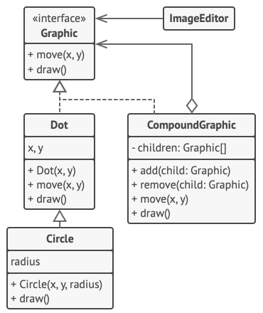

# Composite

> Source: https://refactoring.guru/design-patterns/composite

Composite is a structural design pattern that lets you compose objects into tree structures and then work with these structures as if they were individual objects.

## Problem

Using the Composite pattern makes sense only when the core model of your app can be represented as a tree.

For example, imagine that you have two types of objects: Products and Boxes. A Box can contain several Products as well as a number of smaller Boxes. These little Boxes can also hold some Products or even smaller Boxes, and so on.

Say you decide to create an ordering system that uses these classes. Orders could contain simple products without any wrapping, as well as boxes stuffed with products...and other boxes. How would you determine the total price of such an order?


*An order might comprise various products, packaged in boxes, which are packaged in bigger boxes and so on. The whole structure looks like an upside down tree.*

## Solution

The Composite pattern suggests that you work with Products and Boxes through a common interface which declares a method for calculating the total price.

How would this method work? For a product, it’d simply return the product’s price. For a box, it’d go over each item the box contains, ask its price and then return a total for this box. If one of these items were a smaller box, that box would also start going over its contents and so on, until the prices of all inner components were calculated. A box could even add some extra cost to the final price, such as packaging cost.


*The Composite pattern lets you run a behavior recursively over all components of an object tree.*

The greatest benefit of this approach is that you don’t need to care about the concrete classes of objects that compose the tree. You don’t need to know whether an object is a simple product or a sophisticated box. You can treat them all the same via the common interface. When you call a method, the objects themselves pass the request down the tree.

## Structure


## Pseudocode



The CompoundGraphic class is a container that can comprise any number of sub-shapes, including other compound shapes. A compound shape has the same methods as a simple shape. However, instead of doing something on its own, a compound shape passes the request recursively to all its children and “sums up” the result.

The client code works with all shapes through the single interface common to all shape classes. Thus, the client doesn’t know whether it’s working with a simple shape or a compound one. The client can work with very complex object structures without being coupled to concrete classes that form that structure.

```javascript
// The component interface declares common operations for both
// simple and complex objects of a composition.
interface Graphic is
    method move(x, y)
    method draw()

// The leaf class represents end objects of a composition. A
// leaf object can't have any sub-objects. Usually, it's leaf
// objects that do the actual work, while composite objects only
// delegate to their sub-components.
class Dot implements Graphic is
    field x, y

    constructor Dot(x, y) { ... }

    method move(x, y) is
        this.x += x, this.y += y

    method draw() is
        // Draw a dot at X and Y.

// All component classes can extend other components.
class Circle extends Dot is
    field radius

    constructor Circle(x, y, radius) { ... }

    method draw() is
        // Draw a circle at X and Y with radius R.

// The composite class represents complex components that may
// have children. Composite objects usually delegate the actual
// work to their children and then "sum up" the result.
class CompoundGraphic implements Graphic is
    field children: array of Graphic

    // A composite object can add or remove other components
    // (both simple or complex) to or from its child list.
    method add(child: Graphic) is
        // Add a child to the array of children.

    method remove(child: Graphic) is
        // Remove a child from the array of children.

    method move(x, y) is
        foreach (child in children) do
            child.move(x, y)

    // A composite executes its primary logic in a particular
    // way. It traverses recursively through all its children,
    // collecting and summing up their results. Since the
    // composite's children pass these calls to their own
    // children and so forth, the whole object tree is traversed
    // as a result.
    method draw() is
        // 1. For each child component:
        //     - Draw the component.
        //     - Update the bounding rectangle.
        // 2. Draw a dashed rectangle using the bounding
        // coordinates.


// The client code works with all the components via their base
// interface. This way the client code can support simple leaf
// components as well as complex composites.
class ImageEditor is
    field all: CompoundGraphic

    method load() is
        all = new CompoundGraphic()
        all.add(new Dot(1, 2))
        all.add(new Circle(5, 3, 10))
        // ...

    // Combine selected components into one complex composite
    // component.
    method groupSelected(components: array of Graphic) is
        group = new CompoundGraphic()
        foreach (component in components) do
            group.add(component)
            all.remove(component)
        all.add(group)
        // All components will be drawn.
        all.draw()
```

## Applicability

**Use the Composite pattern when you have to implement a tree-like object structure.**

The Composite pattern provides you with two basic element types that share a common interface: simple leaves and complex containers. A container can be composed of both leaves and other containers. This lets you construct a nested recursive object structure that resembles a tree.

**Use the pattern when you want the client code to treat both simple and complex elements uniformly.**

All elements defined by the Composite pattern share a common interface. Using this interface, the client doesn’t have to worry about the concrete class of the objects it works with.

## How to implement

1. Make sure that the core model of your app can be represented as a tree structure. Try to break it down into simple elements and containers. Remember that containers must be able to contain both simple elements and other containers.

2. Declare the component interface with a list of methods that make sense for both simple and complex components.

3. Create a leaf class to represent simple elements. A program may have multiple different leaf classes.

4. Create a container class to represent complex elements. In this class, provide an array field for storing references to sub-elements. The array must be able to store both leaves and containers, so make sure it’s declared with the component interface type.

    While implementing the methods of the component interface, remember that a container is supposed to be delegating most of the work to sub-elements.

5. Finally, define the methods for adding and removal of child elements in the container.

    Keep in mind that these operations can be declared in the component interface. This would violate the Interface Segregation Principle because the methods will be empty in the leaf class. However, the client will be able to treat all the elements equally, even when composing the tree.

## Pros and cons

✔️ You can work with complex tree structures more conveniently: use polymorphism and recursion to your advantage.

✔️ Open/Closed Principle. You can introduce new element types into the app without breaking the existing code, which now works with the object tree.

❌ It might be difficult to provide a common interface for classes whose functionality differs too much. In certain scenarios, you’d need to overgeneralize the component interface, making it harder to comprehend.