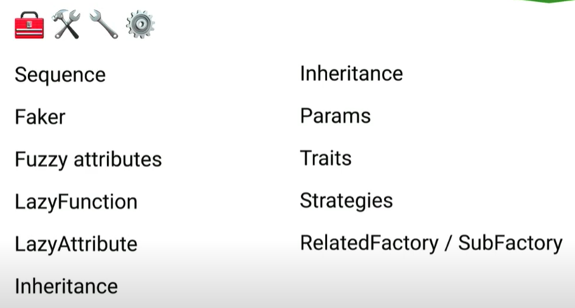
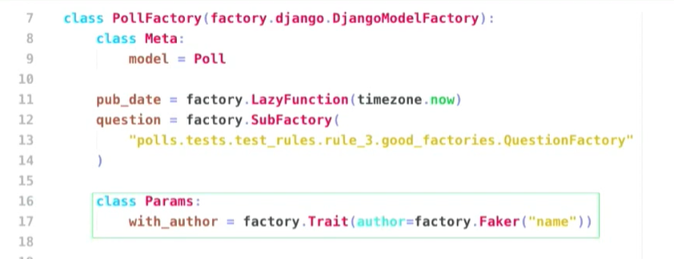
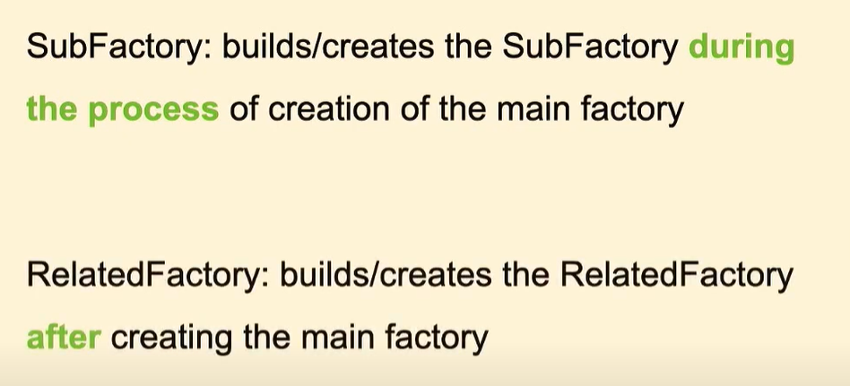
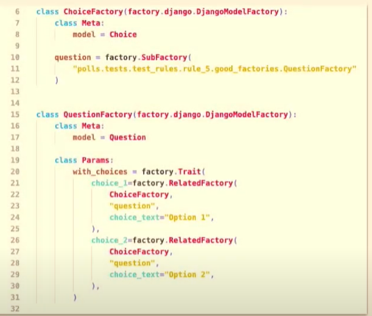

# Factories

Source: 
* https://www.hacksoft.io/blog/improve-your-tests-django-fakes-and-factories#fakes
* https://www.hacksoft.io/blog/improve-your-tests-django-fakes-and-factories-advanced-usage
* https://youtu.be/-C-XNHAJF-c?si=5viLbeVKRLgn8zXD

## Creating Factories

```python
# models.py

from django.db import models
from django.utils import timezone

class VehiclePurchase(models.Model):
    price = models.DecimalField(max_digits=19, decimal_places=2)
    color = models.ForeignKey(
        VehicleColor, null=True, blank=True, on_delete=models.SET_NULL
    )
    vehicle = models.ForeignKey(Vehicle, on_delete=models.CASCADE)
    plan = models.ForeignKey(Plan, on_delete=models.CASCADE)
    customer = models.ForeignKey(
        BaseUser, null=True, blank=True, on_delete=models.SET_NULL
    )
    sales_member = models.ForeignKey(
        BaseUser, null=True, blank=True, on_delete=models.SET_NULL
    )
    requested_at = models.DateTimeField(db_index=True, default=timezone.now)
    cancelled_at = models.DateTimeField(null=True, blank=True)
```

```python
# factories.py

import factory

from my_project.utils.tests import faker

class UserFactory(factory.django.DjangoModelFactory):
    class Meta:
        model = User

    name = factory.LazyAttribute(lambda _: faker.name())
    email = factory.LazyAttribute(lambda _: faker.unique.email())

class VehiclePurchaseFactory(factory.django.DjangoModelFactory):
    class Meta:
        model = VehiclePurchase

    price = factory.LazyAttribute(lambda _: faker.pyfloat(positive=True))
    color = factory.SubFactory(ColorFactory)
    vehicle = factory.SubFactory(VehicleFactory)
    plan = factory.SubFactory(PlanFactory)
    customer = factory.SubFactory(UserFactory)
    sales_member = factory.SubFactory(UserFactory)
```

## DjangoModelFactory

DjangoModelFactory is a basic interface from factory_boy that gives "ORM powers" to your factories.

It's main feature here is that it provides you with a common "create" and "build" strategies that you can use to generate objects in your tests.

* SomeFactory.create() / SomeFactory() - saves the generated object to the database. The related sub factories are also created in the database.
* SomeFactory.build() - generates a model instance without saving it to the database. The related sub factories are also not stored in the database.

## Faker

As you may have noticed, we don't create a Faker instance in the factories file. We import it from another file in the application. This is intentional!

We highly recommend "proxying" the Faker instance and using it in your app that way.

You'd most likely want to have the same configuration when you use fakes around your app. Same goes if you want to customize the providers and use them in different places.
```python
# my_project/utils/tests/base.py

from faker import Faker

faker = Faker()
```

## LazyAttribute
It's an extremely simple but yet powerful abstraction that represents the symbiosis between the factories and the fakes.

It accepts a method which is invoked when a Factory instance is being generated. The return value of the method is used for the value of the desired attribute.

If you don't use it, you're actually setting a class attribute to your Factory. This means that this attribute will be generated when you define your Factory class, not when you instantiate it.
```python
class UserFactory(factory.django.DjangoModelFactory):
    class Meta:
        model = User

    email = faker.unique.email()
```
Defining your Factory this way will produce the following result:

```python
for _ in range(5):
    print(UserFactory.build().email)
 
erobinson@example.org
erobinson@example.org
erobinson@example.org
erobinson@example.org
erobinson@example.org
```
For most of the cases, you would want your objects to be generated with different values every time:
```python
class UserFactory(factory.django.DjangoModelFactory):
    class Meta:
        model = User

    email = factory.LazyAttribute(lambda _: faker.unique.email())
```
This is the output when you use LazyAttribute:

```python
for _ in range(5):
    print(UserFactory.build().email)
    
woodtammy@example.net
justin56@example.com
rachel10@example.com
michaelthompson@example.com
mkennedy@example.com
```

## Factory.build() vs Factory.create()
Factory.build() will return you a new object that's not yet saved in the database.

This might be helpful in situations, where you need the object, but don't need it to be saved in the database, thus, improving the speed of the test.

Possible use cases where you can apply this:

* A method that receives an object and performs some validation over its fields. If this is not related to any database queries, use Factory.build() in your tests
* A service that performs some small validation at the beginning of its definition. This service receives some model instances as arguments. When you test the validation, you can build() the passed objects if you don't need them in the database
* A selector that is grouping some passed data. If this selector does not perform any database queries, build() the passed data instead of creating it

# LazyAttribute for field constraints

```python
class SchoolCourse(models.Model):
    start_date = models.DateField()
    end_date = models.DateField()

    class Meta:
        constraints = [
            models.CheckConstraint(
                name="school_course_start_before_end",
                check=Q(start_date__lt=F("end_date"))
            )
        ]
```

Here is how you can define Factory and make sure that the end_date will be after the start_date:
```python
class SchoolCourseFactory(factory.django.DjangoModelFactory):
    class Meta:
        model = SchoolCourse

    start_date = factory.LazyAttribute(lambda _: faker.past_date())
    end_date = factory.LazyAttribute(lambda _self: _self.start_date + timedelta(days=365))
```
As you can see, the _self attribute of the lamba function is key here.

## SelfAttribute

```python
class Student(models.Model):
    email = models.EmailField(max_length=255)
    school = models.ForeignKey(School, related_name='students', on_delete=models.CASCADE)

    class Meta:
        unique_together = ('email', 'school', )

class Roster(models.Model):
    student = models.ForeignKey(Student, related_name='rosters', on_delete=models.CASCADE)
    school_course = models.ForeignKey(SchoolCourse, related_name='rosters', on_delete=models.CASCADE)

    start_date = models.DateField()
    end_date = models.DateField()
```
> NOTE: The Roster model represents that a Student is taking part in a School Course

```python
class RosterFactory(factory.django.DjangoModelFactory):
    class Meta:
        model = Roster

    student = factory.SubFactory(StudentFactory)
    school_course = factory.SubFactory(
        SchoolCourseFactory,
        school=factory.SelfAttribute('..student.school')
    )
    start_date = factory.SelfAttribute('school_course.start_date')
    end_date = factory.SelfAttribute('school_course.end_date')
```
This implementation says: "I want my roster period to be the same as the course period" which should be a valid statement for most of the use cases. It also says -  "I want my roster's course to be in the school of the generated student by default".

## The double-dot notation
The double-dot notation refers to the parent factory (in our case RosterFactory) where current sub factory (in our case SchoolCourseFactory) is being called. This is well described in the docs [here](https://factoryboy.readthedocs.io/en/stable/reference.html?#parents).

If the double-dot notation is not up to your taste, you can achieve the same behavior by using the LazyAttribute, making the code a bit more explicit:

```python
class RosterFactory(factory.django.DjangoModelFactory):
    class Meta:
        model = Roster

    student = factory.SubFactory(StudentFactory)
    school_course = factory.SubFactory(
        SchoolCourseFactory,
        school=factory.LazyAttribute(lambda course: course.factory_parent.student.school)
    )
    start_date = factory.LazyAttribute(lambda _self: _self.school_course.start_date)
    end_date = factory.LazyAttribute(lambda _self: _self.school_course.end_date)
```
> NOTE: Take a look at the factory_parent here. It's actually a reference to the RosterFactory in our case.

## Helper Factories

For example, if we observe that a lot of tests are dealing with Rosters that need to be in some chronological order, one after the other, we might want to do something like this:

```python
def get_future_roster_start_date(roster_obj):
    if not roster_obj.start_after:
        return faker.future_date()

    return roster_obj.start_after + timedelta(days=faker.pyint(2, 100))

class FutureRosterFactory(RosterFactory):
    class Params:
        start_after = None

    start_date = factory.LazyAttribute(get_future_roster_start_date)
```
```python
In [1]: roster = RosterFactory.build()

In [2]: future_roster1 = FutureRosterFactory.build(start_after=roster.start_date)

In [3]: future_roster2 = FutureRosterFactory.build(start_after=future_roster1.start_date)

In [4]: roster.start_date, future_roster1.start_date, future_roster2.start_date
Out [4]: (datetime.date(2021, 11, 25),
 datetime.date(2022, 3, 1),
 datetime.date(2022, 5, 13))
```
> NOTE: In the Params class you can list all arguments that are factory class specific. They won't be passed to the generated instance.

```python
In [13]: future_roster1.start_after
---------------------------------------------------------------------------
AttributeError                            Traceback (most recent call last)
<ipython-input-13-9299608b2d13> in <module>
----> 1 future_roster1.start_after

AttributeError: 'Roster' object has no attribute 'start_after'
```

## Parent with children factory

If we observe that a lot of tests always require a specific parent object, to come hand-in-hand with created children objects, we might want to make our lives a bit easier.

Let's take our SchoolCourse model.  You'd most likely have services and/or selectors that work with school courses that have rosters in them.

Here's a helper factory dealing with this:

```python
class SchoolCourseWithRostersFactory(SchoolCourseFactory):
    @factory.post_generation
    def rosters(obj, create, extracted, **kwargs):
        if create:
            rosters = extracted or RosterFactory.create_batch(
                kwargs.pop('count', 5),
                **kwargs,
                student__school=obj.school  # NOTE!
            )

            obj.rosters.set(rosters)

            return rosters
```

```python
In [1]: course1 = SchoolCourseWithRostersFactory()

In [2]: course1.rosters.count()
Out[2]: 5

In [3]: roster = RosterFactory()

In [4]: course2 = SchoolCourseWithRostersFactory(rosters=[roster])

In [5]: course2.rosters.all()
Out[5]: <QuerySet [<Roster: Roster object (6)>]>

In [6]: course3 = SchoolCourseWithRostersFactory(rosters__count=10)

In [7]: course3.rosters.count()
Out[7]: 10
```

There are several important points here:

* @factory.post_generation is a post-generation hook from factory_boy. It's invoked after the model object is created
* The obj argument is the model object that's just been generated
* The create argument is a boolean which is True if the create() strategy is being used. False otherwise (.build() strategy)
* extracted is the value of the defined attribute if one is passed when the Factory is being called. SchoolCourseWithRostersFactory(students=some_generated_students) →  extracted == some_generated_students
* kwargs are the passed optional arguments via the double underscores of the defined attribute. SchoolCourseWithRostersFactory(students__count=10) → kwargs == {'count': 10}
* As you may have noticed, this example is going to work only with the create() strategy. This is a limitation that comes from the fact that the students set comes as a reversed relation from the ORM.

The moral of the story is - whenever you see a pattern emerging, create additional helpers, to make your tests clearer.

## Other topics



## Traits



## SubFactory vs RelatedFactory


