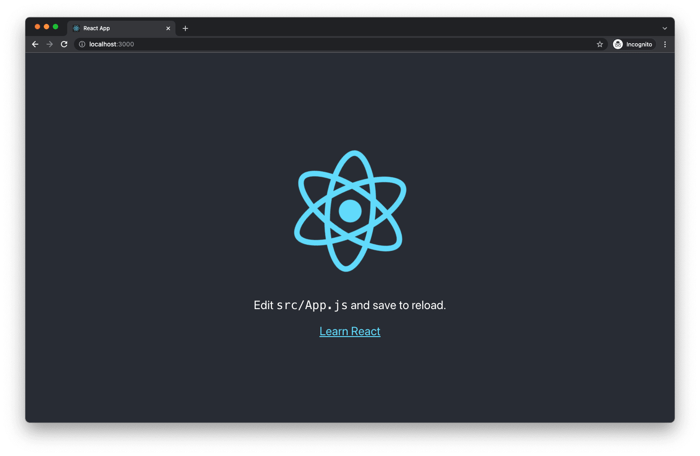

# React setup

> Source: https://testdriven.io/courses/taxi-react/react-setup/

You will need a recent version of Node.js on your machine. Along with Node.js, you get npm, a JavaScript package manager, and yarn, a utility that can run scripts from your local directory or a central cache.

```
$ node -v
v19.0.0

$ npm -v
8.19.2

$ yarn -v
1.22.17
```

Once you have installed the required software on your machine, navigate to the root directory in your terminal.

From there, create a new single-page React app using Create React App:

```
yarn create react-app client
```

Since we don't have any Node.js modules in our root directory, yarn will download react-app and any dependencies from the npm central cache.

After the installation has completed, you should see a new "client" directory in the project root with the following contents:

```
├── README.md
├── package.json
├── public
│   ├── favicon.ico
│   ├── index.html
│   ├── logo192.png
│   ├── logo512.png
│   ├── manifest.json
│   └── robots.txt
├── src
│   ├── App.css
│   ├── App.js
│   ├── App.test.js
│   ├── index.css
│   ├── index.js
│   ├── logo.svg
│   ├── reportWebVitals.js
│   └── setupTests.js
└── yarn.lock
```

Change directories into "client" and start the React development server:

```
$ cd client
$ yarn start
```

You should see something similar to:

```
Compiled successfully!

You can now view client in the browser.

  http://localhost:3000

Note that the development build is not optimized.
To create a production build, use yarn build.
```

The terminal should also trigger your default browser to open and navigate to http://localhost:3000/ by default:



Kill the server in the terminal with CTRL+C.

Let's do some clean up before we proceed:

* Clear the client/src/App.css file.
* Clear the client/src/index.css file.

Next, replace the contents of client/public/index.html with the following code.

```html
<!-- client/public/index.html -->

<!DOCTYPE html>
<html lang='en'>
  <head>
    <meta charset='utf-8' />
    <link rel='shortcut icon' href='%PUBLIC_URL%/favicon.ico' />
    <meta name='viewport' content='width=device-width, initial-scale=1' />
    <meta name='theme-color' content='#000000' />
    <link rel='manifest' href='%PUBLIC_URL%/manifest.json' />
    <title>App</title>
  </head>
  <body>
    <noscript>You need to enable JavaScript to run this app.</noscript>
    <div id='root'></div>
  </body>
</html>
```

Edit the client/src/App.js component. Remove all the boilerplate code and replace it with the following:

```javascript
// client/src/App.js

import React from 'react';

import './App.css';

function App () {
  return (
    <h1>React App</h1>
  );
}

export default App;
```

Start the development server and visit http://localhost:3000/:
