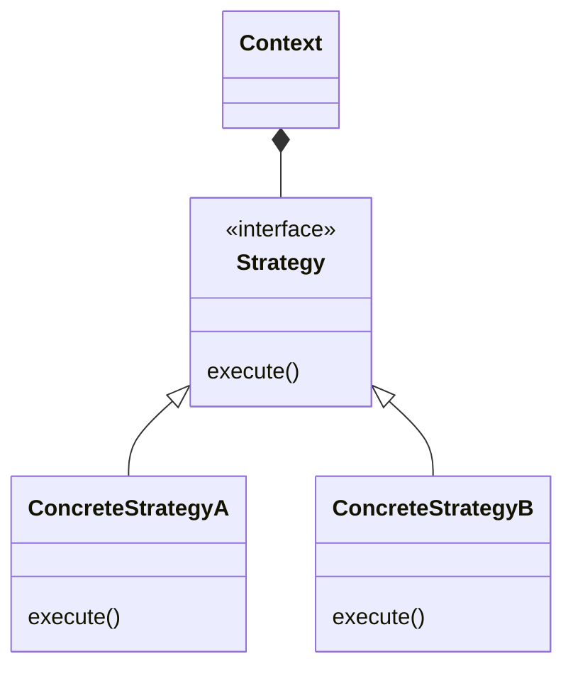
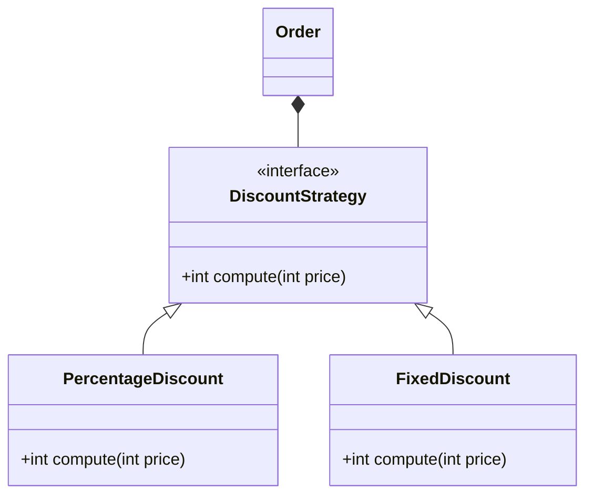

# Strategy

> Source: https://academy.arjancodes.com/products/the-software-designer-mindset-pythonic-patterns/categories/2149946547/posts/2160000087

## Initial code

```python
@dataclass
class Order:
    price: int
    quantity: int

    def compute_total(self, discount_type: str) -> int:
        if discount_type == "percentage":
            discount = int(self.price * self.quantity * 0.20)
        elif discount_type == "fixed":
            discount = 10_00
        return self.price * self.quantity - discount

    
def main() -> None:
    order = Order(price=100_00, quantity=2)
    print(order)
    print(f"Total: ${order.compute_total('percentage')/100:.2f}")
```

* Discount calculated in Order class, that has plenty of responsibilities now
* Discount type specified by string

## Strategy pattern


* Context depends only on abstract Strategy class
* Context does not know anything about implementation details of particular Strategy
* Context only knows base interface that it accepts



* Separate Strategy class for particular discount type. 
* Order class does not know anything about implementation details of particular DiscountStrategy 
subclass
* Order only needs Strategy class meeting expected interface (which in that case means having "compute" method).

## Classic approach

```python
from abc import ABC, abstractmethod
from dataclasses import dataclass


class DiscountStrategy(ABC):
    @abstractmethod
    def compute(self, price: int) -> int:
        pass


class PercentageDiscount(DiscountStrategy):
    def compute(self, price: int) -> int:
        return int(price * 0.20)


class FixedDiscount(DiscountStrategy):
    def compute(self, _: int) -> int:
        return 10_00


@dataclass
class Order:
    price: int
    quantity: int
    discount: DiscountStrategy

    def compute_total(self) -> int:
        discount = self.discount.compute(self.price * self.quantity)
        return self.price * self.quantity - discount


def main() -> None:
    order = Order(price=100_00, quantity=2, discount=PercentageDiscount())
    print(order)
    print(f"Total: ${order.compute_total()/100:.2f}")
```

* `DiscountStrategy` abstract class with `.compute` method
* `PercentageDiscount` and `FixedDiscount` with `.compute` methods
* Discount calculated in particular `DiscountStrategy` subclass, not in `Order` class.


To reach the same goal abstract classes may be replaced with protocols.

```python
class DiscountStrategy(Protocol):
    def compute(self, price: int) -> int:
        ...


class PercentageDiscount:
    def compute(self, price: int) -> int:
        return int(price * 0.20)


class FixedDiscount:
    def compute(self, _: int) -> int:
        return 10_00
```

## Callable approach

```python
from dataclasses import dataclass
from typing import Callable

DiscountFunction = Callable[[int], int]


@dataclass
class PercentageDiscount:
    percentage: float
    
    def __call__(self, price: int) -> int:
        return int(price * self.percentage)

@dataclass
class FixedDiscount:
    fixed: int
    
    def __call__(self, price: int) -> int:
        return self.fixed


@dataclass
class Order:
    price: int
    quantity: int
    discount: DiscountFunction

    def compute_total(self) -> int:
        discount = self.discount(self.price * self.quantity)
        return self.price * self.quantity - discount

def main() -> None:
    order = Order(price=100_00, quantity=2, discount=FixedDiscount(20_00))
    print(order)
    print(f"Total: ${order.compute_total()/100:.2f}")
```

* `DiscountFunction` type defined to declare it in Order class.
* `__call__` method overridden in both Discount classes
* Discount classes accepting params to remove magic numbers

## Functional approach

```python
from dataclasses import dataclass
from typing import Callable

DiscountFunction = Callable[[int], int]


def percentage_discount(price: int) -> int:
    return int(price * 0.20)


def fixed_discount(_: int) -> int:
    return 10_00


@dataclass
class Order:
    price: int
    quantity: int
    discount: DiscountFunction

    def compute_total(self) -> int:
        discount = self.discount(self.price * self.quantity)
        return self.price * self.quantity - discount

def main() -> None:
    order = Order(price=100_00, quantity=2, discount=percentage_discount)
    print(order)
    print(f"Total: ${order.compute_total()/100:.2f}")
```

* `DiscountFunction` type defined to declare it in Order class.
* Functions for calculating discount declared
* In that case functions cannot deal with magic numbers


## Functional approach with closures

```python
from dataclasses import dataclass
from typing import Callable

DiscountFunction = Callable[[int], int]


def percentage_discount(percentage: float) -> DiscountFunction:
    return lambda price: int(price * percentage)


def fixed_discount(fixed: int) -> DiscountFunction:
    return lambda _: fixed


@dataclass
class Order:
    price: int
    quantity: int
    discount: DiscountFunction

    def compute_total(self) -> int:
        discount = self.discount(self.price * self.quantity)
        return self.price * self.quantity - discount


def main() -> None:
    order = Order(price=100_00, quantity=2, discount=percentage_discount(0.12))
    print(order)
    print(f"Total: ${order.compute_total()/100:.2f}")
```

* Discount functions as higher order functions (functions that creates another functions)
* Discount functions can accept additional arguments to remove magic numbers
* Discount functions return functions with `DiscountFunction` type. 
