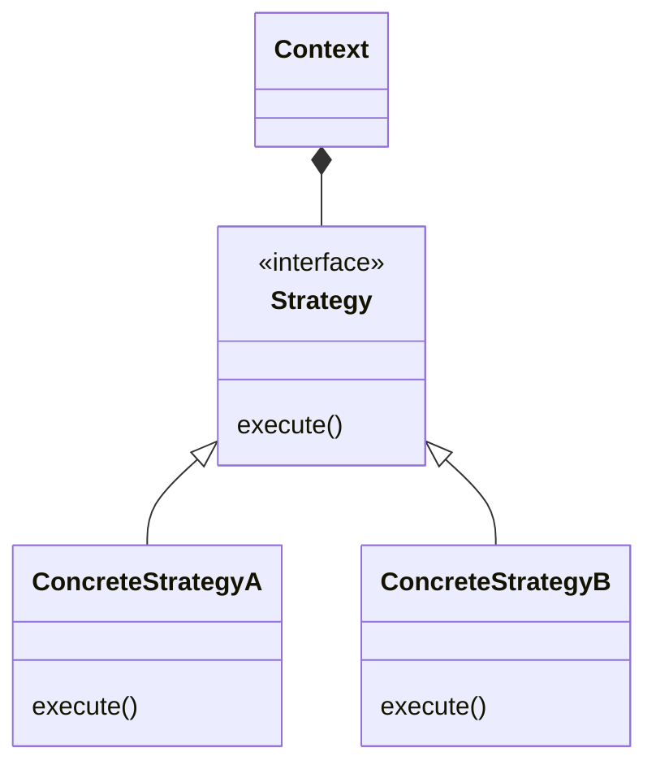
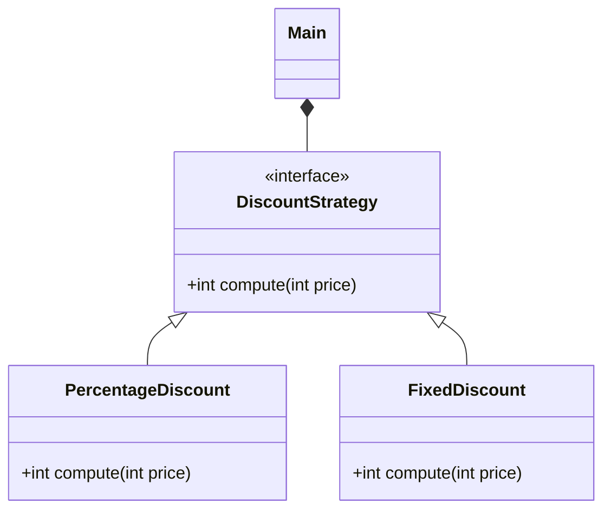

# Strategy

> Source: https://academy.arjancodes.com/products/the-software-designer-mindset-pythonic-patterns/categories/2149946547/posts/2160000087

## Initial code

```python
@dataclass
class Order:
    price: int
    quantity: int

    def compute_total(self, discount_type: str) -> int:
        if discount_type == "percentage":
            discount = int(self.price * self.quantity * 0.20)
        elif discount_type == "fixed":
            discount = 10_00
        return self.price * self.quantity - discount

    
def main() -> None:
    order = Order(price=100_00, quantity=2)
    print(order)
    print(f"Total: ${order.compute_total('percentage')/100:.2f}")
```

In code above there are plenty of states managed by `if/else` with magic numbers for computation.

## Strategy pattern


Context depends only on abstract Strategy class, it does not know anything about implementation details of particular Strategy, it only knows base interface.



For discount case from initial code Strategy may look like in diagram above - we have separate Strategy class for 
particular discount type.

## Classic approach

```python
from abc import ABC, abstractmethod
from dataclasses import dataclass


class DiscountStrategy(ABC):
    @abstractmethod
    def compute(self, price: int) -> int:
        pass


class PercentageDiscount(DiscountStrategy):
    def compute(self, price: int) -> int:
        return int(price * 0.20)


class FixedDiscount(DiscountStrategy):
    def compute(self, _: int) -> int:
        return 10_00


@dataclass
class Order:
    price: int
    quantity: int
    discount: DiscountStrategy

    def compute_total(self) -> int:
        discount = self.discount.compute(self.price * self.quantity)
        return self.price * self.quantity - discount


def main() -> None:
    order = Order(price=100_00, quantity=2, discount=PercentageDiscount())
    print(order)
    print(f"Total: ${order.compute_total()/100:.2f}")
```

In classic approach we can apply strategy pattern by using abstract classes and inheritance.