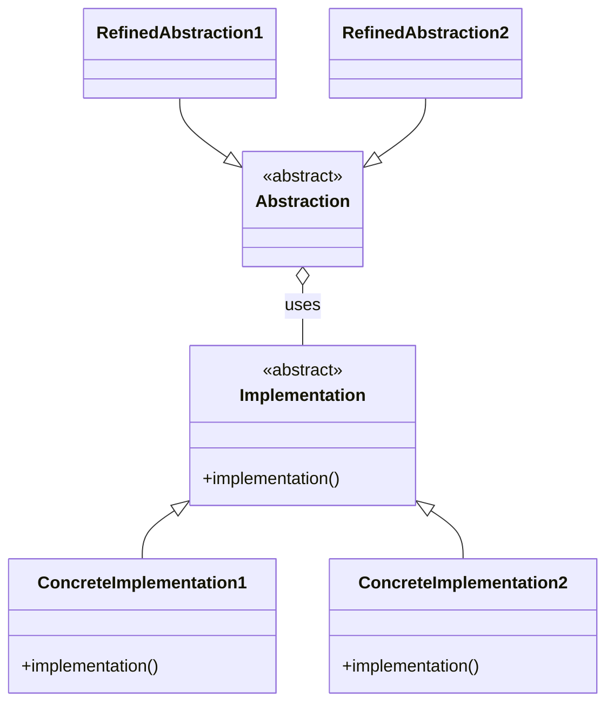
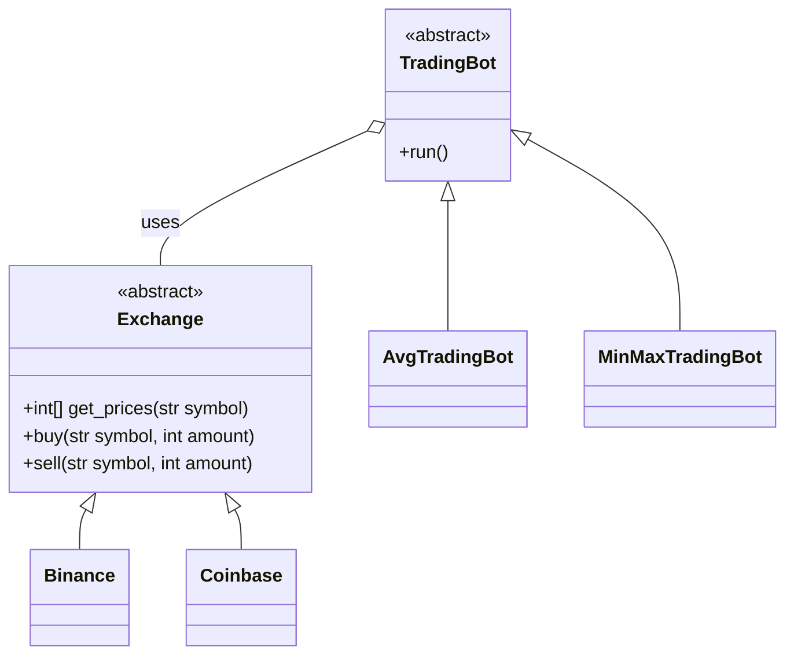

# Bridge

> Source: https://academy.arjancodes.com/products/the-software-designer-mindset-pythonic-patterns/categories/2149946548/posts/2160000213

## Initial code

```python
def main() -> None:
    # symbol we trade on
    symbol = "BTC/USD"
    trade_amount = 10

    # create the exchange
    exchange = Coinbase()
    
    exchange.buy(symbol, trade_amount)
```
* Specific exchange method declared in `main()` function
* No strategy for TradingBot specified yet

## Bridge pattern


* `Abstraction` uses `Implementation`
* `RefinedAbstraction` classes are strategies for `Abstraction`
* `ConcreteImplementation` classes are strategies for `Implementation`
* Bridge exists between `Abstraction` and `Implementation`
* `Abstraction` strategies know nothing about `Implementation` subclasses


* `TradingBot` uses `Exchange`
* `AvgTradingBot` and `MinMaxTradingBot` classes are strategies for `TradingBot`
* `Binance` and `Coinbase` classes are strategies for `Exchange`
* Bridge exists between `TradingBot` and `Exchange`
* `TradingBot` strategies know nothing about `Exchange` subclasses

## Classic Bridge Pattern

### Abstract classes for Exchange and TradingBot 

```python
# exchange.py
from abc import ABC, abstractmethod


class Exchange(ABC):
    @abstractmethod
    def get_prices(self, symbol: str) -> list[int]:
        pass

    @abstractmethod
    def buy(self, symbol: str, amount: int) -> None:
        pass

    @abstractmethod
    def sell(self, symbol: str, amount: int) -> None:
        pass
```
```python
# trading_bot.py
from abc import ABC, abstractmethod
from dataclasses import dataclass

from exchange import Exchange


@dataclass
class TradingBot(ABC):
    exchange: Exchange

    @abstractmethod
    def should_buy(self, symbol: str) -> bool:
        pass

    @abstractmethod
    def should_sell(self, symbol: str) -> bool:
        pass
```

`TradingBot` receives `Exchange` abstract class as bridge connection between two classes.

### Subclasses of Bridge components

```python
from exchange import Exchange

PRICE_DATA = {
    "BTC/USD": [
        35_842_00,
        34_069_00,
        33_871_00,
    ],
    "ETH/USD": [
        2_381_00,
        2_233_00,
        2_300_00,
    ],
}


class Coinbase(Exchange):
    def get_prices(self, symbol: str) -> list[int]:
        return PRICE_DATA[symbol]

    def buy(self, symbol: str, amount: int) -> None:
        print(f"[Coinbase] Buying amount {amount} in market {symbol}.")

    def sell(self, symbol: str, amount: int) -> None:
        print(f"[Coinbase] Selling amount {amount} in market {symbol}.")

```

```python
# avg_trading_bot.py

import statistics
from dataclasses import dataclass

from trading_bot import TradingBot


@dataclass
class AverageTradingBot(TradingBot):
    window_size: int = 3

    def should_buy(self, symbol: str) -> bool:
        prices = self.exchange.get_prices(symbol)
        list_window = prices[-self.window_size :]
        return prices[-1] < statistics.mean(list_window)

    def should_sell(self, symbol: str) -> bool:
        prices = self.exchange.get_prices(symbol)
        list_window = prices[-self.window_size :]
        return prices[-1] > statistics.mean(list_window)

```
Subclasses of both abstract classes matches parent classes interfaces, so they can be connected by bridge pattern.

### main.py file
```python
# main.py

from avg_trading_bot import AverageTradingBot
from coinbase import Coinbase


def main() -> None:
    # symbol we trade on
    symbol = "BTC/USD"
    trade_amount = 10

    # create the exchange
    exchange = Coinbase()

    # create the trading bot
    trading_bot = AverageTradingBot(exchange)  # BRIDGE CONNECTION

    should_buy = trading_bot.should_buy(symbol)
    should_sell = trading_bot.should_sell(symbol)
    if should_buy:
        exchange.buy(symbol, trade_amount)
    elif should_sell:
        exchange.sell(symbol, trade_amount)
    else:
        print("No action needed.")


if __name__ == "__main__":
    main()
```
