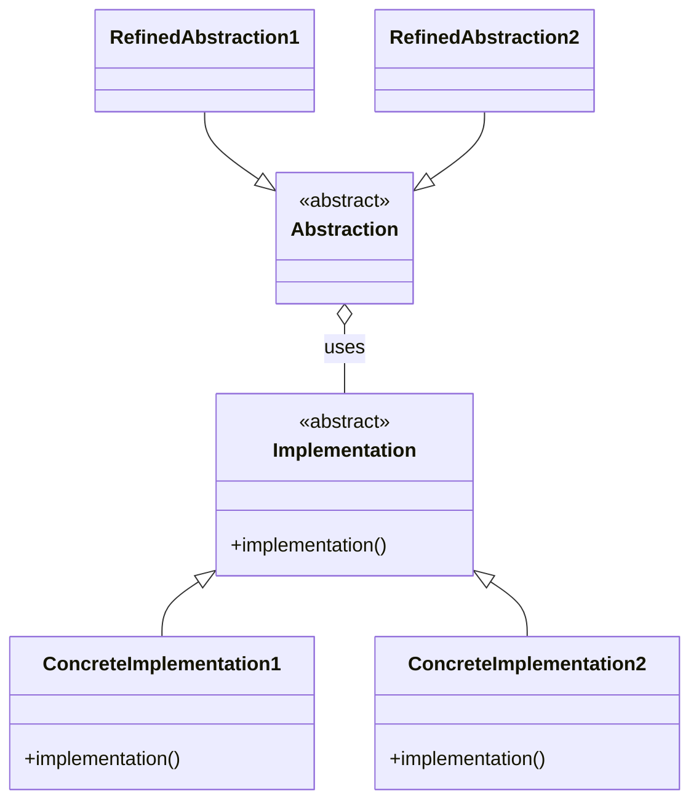
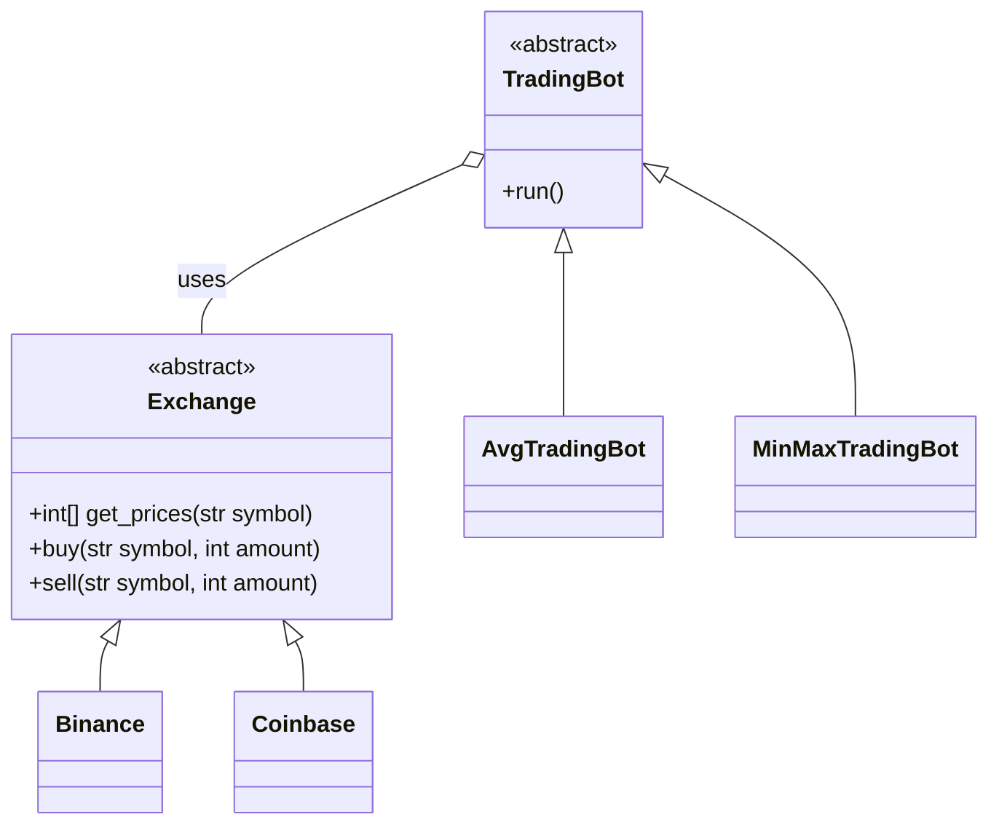

# Bridge

> Source: https://academy.arjancodes.com/products/the-software-designer-mindset-pythonic-patterns/categories/2149946548/posts/2160000213

## Initial code

```python
def main() -> None:
    # symbol we trade on
    symbol = "BTC/USD"
    trade_amount = 10

    # create the exchange
    exchange = Coinbase()
    
    exchange.buy(symbol, trade_amount)
```
* Specific exchange method declared in `main()` function
* No strategy for TradingBot specified yet

## Bridge pattern


* `Abstraction` uses `Implementation`
* `RefinedAbstraction` classes are strategies for `Abstraction`
* `ConcreteImplementation` classes are strategies for `Implementation`
* Bridge exists between `Abstraction` and `Implementation`
* `Abstraction` strategies know nothing about `Implementation` subclasses


* `TradingBot` uses `Exchange`
* `AvgTradingBot` and `MinMaxTradingBot` classes are strategies for `TradingBot`
* `Binance` and `Coinbase` classes are strategies for `Exchange`
* Bridge exists between `TradingBot` and `Exchange`
* `TradingBot` strategies know nothing about `Exchange` subclasses