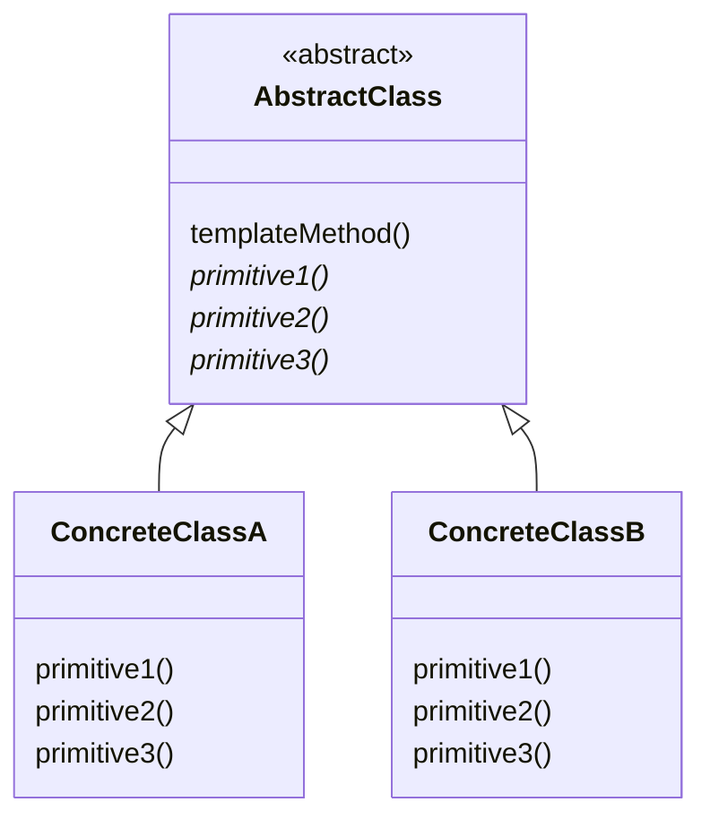
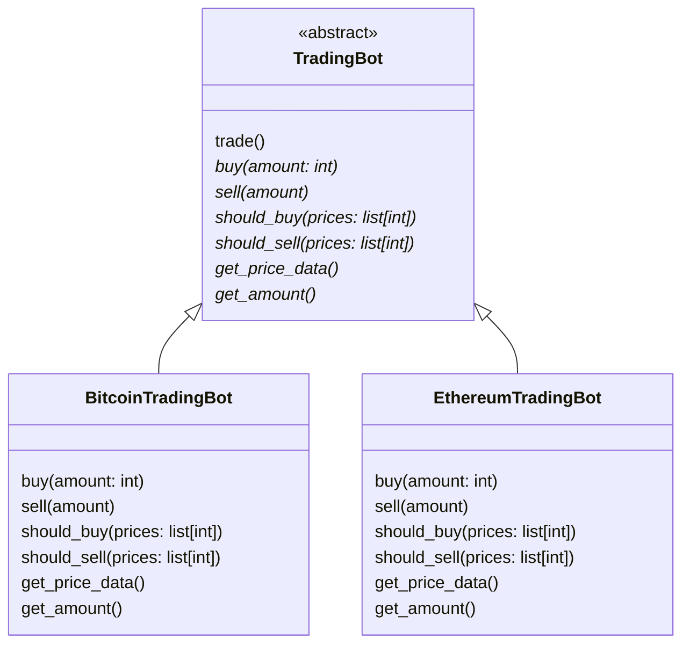

# Template method

> Source: https://academy.arjancodes.com/products/the-software-designer-mindset-pythonic-patterns/categories/2149946548/posts/2160000213

## Initial code
```python
# main.py
from bitcoin import BitcoinTradingBot
from ethereum import EthereumTradingBot


def main():
    bitcoin_trader = BitcoinTradingBot()
    bitcoin_trader.trade()

    ethereum_trader = EthereumTradingBot()
    ethereum_trader.trade()

```
```python
# bitcoin.py

class BitcoinTradingBot:
    ...
    def trade(self) -> None:
    prices = self.get_price_data()
    amount = self.get_amount()

    if self.should_buy(prices):
        self.buy(amount)
    if self.should_sell(prices):
        self.sell(amount)
```
```python
# ethereum.py

class EthereumTradingBot:
    ...
    def trade(self) -> None:
    prices = self.get_price_data()
    amount = self.get_amount()

    if self.should_buy(prices):
        self.buy(amount)
    if self.should_sell(prices):
        self.sell(amount)
```
* Two TradingBot classes with some differences, but with the same, crucial `.trade()` method.

## Template method pattern



Algorithms stays the same, components changes.

