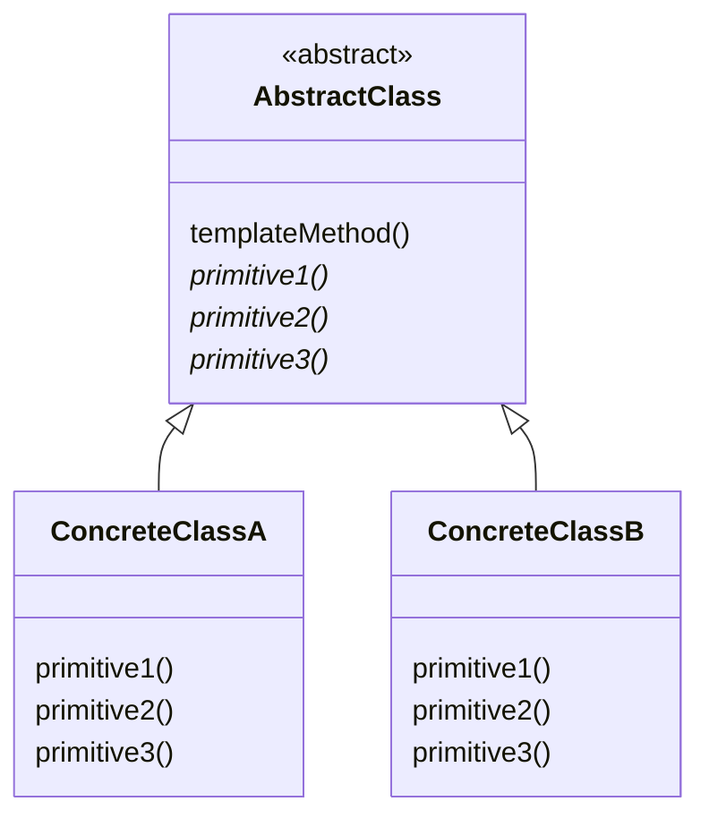
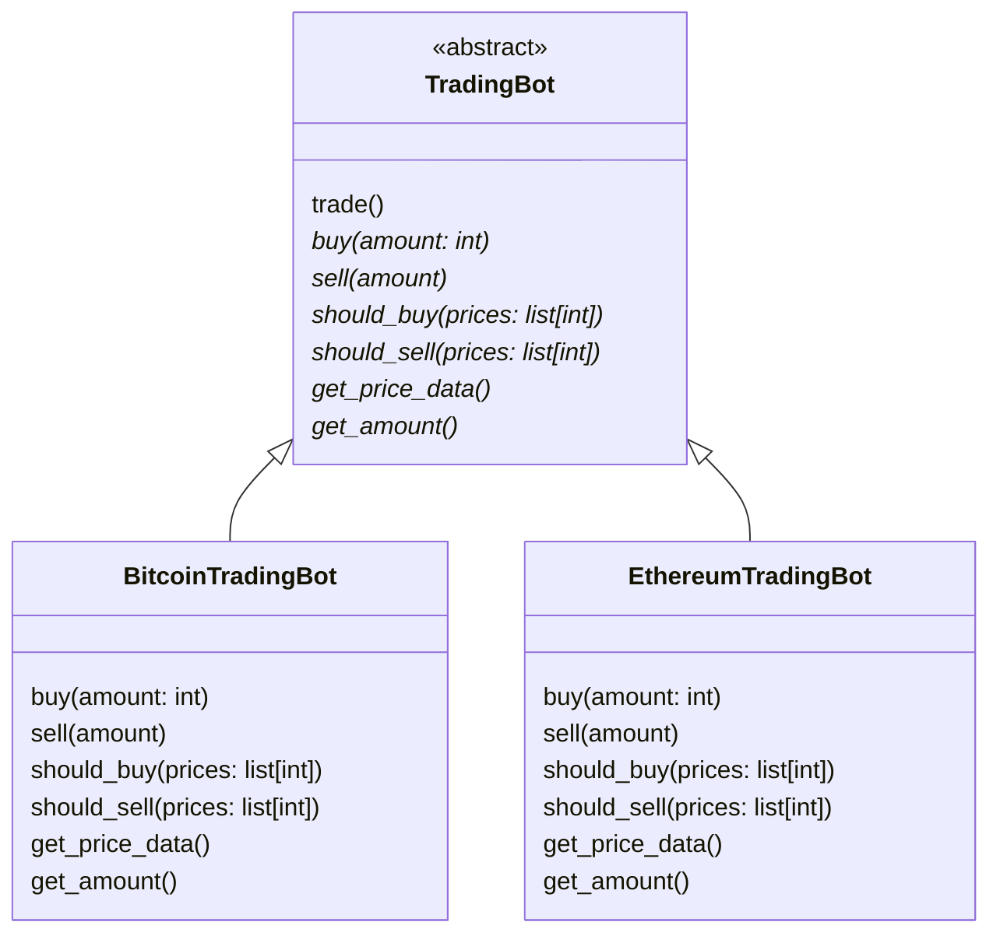

# Template method

> Source: https://academy.arjancodes.com/products/the-software-designer-mindset-pythonic-patterns/categories/2149946548/posts/2160000213

Template method allows you to separate the algorithm from its parts. Algorithms stays the same, components changes.

## Initial code
```python
# main.py
from bitcoin import BitcoinTradingBot
from ethereum import EthereumTradingBot


def main():
    bitcoin_trader = BitcoinTradingBot()
    bitcoin_trader.trade()

    ethereum_trader = EthereumTradingBot()
    ethereum_trader.trade()

```
```python
# bitcoin.py

class BitcoinTradingBot:
    ...
    def trade(self) -> None:
    prices = self.get_price_data()
    amount = self.get_amount()

    if self.should_buy(prices):
        self.buy(amount)
    if self.should_sell(prices):
        self.sell(amount)
```
```python
# ethereum.py

class EthereumTradingBot:
    ...
    def trade(self) -> None:
    prices = self.get_price_data()
    amount = self.get_amount()

    if self.should_buy(prices):
        self.buy(amount)
    if self.should_sell(prices):
        self.sell(amount)
```
* Two TradingBot classes with some differences, but with the same, crucial `.trade()` method.

## Template method pattern



* AbstractClass with `templateMethod()` implementation
* Abstract `primitive` methods, that need to be implemented in subclasses.
* `ConcreteClass` subclasses of `AbstractClass` with `primitive` methods implemented



* `TradingBot` with `trade()` implementation
* Abstract methods like `buy()`, `sell()`, etc., that need to be implemented in subclasses.
* `BitcoinTradingBot` and `EthereumTradingBot` subclasses of `TradingBot` with abstract methods like `buy()`, `sell()` 
methods implemented

## Classic Template method

```python
# trading_bot.py

from abc import ABC, abstractmethod


class TradingBot(ABC):
    @abstractmethod
    def buy(self, amount: int) -> None:
        pass

    @abstractmethod
    def sell(self, amount: int) -> None:
        pass

    @abstractmethod
    def should_buy(self, prices: list[int]) -> bool:
        pass

    @abstractmethod
    def should_sell(self, prices: list[int]) -> bool:
        pass

    @abstractmethod
    def get_price_data(self) -> list[int]:
        pass

    @abstractmethod
    def get_amount(self) -> int:
        pass

    def trade(self) -> None:
        prices = self.get_price_data()
        amount = self.get_amount()

        if self.should_buy(prices):
            self.buy(amount)
        if self.should_sell(prices):
            self.sell(amount)
```
* Abstract class `TradingBot`
* Abstract methods for subclasses declared
* `.trade()` method implementation

```python
# bitcoin.py
from trading_bot import TradingBot


class BitcoinTradingBot(TradingBot):
    ...

```
```python
# ethereum.py
from trading_bot import TradingBot


class EthereumTradingBot(TradingBot):
    ...
```
* `BitcoinTradingBot` and `EthereumTradingBot` as `TradingBot` subclasses
* `BitcoinTradingBot` and `EthereumTradingBot` have their own implementations of `TradingBot` abstract methods
* `BitcoinTradingBot` and `EthereumTradingBot` inherit `.trade()` method from `TradingBot` class.