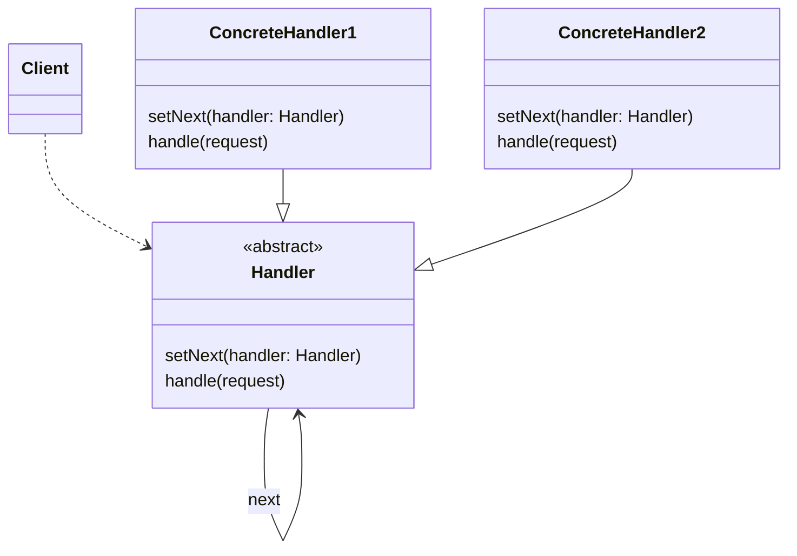
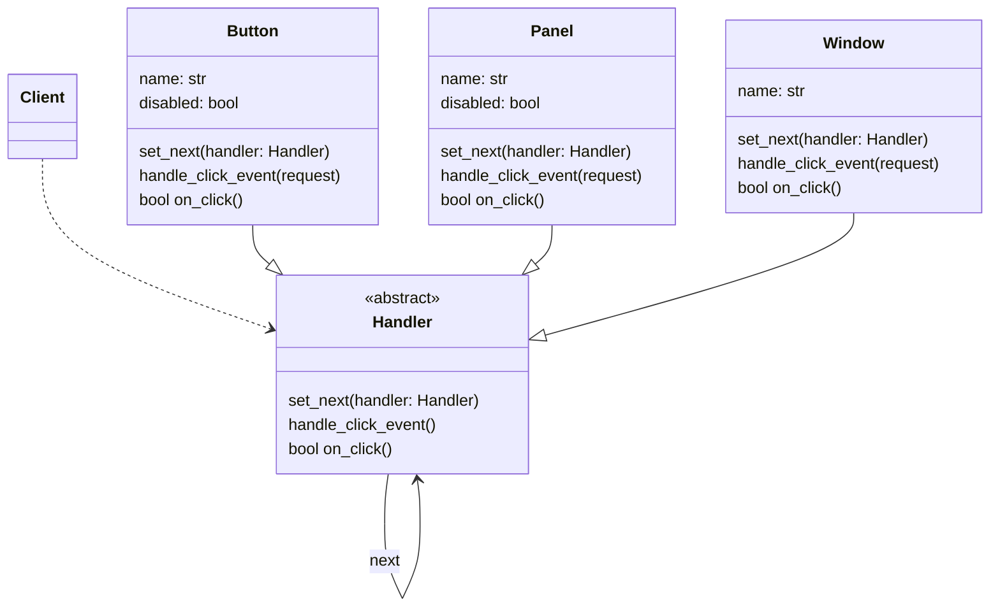

# Pipeline patterns

> Source: https://academy.arjancodes.com/products/the-software-designer-mindset-pythonic-patterns/categories/2149946552/posts/2160000607

## Chain of responsibility pattern



* Client uses a Handler for some process
* Handler has setNext() method to indicate, what next Handler should process request


* Client uses a Handler subclasses for processing request
* Button, Panel and Window as subclasses of Handler abstract class

## Chain of responsibility implementation

```python
from __future__ import annotations

from abc import ABC
from dataclasses import dataclass
from typing import Optional


class Handler(ABC):
    def __init__(self):
        self.next: Optional[Handler] = None

    def set_next(self, handler: Handler) -> None:
        self.next = handler

    def handle_click_event(self) -> None:
        if self.on_click() and self.next:
            self.next.handle_click_event()

    def on_click(self) -> bool:
        """Handle a click event."""
        return True


@dataclass
class Button(Handler):
    name: str = "button"
    disabled: bool = False

    def on_click(self) -> bool:
        if self.disabled:
            return True
        print(f"Button [{self.name}] handling click.")
        return False


@dataclass
class Panel(Handler):
    name: str = "panel"
    disabled: bool = False


@dataclass
class Window(Handler):
    name: str = "window"

    def on_click(self) -> bool:
        print(f"Window [{self.name}] handling click.")
        return False


def main() -> None:
    button = Button(name="my_button", disabled=False)
    panel = Panel(name="my_panel", disabled=False)
    window = Window(name="my_window")

    # setup the chain of responsibility
    button.set_next(panel)
    panel.set_next(window)

    button.handle_click_event()
```