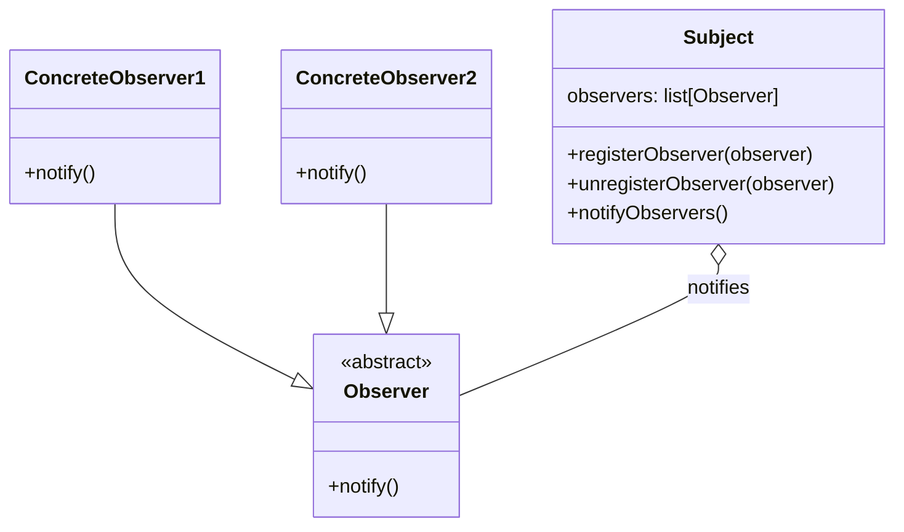

# Notification patterns

> Source: https://academy.arjancodes.com/products/the-software-designer-mindset-pythonic-patterns/categories/2149946554/posts/2160000668

## Observer pattern diagram


* Observer abstract class for notifier objects
* Concrete subclasses of Observer class - like email notifier, sms notifier, etc.
* Subject class for business logic handling

```python
from abc import ABC, abstractmethod
from dataclasses import dataclass, field


class Observer(ABC):
    @abstractmethod
    def notify(self) -> None:
        pass


class ConcreteObserver(Observer):
    def notify(self) -> None:
        print("ConcreteObserver.notify")


@dataclass
class Subject:
    observers: list[Observer] = field(default_factory=list)

    def register_observer(self, observer: Observer) -> None:
        self.observers.append(observer)

    def unregister_observer(self, observer: Observer) -> None:
        self.observers.remove(observer)

    def notify_observers(self) -> None:
        for obs in self.observers:
            obs.notify()

    def do_something(self) -> None:
        print("Subject.do_something")
        self.notify_observers()


def main() -> None:
    subject = Subject()
    observer = ConcreteObserver()
    subject.register_observer(observer)
    subject.do_something()
```