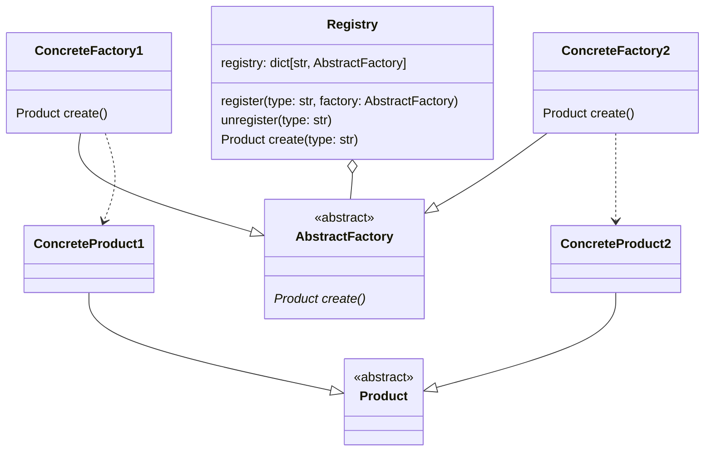
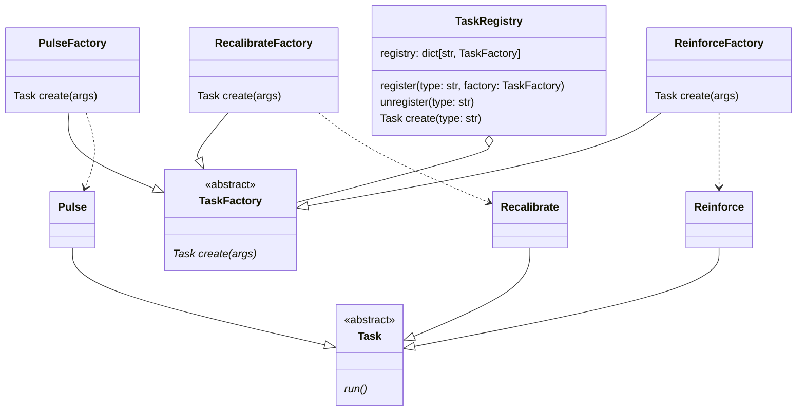

# Registry

> Source: https://academy.arjancodes.com/products/the-software-designer-mindset-pythonic-patterns/categories/2149946555/posts/2160000778

## Registry pattern

* Registry contains str for representing particular AbstractFactory subclass.
* ConcreteFactories as AbstractFactory subclasses
* Product as abstract class for ConcreteProducts
* ConcreteFactories only create ConcreteProducts
* Registry handles creating objects of particular type 

* TaskRegistry contains str for representing particular TaskFactory subclass.
* PulseFactory, ReinforceFactory and RecalibrateFactory as TaskFactory subclasses
* Task as abstract class for Pulse, Recalibrate and Reinforce classes
* PulseFactory, ReinforceFactory and RecalibrateFactory only create Pulse, Recalibrate and Reinforce classes
* TaskRegistry handles creating objects of particular type 

## Implementation
```python
# registry.py

from typing import Any, Protocol


class Task(Protocol):
    def run(self) -> None:
        """Run the task."""


class TaskFactory(Protocol):
    def create(self, args: dict[str, Any]) -> Task:
        """Creates a new task."""
```
* Protocol for Task defined
* Factory for Task class

```python
# tasks.py
from dataclasses import dataclass
from typing import Any

from registry import Task


@dataclass
class Pulse:
    strength: int

    def run(self) -> None:
        print(
            f"Sending a subspace pulse of {self.strength} microPicards to the converter assembly."
        )


@dataclass
class Recalibrate:
    target: str

    def run(self) -> None:
        print(f"Recalibrating the {self.target}.")


@dataclass
class Reinforce:
    plating_type: str
    target: str

    def run(self) -> None:
        print(f"Reinforcing {self.plating_type} plating of {self.target}.")


class PulseFactory:
    def create(self, args: dict[str, Any]) -> Task:
        return Pulse(**args)


class RecalibrateFactory:
    def create(self, args: dict[str, Any]) -> Task:
        return Recalibrate(**args)


class ReinforceFactory:
    def create(self, args: dict[str, Any]) -> Task:
        return Reinforce(**args)
```
* Reinforce, Recalibrate and Pulse classes matching Task protocol
* Factories for Reinforce, Recalibrate and Pulse classes matching TaskFactory protocol